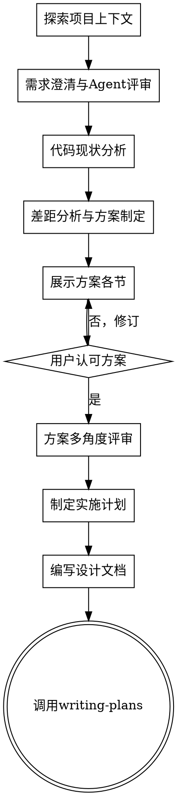

# Feature Brainstorming — 金字塔原理驱动的需求设计流程

## 核心目标 / Ultimate Goal

增加前期需求确认和方案设计时间，减少后期返工次数。**一次分析到位，交付 100% 可用的功能。**

运用**金字塔原理**：结论先行，再展示支撑依据；自顶向下表达，自底向上思考。
遵循 **MECE 原则**：相互独立、完全穷尽，不遗漏、不重叠。
每个阶段结束必须有**文档产出**。

<HARD-GATE>
Do NOT invoke any implementation skill, write any code, scaffold any project, or take any implementation action until you have presented a design and the user has approved it. This applies to EVERY project regardless of perceived simplicity.
</HARD-GATE>

## Anti-Pattern: "This Is Too Simple To Need A Design"

Every project goes through this process — a single-function change, a config tweak, all of them. "Simple" projects are where unexamined assumptions cause the most wasted work. The design can be short (a few sentences), but you MUST present it and get approval.

---

## Checklist（按顺序完成，每步创建 Task）

**阶段一：需求确认**
1. **探索项目上下文** — 检查文件、文档、近期提交
2. **需求澄清与 Agent 评审** — 逐一提问，多角色 Agent 团队审视需求
3. **代码现状分析** — 从系统架构到底层逐层拆解，定位相关模块

**阶段二：方案设计**
4. **差距分析与方案制定** — 对比现状与目标，聚焦核心矛盾，提出 2-3 个方案
5. **方案展示与用户确认** — 逐节展示设计，获得用户认可
6. **方案多角度评审** — Agent 团队从多维度审查方案完整性

**阶段三：计划输出**
7. **制定实施计划** — SMART 原则，核心功能描述完善，含验证标准
8. **编写设计文档** — 保存至 `docs/plans/YYYY-MM-DD-<topic>-design.md` 并提交
9. **转入实施阶段** — 调用 writing-plans skill

---

## Process Flow

**终止状态是调用 writing-plans。** 禁止调用 frontend-design、mcp-builder 或其他实现类 skill。brainstorming 之后唯一调用的 skill 是 writing-plans。

---

## 阶段一：需求确认

### 步骤 1 — 探索项目上下文

- 检查文件结构、文档、近期提交记录，了解当前状态
- 评估请求规模：如果描述了多个独立子系统，立即标记并协助拆解，不要深入细节后才发现范围过大
- 如规模过大，协助分解为子项目，明确边界、依赖关系和构建顺序；每个子项目走完整的 spec → plan → implementation 周期

### 步骤 2 — 需求澄清与 Agent 评审

**逐一提问，理解需求：**
- 每次只问一个问题；能给选项时优先给选项
- 聚焦：目的、约束条件、成功标准

**建立 Agent 需求评审团**，从不同角色并行审视需求（MECE：不遗漏、不重叠）：

| Agent 角色 | 关注点 |
|-----------|--------|
| 用户/产品视角 | 功能是否满足实际使用场景？有无遗漏的用户期望？ |
| 架构/编码视角 | 技术可行性、与现有架构的兼容性、潜在技术风险 |
| 测试/质量视角 | 如何验证功能完整性？边界条件和异常路径 |

**文档产出：** 需求摘要（含各角色评审意见）写入 `docs/plans/YYYY-MM-DD-<topic>-requirements.md`

### 步骤 3 — 代码现状分析

从系统架构层面入手，**自顶向下**逐层拆解，直到与需求直接相关的底层模块：

1. 整体架构概览（分层关系、模块职责）
2. 定位相关模块，阅读接口定义和实现
3. 梳理数据流和调用链

分析遵循金字塔原理：**先给出结论**（"当前缺少 X，需要修改 Y"），再展示支撑依据。

**文档产出：** 现状分析摘要（架构图、相关模块、关键接口）附加至需求文档

---

## 阶段二：方案设计

### 步骤 4 — 差距分析与方案制定

- 明确现状与目标之间的差距，**抓住主要矛盾**
- 先确认核心功能范围，再处理边界问题；避免 YAGNI 陷阱，去除不必要的功能
- 逐个提出问题以完善想法（每次一个问题）
- 提出 2-3 个不同方案，含利弊权衡；**推荐方案放在最前**，解释原因

### 步骤 5 — 方案展示与用户确认

- 理解清楚后再展示设计，不要过早展示
- 每节按复杂度缩放：简单的几句话，复杂的 200-300 字
- 每节后询问是否符合预期，准备好随时修订
- 涵盖：架构、组件、数据流、错误处理、测试策略

**设计隔离原则：**
- 每个模块只做一件事，通过明确接口通信，可独立理解和测试
- 能回答：它做什么？如何使用？依赖什么？
- 内部修改不应破坏外部消费者

### 步骤 6 — 方案多角度评审

用户认可方案后，派遣 Agent 团队从以下维度做最终审查（MECE）：

| 评审维度 | 检查项 |
|---------|--------|
| 功能完整性 | 需求是否全部覆盖？有无遗漏的场景？ |
| 技术可行性 | 方案在目标平台上是否可实现？依赖是否合理？ |
| 可维护性 | 代码结构是否清晰？接口是否稳定？ |
| 可测试性 | 每个功能单元是否可独立验证？ |
| 风险识别 | 有哪些潜在风险？如何规避？ |

如发现遗漏，返回步骤 4 修订方案。

---

## 阶段三：计划输出

### 步骤 7 — 制定实施计划

实施计划每一步遵循 **SMART 原则**：

- **S**pecific（具体）— 明确描述核心功能，具体到文件、函数、接口，不留模糊空间
- **M**easurable（可量化）— 定义完成标准和验证方式（命令、测试用例）
- **A**chievable（可实现）— 步骤粒度合理，单步可在一次会话内完成
- **R**elevant（相关）— 每步直接服务于需求目标
- **T**ime-bound（有顺序）— 明确各步骤的依赖顺序和前置条件

每步须包含：修改内容、完成判定标准、验证命令。

### 步骤 8 — 编写设计文档

- 将完整设计写入 `docs/plans/YYYY-MM-DD-<topic>-design.md`
- 包含：需求摘要、现状分析、方案设计、实施计划
- 提交到 git

**Spec 评审循环：**
1. 派遣 spec-document-reviewer 子 Agent 检查文档质量
2. 如发现问题：修正、重新派遣，直至通过
3. 循环超过 5 次则升级给用户处理

### 步骤 9 — 转入实施

- 调用 writing-plans skill 创建详细实施计划
- 禁止调用其他任何 skill。writing-plans 是下一步。

---

## 后续阶段参考（由 writing-plans / executing-plans 接管）

以下阶段记录于此以保持全流程可见：

**实施阶段：** 按计划逐步实施，每步完成后验证，验证通过后更新文档中的完成状态。

**代码评审阶段：** 从多角度对实现进行评审：
- Bug 检查：逻辑错误、边界条件、资源管理
- 代码质量：可读性、模块化、重复代码
- 编码规范：命名、注释、项目约定

输出评审报告到 `docs/plans/YYYY-MM-DD-<topic>-review.md`

**交付确认：** 对照需求逐条确认，功能 100% 可用后收尾。

---

## Key Principles

- **金字塔原理** — 结论先行，再展示支撑依据
- **MECE 原则** — 分析和方案必须相互独立、完全穷尽
- **每步有产出** — 每个阶段结束前必须有文档输出
- **Agent 团队** — 多角色并行评审，专注各自上下文，减少遗漏
- **一次问一个** — 不要同时抛出多个问题
- **优先给选项** — 比开放式问题更容易回答
- **YAGNI 原则** — 从所有设计中去除不必要的功能
- **增量验证** — 展示设计、获得认可，再推进
