# 键盘框架架构设计文档

## 目录
1. [架构概览](#1-架构概览)
2. [分层架构设计](#2-分层架构设计)
3. [目录结构](#3-目录结构)
4. [核心模块详解](#4-核心模块详解)
5. [数据流程图](#5-数据流程图)
6. [模块调用关系](#6-模块调用关系)
7. [初始化流程](#7-初始化流程)
8. [按键处理流程](#8-按键处理流程)
9. [通信流程](#9-通信流程)
10. [配置系统](#10-配置系统)
11. [平台适配](#11-平台适配)

---

## 1. 架构概览

### 1.1 设计理念
本键盘框架采用**四层分层架构**设计，灵感来源于QMK固件，但更加模块化和平台无关。设计原则：
- **分层解耦**: 严格遵循HAL → Driver → Middleware → Application 的分层
- **平台无关**: 通过HAL层抽象硬件差异
- **事件驱动**: 采用事件队列和任务调度机制
- **模块化**: 每个模块职责单一，易于测试和维护

### 1.2 整体架构图

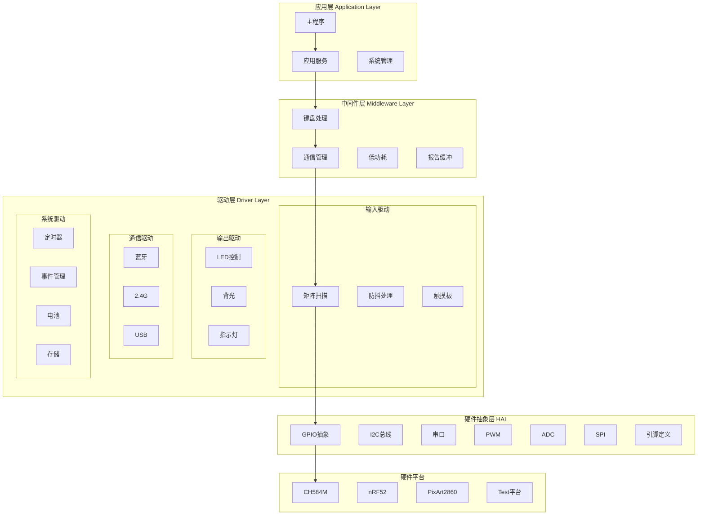

---

## 2. 分层架构设计

### 2.1 硬件抽象层 (HAL - Hardware Abstraction Layer)

**职责**: 抽象硬件平台差异，提供统一的硬件操作接口

**设计原则**:
- 定义统一的接口规范
- 平台-specific实现位于 `hal/platforms/` 目录
- 上层代码不直接操作硬件寄存器

**主要模块**:

| 模块 | 头文件 | 平台实现 | 说明 |
|------|--------|----------|------|
| GPIO | `gpio.h` | `platforms/*/_gpio.c` | GPIO引脚控制 |
| I2C | `i2c_master.h` | `platforms/*/_i2c_master.c` | I2C主设备 |
| UART | `uart.h` | `platforms/*/_uart.c` | 串口通信 |
| PWM | `pwm.h` | `platforms/*/_pwm.c` | PWM控制 |
| ADC | `adc.h` | `platforms/*/_adc.c` | ADC采样 |
| SPI | `spi_master.h` | `platforms/*/_spi_master.c` | SPI主设备 |
| 引脚定义 | `pin_defs.h` | `platforms/*/_pin_defs.h` | 引脚映射 |

**接口示例**:
```c
// GPIO接口 (hal/gpio.h)
void gpio_set_pin_input(pin_t pin);
void gpio_set_pin_input_high(pin_t pin);
void gpio_set_pin_output_push_pull(pin_t pin);
void gpio_write_pin_high(pin_t pin);
void gpio_write_pin_low(pin_t pin);
uint8_t gpio_read_pin(pin_t pin);
void gpio_toggle_pin(pin_t pin);
```

### 2.2 驱动层 (Driver Layer)

**职责**: 设备驱动实现，将硬件能力封装为功能模块

**设计原则**:
- 每个驱动对应一类硬件设备
- 驱动可以相互依赖，但避免循环依赖
- 提供标准化的驱动接口

**驱动分类**:

#### 2.2.1 输入驱动
- **矩阵扫描** (`drivers/input/keyboard/matrix.c`)
  - 扫描键盘矩阵，读取按键状态
  - 支持COL2ROW和ROW2COL
  - 可配置扫描顺序

- **防抖处理** (`drivers/input/keyboard/debounce.c`)
  - 硬件信号滤波
  - 多种防抖算法
  - 时间戳跟踪

- **触摸板** (`drivers/input/touchpad/`)
  - 触摸手势识别
  - 多点触控支持

#### 2.2.2 输出驱动
- **LED控制** (`drivers/output/leds/`)
  - RGB矩阵控制
  - 背光控制

- **背光** (`drivers/output/backlight/`)
  - PWM背光调节
  - 亮度控制

- **指示灯** (`drivers/output/indicators/`)
  - 状态指示
  - 蓝牙/无线状态

#### 2.2.3 通信驱动
- **蓝牙** (`drivers/communication/bluetooth/`)
  - BLE协议栈
  - 配对管理
  - HID报告

- **2.4G无线** (`drivers/communication/p2p4g/`)
  - 2.4G协议
  - 主机配对
  - 报告发送

- **USB** (`drivers/communication/usb/`)
  - USB HID
  - 端点管理
  - 设备枚举

#### 2.2.4 系统驱动
- **定时器** (`drivers/system/timer.c`)
  - 系统时间基准
  - 延时管理
  - 溢出处理

- **事件管理** (`drivers/system/event_manager.c`)
  - 事件队列
  - 任务调度
  - 消息传递

- **电池管理** (`drivers/power/battery.c`)
  - 电量检测
  - 低电告警
  - 功耗优化

- **存储** (`drivers/storage/storage.c`)
  - EEPROM操作
  - 配置保存
  - CRC校验

### 2.3 中间件层 (Middleware Layer)

**职责**: 提供高级功能服务，连接驱动和应用

**设计原则**:
- 组合多个驱动能力形成完整功能
- 状态管理和逻辑处理
- 为应用层提供简化接口

**主要模块**:

#### 2.3.1 键盘处理中间件
- **键盘主逻辑** (`middleware/keyboard/keyboard.c`)
  - 按键事件处理
  - 状态机管理
  - 任务调度

- **动作执行** (`middleware/keyboard/action.c`)
  - 动作解析
  - 层切换
  - 修饰键处理

- **层管理** (`middleware/keyboard/action_layer.c`)
  - 多层键位映射
  - 层切换逻辑
  - 临时层

- **组合键** (`middleware/keyboard/combo.c`)
  - 组合键检测
  - 时序判断
  - 触发动作

- **键码处理** (`middleware/keyboard/keymap_common.c`)
  - 键位映射
  - 键码转换
  - 特殊键处理

#### 2.3.2 通信中间件
- **无线管理** (`middleware/communication/wireless.c`)
  - 无线状态机
  - 连接管理
  - 重连机制

- **传输层** (`middleware/communication/transport.c`)
  - 协议切换
  - 驱动管理
  - 负载均衡

- **报告缓冲** (`middleware/communication/report_buffer.c`)
  - HID报告队列
  - 发送节流
  - 丢包重传

- **低功耗** (`middleware/communication/lpm.c`)
  - 功耗模式
  - 休眠唤醒
  - 空闲管理

### 2.4 应用层 (Application Layer)

**职责**: 业务逻辑和用户交互

**设计原则**:
- 调用中间件服务
- 实现产品特定功能
- 系统状态监控

**主要模块**:

#### 2.4.1 应用服务
- **输入服务** (`application/service/input_service.c`)
  - 输入任务管理
  - 矩阵扫描调度

- **输出服务** (`application/service/output_service.c`)
  - 输出任务管理
  - LED控制协调

- **通信服务** (`application/service/communication_service.c`)
  - 通信任务管理
  - 连接状态监控

- **系统服务** (`application/service/system_service.c`)
  - 系统监控
  - 故障恢复

#### 2.4.2 系统管理
- **系统初始化** (`application/system/system_init.c`)
  - 分层初始化协调
  - 状态跟踪
  - 依赖管理

---

## 3. 目录结构

```
keyboard-framework/
│
├── hal/                          # 硬件抽象层
│   ├── interface/                # HAL接口定义 (旧版)
│   ├── platforms/                # 平台特定实现
│   │   ├── ch584/                # WCH CH584平台
│   │   │   ├── _gpio.c           # GPIO实现
│   │   │   ├── _i2c_master.c     # I2C实现
│   │   │   ├── _uart.c           # UART实现
│   │   │   ├── _pwm.c            # PWM实现
│   │   │   ├── _adc.c            # ADC实现
│   │   │   ├── _spi_master.c     # SPI实现
│   │   │   ├── _i2c_slave.c      # I2C从设备实现
│   │   │   ├── pin_mapper.c      # 引脚映射表
│   │   │   └── _pin_defs.h       # 引脚定义
│   │   ├── nrf52/                # Nordic nRF52平台
│   │   │   ├── gpio_hal.h        # GPIO HAL
│   │   │   ├── i2c_hal.h         # I2C HAL
│   │   │   ├── uart_hal.h        # UART HAL
│   │   │   ├── pwm_hal.h         # PWM HAL
│   │   │   ├── adc_hal.h         # ADC HAL
│   │   │   ├── timer_hal.h       # 定时器 HAL
│   │   │   └── power_hal.h       # 电源 HAL
│   │   ├── pixart2860/           # PixArt 2860平台
│   │   │   ├── gpio_hal.h        # GPIO HAL
│   │   │   ├── i2c_hal.h         # I2C HAL
│   │   │   ├── uart_hal.h        # UART HAL
│   │   │   ├── pwm_hal.h         # PWM HAL
│   │   │   ├── adc_hal.h         # ADC HAL
│   │   │   ├── timer_hal.h       # 定时器 HAL
│   │   │   └── power_hal.h       # 电源 HAL
│   │   └── test/                 # 测试平台
│   │       ├── _gpio.c           # GPIO模拟实现
│   │       ├── _i2c_master.c     # I2C模拟实现
│   │       ├── _uart.c           # UART模拟实现
│   │       ├── _pwm.c            # PWM模拟实现
│   │       ├── _adc.c            # ADC模拟实现
│   │       ├── _spi_master.c     # SPI模拟实现
│   │       ├── _i2c_slave.c      # I2C从设备模拟实现
│   │       ├── pin_mapper.c      # 引脚映射表
│   │       └── _pin_defs.h       # 引脚定义
│   │
│   ├── gpio.h                    # GPIO接口定义
│   ├── i2c_master.h              # I2C主设备接口
│   ├── i2c_slave.h               # I2C从设备接口
│   ├── uart.h                    # UART接口
│   ├── pwm.h                     # PWM接口
│   ├── adc.h                     # ADC接口
│   ├── spi_master.h              # SPI主设备接口
│   ├── pin_defs.h                # 引脚类型定义
│   ├── pin_mapper.h              # 引脚映射接口
│   └── power.h                   # 电源管理接口
│
├── drivers/                      # 设备驱动层
│   ├── communication/            # 通信驱动
│   │   ├── bluetooth/            # 蓝牙驱动
│   │   │   └── bt_driver.c       # 蓝牙驱动实现
│   │   └── p2p4g/                # 2.4G无线驱动
│   │       └── p24g_driver.c     # 2.4G驱动实现
│   │
│   ├── input/                    # 输入设备驱动
│   │   ├── keyboard/             # 键盘相关
│   │   │   ├── matrix.c          # 矩阵扫描
│   │   │   ├── matrix.h          # 矩阵扫描接口
│   │   │   ├── debounce.c        # 防抖处理
│   │   │   └── debounce.h        # 防抖接口
│   │   └── touchpad/             # 触摸板驱动
│   │       └── touchpad.c        # 触摸板实现
│   │
│   ├── output/                   # 输出设备驱动
│   │   ├── backlight/            # 背光控制
│   │   │   ├── backlight.c       # 背光主逻辑
│   │   │   ├── backlight_pwm.c   # PWM背光
│   │   │   └── backlight.h       # 背光接口
│   │   ├── indicators/           # 指示灯
│   │   │   └── indicator.c       # 指示灯控制
│   │   └── leds/                 # LED控制
│   │       └── led_matrix.c      # LED矩阵
│   │
│   ├── power/                    # 电源管理驱动
│   │   └── battery.c             # 电池管理
│   │
│   ├── storage/                  # 存储驱动
│   │   ├── storage.c             # 存储主模块
│   │   ├── storage.h             # 存储接口
│   │   └── test/                 # 测试相关
│   │       └── eeprom.c          # EEPROM模拟
│   │
│   └── system/                   # 系统驱动
│       ├── timer.c               # 定时器驱动
│       ├── timer.h               # 定时器接口
│       ├── timer_manager.c       # 定时器管理
│       ├── timer_manager.h       # 定时器管理接口
│       ├── event_manager.c       # 事件管理实现
│       ├── event_manager.h       # 事件管理接口
│       ├── wait.h                # 等待接口
│       ├── atomic_util.h         # 原子操作工具
│       └── platforms/            # 平台特定驱动
│           ├── test/
│           │   ├── event_manager.c   # 事件管理测试实现
│           │   └── wait.c            # 等待测试实现
│           └── ch584/             # CH584平台驱动
│               └── event_manager.c   # 事件管理CH584实现
│
├── middleware/                   # 中间件层
│   ├── keyboard/                 # 键盘处理中间件
│   │   ├── action.c              # 动作执行
│   │   ├── action.h              # 动作接口
│   │   ├── action_layer.c        # 层管理
│   │   ├── action_layer.h        # 层管理接口
│   │   ├── action_util.c         # 动作工具
│   │   ├── action_util.h         # 动作工具接口
│   │   ├── action_code.h         # 动作码定义
│   │   ├── combo.c               # 组合键
│   │   ├── combo.h               # 组合键接口
│   │   ├── keyboard.c            # 键盘主逻辑
│   │   ├── keyboard.h            # 键盘接口
│   │   ├── keycode_config.c      # 键码配置
│   │   ├── keycode_config.h      # 键码配置接口
│   │   ├── keymap_common.c       # 键位映射
│   │   ├── keymap_common.h       # 键位映射接口
│   │   ├── keymap_introspection.c # 键位映射内省
│   │   ├── keymap_introspection.h # 键位映射内省接口
│   │   ├── keymap_extras/        # 键位映射扩展
│   │   │   ├── keymap_cn.h       # 中文键位
│   │   │   └── keymap_jp.h       # 日文键位
│   │   ├── custom_function.c     # 自定义功能
│   │   ├── custom_function.h     # 自定义功能接口
│   │   └── report.c              # 报告处理
│   │
│   └── communication/            # 通信中间件
│       ├── host.c                # 主机抽象
│       ├── host.h                # 主机接口
│       ├── host_driver.h         # 主机驱动接口
│       ├── lpm.c                 # 低功耗管理
│       ├── lpm.h                 # 低功耗接口
│       ├── report_buffer.c       # 报告缓冲
│       ├── report_buffer.h       # 报告缓冲接口
│       ├── transport.c           # 传输层
│       ├── transport.h           # 传输层接口
│       ├── wireless.c            # 无线管理
│       ├── wireless.h            # 无线管理接口
│       └── wireless_event_type.h # 无线事件类型
│
├── application/                  # 应用层
│   ├── service/                  # 应用服务
│   │   ├── input_service.c       # 输入服务
│   │   ├── input_service.h       # 输入服务接口
│   │   ├── output_service.c      # 输出服务
│   │   ├── output_service.h      # 输出服务接口
│   │   ├── communication_service.c # 通信服务
│   │   ├── communication_service.h # 通信服务接口
│   │   ├── system_service.c      # 系统服务
│   │   └── system_service.h      # 系统服务接口
│   │
│   ├── system/                   # 系统管理
│   │   ├── system_init.c         # 系统初始化协调器
│   │   └── system_init.h         # 系统初始化接口
│   │
│   ├── main.c                    # 主程序入口
│   ├── sys_config.h              # 系统配置
│   └── sys_error.h               # 系统错误定义
│
├── keyboards/                    # 产品配置
│   ├── product_config.h          # 产品特定配置
│   └── keymaps/                  # 键位映射表
│       ├── keymap_ansi.c         # ANSI布局
│       ├── keymap_iso.c          # ISO布局
│       └── keymap_jis.c          # JIS布局
│
├── utils/                        # 工具库
│   ├── bitwise.c                 # 位操作工具
│   ├── bitwise.h                 # 位操作接口
│   └── logging/                  # 日志系统
│       ├── debug.c               # 调试输出
│       ├── debug.h               # 调试接口
│       ├── print.c               # 打印实现
│       ├── print.h               # 打印接口
│       ├── sendchar.c            # 字符发送
│       └── sendchar.h            # 字符发送接口
│
├── test/                         # 测试相关
│   ├── test_main.c               # 测试主程序
│   ├── test_matrix.c             # 矩阵测试
│   └── unity/                    # Unity测试框架
│
├── DOCS/                         # 文档目录
│   ├── api/                      # API文档
│   ├── guides/                   # 使用指南
│   └── architecture/             # 架构文档
│
├── examples/                     # 示例代码
│   ├── basic_keyboard/           # 基础键盘示例
│   ├── wireless_keyboard/        # 无线键盘示例
│   └── gaming_keyboard/          # 游戏键盘示例
│
├── project/                      # 项目文件
│   └── ch584m/                   # CH584M项目
│       ├── .mrs/                 # MRS项目配置
│       └── StdPeriphDriver/      # CH584标准外设库
│           ├── inc/              # 头文件
│           └── src/              # 源文件
│
├── code_example/                 # 代码参考
│   └── qmk_firmware/             # QMK固件参考
│       ├── docs/                 # QMK文档
│       └── drivers/              # QMK驱动参考
│
├── CMakeLists.txt                # CMake构建配置
├── CLAUDE.md                     # Claude Code指南
└── ARCHITECTURE.md               # 本文档
```

---

## 4. 核心模块详解

### 4.1 矩阵扫描模块 (matrix.c)

**位置**: `drivers/input/keyboard/matrix.c`

**功能**:
- 扫描键盘矩阵，检测按键状态
- 支持多种二极管方向配置
- 与防抖系统集成

**核心函数**:
```c
// 初始化矩阵
void matrix_init(void);

// 扫描矩阵，返回是否有变化
uint8_t matrix_scan(void);

// 矩阵状态查询
bool matrix_is_on(uint8_t row, uint8_t col);
matrix_row_t matrix_get_row(uint8_t row);

// 调试输出
void matrix_print(void);
```

**工作流程**:

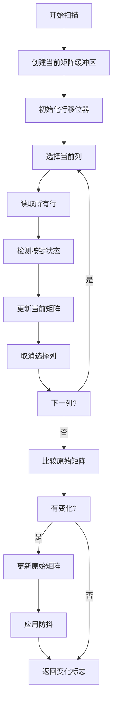

**配置参数**:
```c
// 矩阵尺寸
#define MATRIX_ROWS 8
#define MATRIX_COLS 16

// 引脚配置
#define MATRIX_ROW_PINS { A4,A5,A6,A0,A1,A8,A9,B9 }
#define MATRIX_COL_PINS { B5,B8,B17,B16,B15,B14,B13,B12,B3,B4,B2,A7,B7,B18,B1,B6 }

// 二极管方向
#define DIODE_DIRECTION ROW2COL  // 或 COL2ROW

// 输入状态
#define MATRIX_INPUT_PRESSED_STATE 0  // 0表示按下，1表示释放
```

### 4.2 防抖模块 (debounce.c)

**位置**: `drivers/input/keyboard/debounce.c`

**功能**:
- 过滤按键抖动信号
- 提供多种防抖算法
- 按键级独立跟踪

**防抖算法**:

#### 1. 对称延迟 (DEBOUNCE_SYM_DEFER_PK)
- 按下和释放都延迟
- 最稳定的防抖效果
- QMK默认算法

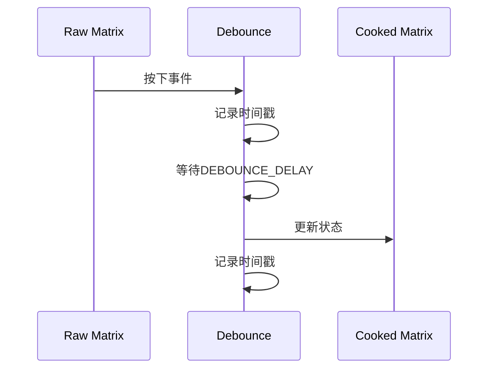

#### 2. 对称急切 (DEBOUNCE_SYM_EAGER_PK)
- 按下立即响应
- 释放延迟处理
- 适合游戏场景

#### 3. 非对称 (DEBOUNCE_ASYM_EAGER_DEFER_PK)
- 按下无延迟
- 释放延迟
- 极致响应速度

**核心函数**:
```c
// 初始化防抖
void debounce_init(uint8_t num_rows);

// 主防抖处理
bool debounce(matrix_row_t raw[], matrix_row_t cooked[],
              uint8_t num_rows, bool changed);

// 查询防抖状态
const matrix_row_t* debounce_get_matrix(void);
bool debounce_changed(void);

// 重置防抖状态
void debounce_reset(void);
```

### 4.3 事件管理模块 (event_manager.c)

**位置**: `drivers/system/event_manager.c`

**功能**:
- 事件队列管理
- 任务调度
- 消息传递

**核心概念**:

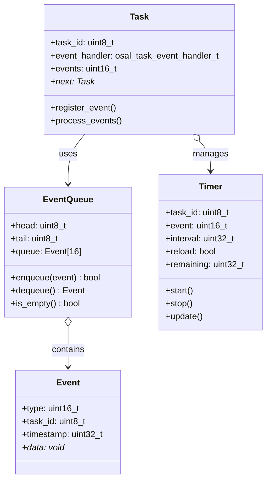

**核心API**:
```c
// 任务管理
uint8_t OSAL_ProcessEventRegister(osal_task_event_handler_t eventCb);
error_code_t OSAL_MsgSend(uint8_t taskID, uint16_t event);
error_code_t OSAL_StartReloadTask(uint8_t taskID, uint16_t event, uint32_t time);
error_code_t OSAL_StopTask(uint8_t taskID, uint16_t event);
void OSAL_SystemProcess(void);
```

**使用示例**:
```c
// 1. 定义事件处理器
uint16_t keyboard_process_event(uint8_t task_id, uint16_t events) {
    if (events & MATRIX_SCAN_EVENT) {
        matrix_scan();
        return events ^ MATRIX_SCAN_EVENT;
    }
    return 0;
}

// 2. 注册任务
void keyboard_init(void) {
    keyboard_taskID = OSAL_ProcessEventRegister(keyboard_process_event);
    OSAL_StartReloadTask(keyboard_taskID, MATRIX_SCAN_EVENT, 5);
}

// 3. 触发事件
OSAL_MsgSend(keyboard_taskID, LED_BLINK_EVENT);
```

### 4.4 键盘处理模块 (keyboard.c)

**位置**: `middleware/keyboard/keyboard.c`

**功能**:
- 键盘主任务循环
- 事件处理协调
- 状态机管理

**工作流程**:

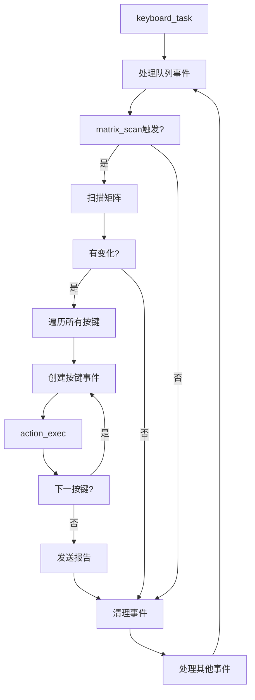

### 4.5 动作执行模块 (action.c)

**位置**: `middleware/keyboard/action.c`

**功能**:
- 解析按键动作
- 执行具体操作
- 层切换处理
- 修饰键管理

**动作类型**:
```c
// 动作类型枚举
typedef enum {
    ACT_NONE,              // 无动作
    ACT_LAYER_TAP,         // 层+点击
    ACT_LAYER,             // 层切换
    ACT_MODS,              // 修饰键
    ACT_MODS_TAP,          // 修饰键+点击
    ACT_USAGE,             // 使用者按键(媒体键)
    ACT_MACRO,             // 宏
    ACT_COMMAND,           // 命令
    ACT_FUNCTION,          // 功能键
} action_kind_t;
```

**处理流程**:

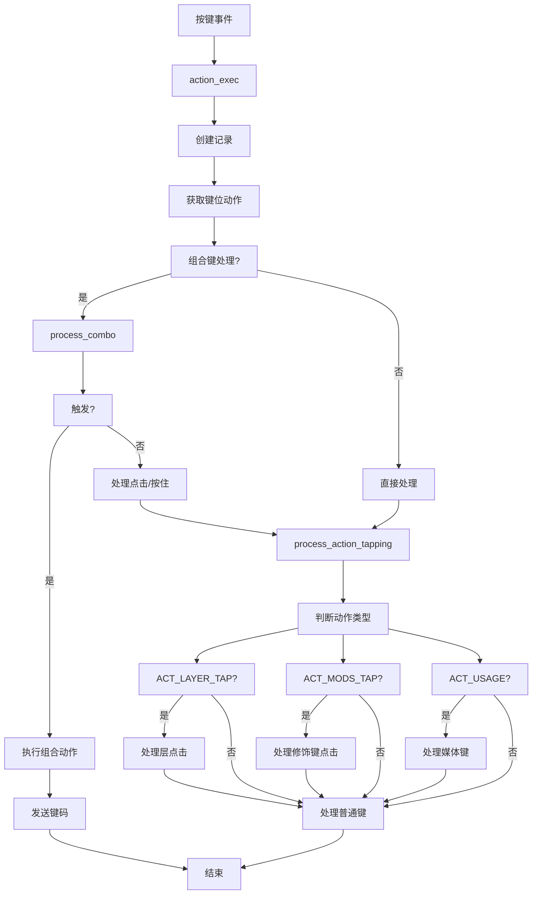

### 4.6 无线管理模块 (wireless.c)

**位置**: `middleware/communication/wireless.c`

**功能**:
- 无线状态机管理
- 连接/断开处理
- 配对管理
- 报告发送

**状态机**:

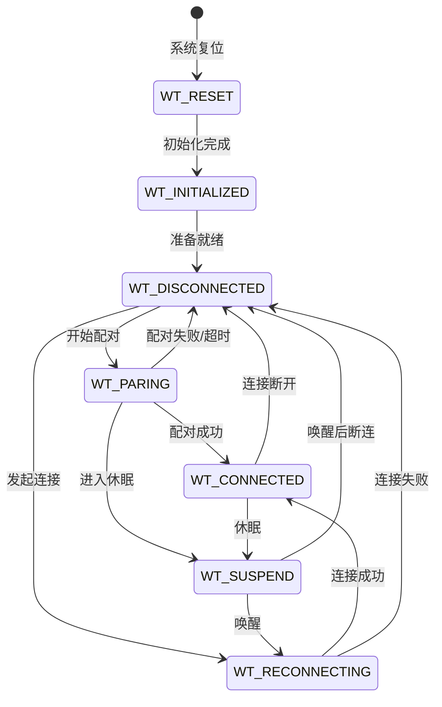

**事件流程**:

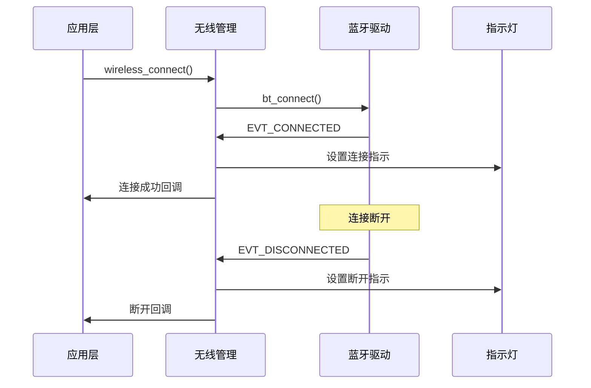

---

## 5. 数据流程图

### 5.1 整体数据流

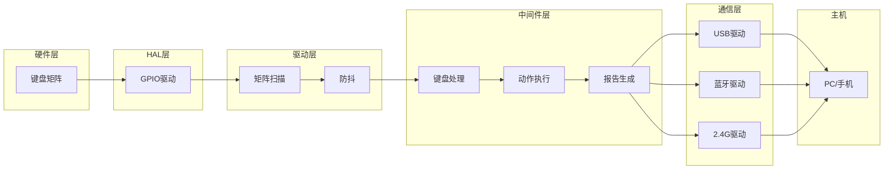

### 5.2 按键处理数据流

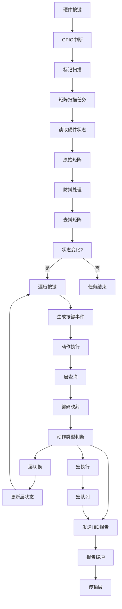

### 5.3 报告发送数据流

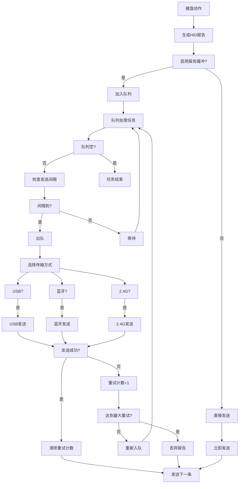

### 5.4 报告缓冲详细流程

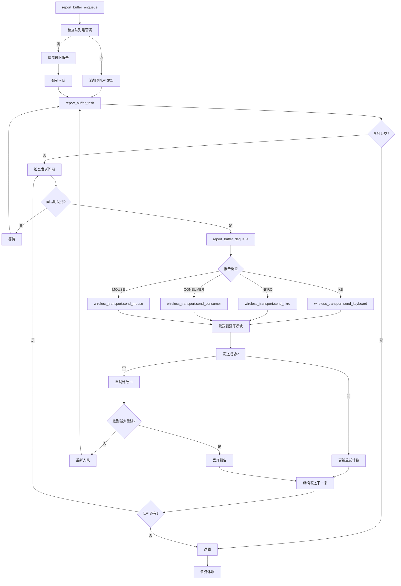

---

## 6. 模块调用关系

### 6.1 初始化调用链

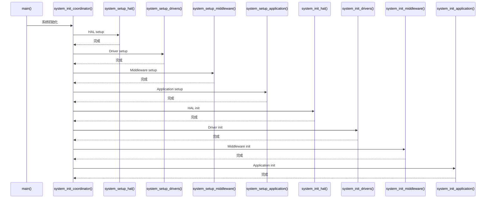

### 6.2 按键处理调用链

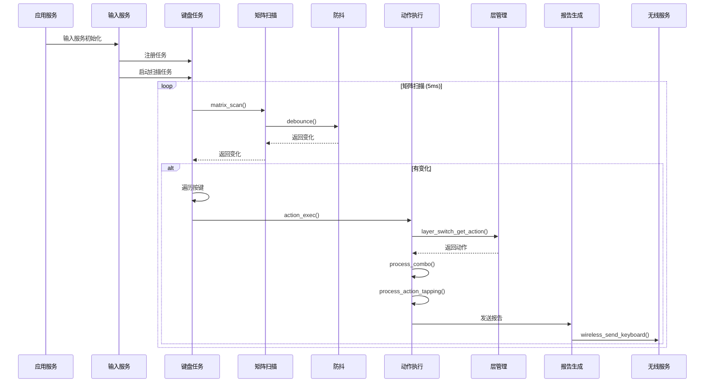

### 6.3 事件处理调用链

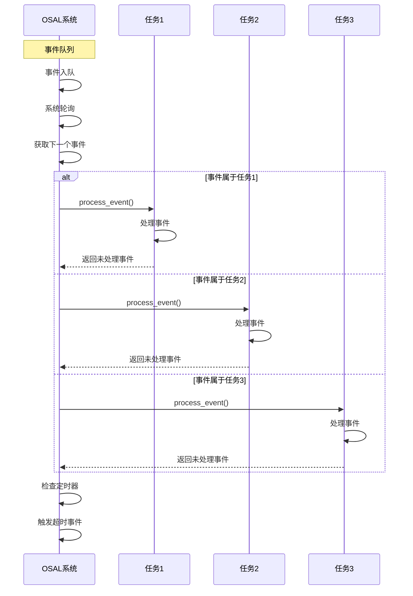

---

## 7. 初始化流程

### 7.1 系统初始化流程图

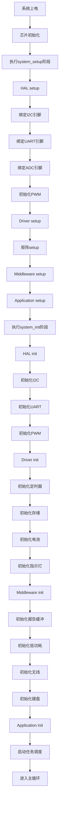

### 7.2 分层初始化顺序

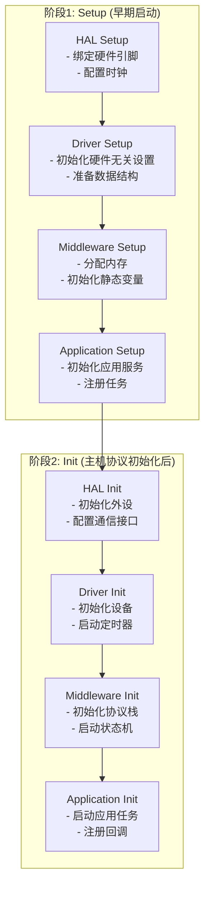

---

## 8. 按键处理流程

### 8.1 完整按键流程

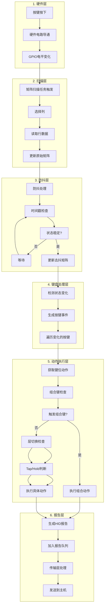

### 8.2 组合键处理流程

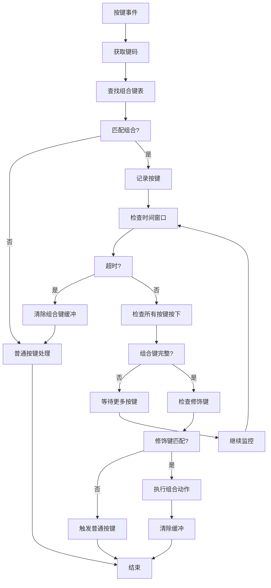

---

## 9. 通信流程

### 9.1 三模式切换流程

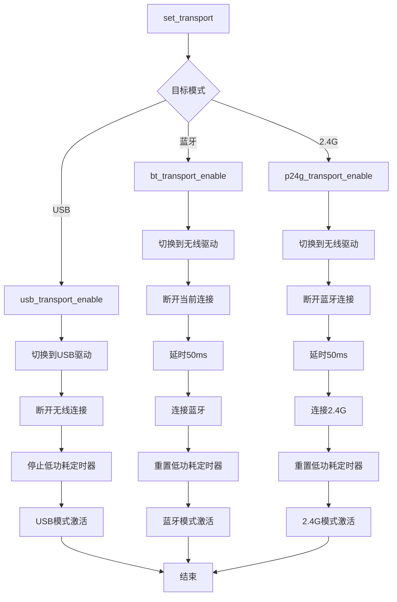

### 9.2 蓝牙配对流程

```mermaid
sequenceDiagram
    participant U as 用户
    participant K as 键盘
    participant BT as 蓝牙模块
    participant H as 主机

    U->>K: 按下配对键
    K->>BT: 发起配对请求
    BT->>K: 返回配对模式
    K->>K: 设置配对指示灯

    BT->>H: 广播可发现
    H->>BT: 扫描设备
    H->>BT: 选择键盘
    H->>BT: 发起配对

    BT->>K: 发送配对请求
    K->>K: 生成PIN码
    K->>H: 显示PIN码
    H->>BT: 输入PIN码
    BT->>K: 验证PIN码
    K->>BT: 确认配对

    BT->>K: 配对成功
    K->>K: 清除配对指示
    K->>K: 保存配对信息
    K->>K: 切换到已连接状态

    BT->>H: 建立连接
    H->>K: HID连接建立
    K->>K: 启用NKRO
```

### 9.3 报告发送流程

```mermaid
flowchart TD
    A[按键事件] --> B[生成报告]
    B --> C{无线状态}
    C -->|未连接| D[尝试重连]
    C -->|配对中| E{处于PIN输入?}
    C -->|已连接| F[允许发送]

    D --> G[启动重连定时器]
    G --> H[延时后重试]
    H --> A

    E -->|是| F
    E -->|否| I[丢弃报告]
    I --> J[结束]

    F --> K{启用报告缓冲?}
    K -->|是| L[入队]
    K -->|否| M[立即发送]

    L --> N[队列管理任务]
    N --> O[队列空?]
    O -->|是| P[等待]
    P --> N
    O -->|否| Q[检查发送间隔]
    Q --> R[间隔到?]
    R -->|否| S[等待]
    S --> N
    R -->|是| T[出队]
    T --> U[选择传输方式]
    U --> V[USB/蓝牙/2.4G]
    V --> W[发送报告]
    W --> X[发送成功?]
    X -->|是| Y[清除重试计数]
    X -->|否| Z[重试计数+1]
    Z --> AA[达到最大重试?]
    AA -->|否| BB[重新入队]
    AA -->|是| CC[丢弃报告]
    BB --> N
    CC --> Y
    Y --> DD[继续发送]
    DD --> N

    M --> EE[调用传输回调]
    EE --> FF[驱动发送]
    FF --> DD
```

---

## 10. 配置系统

### 10.1 配置层次结构

```mermaid
graph TD
    subgraph "产品配置 keyboards/product_config.h"
        A1[矩阵配置<br/>- 行数/列数<br/>- 引脚定义<br/>- 二极管方向]
        A2[USB配置<br/>- 设备描述符<br/>- 端点配置<br/>- 功耗设置]
        A3[功能配置<br/>- 组合键<br/>- Tap/Dance<br/>- 层配置]
    end

    subgraph "系统配置 application/sys_config.h"
        B1[芯片配置<br/>- 芯片型号<br/>- 时钟配置<br/>- 调试设置]
        B2[通信配置<br/>- USB开关<br/>- 蓝牙开关<br/>- 无线配置]
        B3[调试配置<br/>- 日志级别<br/>- 串口配置<br/>- 打印开关]
    end

    subgraph "驱动配置 drivers/*/*.h"
        C1[矩阵扫描<br/>- 扫描间隔<br/>- 输出延迟]
        C2[防抖<br/>- 防抖算法<br/>- 防抖延迟]
        C3[定时器<br/>- 系统时钟<br/>- 计数器宽度]
    end
```

### 10.2 配置继承关系

```mermaid
flowchart TD
    A[默认配置] --> B[驱动层配置]
    B --> C[产品层配置]
    C --> D[系统配置]
    D --> E[运行时配置]

    F[预处理器宏] --> B
    G[编译时定义] --> C
    H[EEPROM配置] --> E
    I[运行时API] --> E
```

### 10.3 关键配置项

#### 矩阵配置
```c
// 矩阵尺寸
#define MATRIX_ROWS 8
#define MATRIX_COLS 16

// 引脚定义 (使用宏定义引脚)
#define MATRIX_ROW_PINS { A4,A5,A6,A0,A1,A8,A9,B9 }
#define MATRIX_COL_PINS { B5,B8,B17,B16,B15,B14,B13,B12,B3,B4,B2,A7,B7,B18,B1,B6 }

// 二极管方向
#define DIODE_DIRECTION ROW2COL  // 或 COL2ROW

// 输入配置
#define MATRIX_INPUT_PRESSED_STATE 0  // 0=按下为低电平, 1=按下为高电平

// 扫描配置
#define MATRIX_SCAN_TIMER 5  // 扫描间隔 (ms)
#define MATRIX_IO_DELAY 30   // IO延迟 (us)
```

#### 防抖配置
```c
// 防抖算法选择
#define DEBOUNCE_ALGORITHM DEBOUNCE_SYM_DEFER_PK
// 可选值:
// - DEBOUNCE_NONE: 无防抖
// - DEBOUNCE_SYM_DEFER_PK: 对称延迟
// - DEBOUNCE_SYM_EAGER_PK: 对称急切
// - DEBOUNCE_ASYM_EAGER_DEFER_PK: 非对称

// 防抖延迟
#define DEBOUNCE_DELAY 5  // ms

// 最大行数
#define MAX_MATRIX_ROWS 16
```

#### 通信配置
```c
// USB配置
#define USB_ENABLE TRUE
#define USB_MAX_POWER_CONSUMPTION 500  // mA
#define USB_POLLING_INTERVAL_MS 10     // 轮询间隔

// 蓝牙配置
#define BLE_ENABLE TRUE
#define BLE_NAME "CH584M_BLE"
#define BLE_ADVERTISE_INTERVAL 1000    // 广播间隔 (ms)

// 2.4G配置
#define P2P4G_ENABLE TRUE
#define P2P4G_HOST_DEVICES_COUNT 1     // 支持的主机数量

// 传输模式开关
#define USB_ENABLE_FLAG FALSE
#define BLUETOOTH_ENABLE_FLAG TRUE
#define P2P4G_ENABLE_FLAG FALSE
```

#### 高级功能配置
```c
// Tap配置
#define TAPPING_TERM 200      // 点击判定时间 (ms)
#define TAPPING_TOGGLE 2      // 点击次数切换
#define QUICK_TAP_TERM 100    // 快速点击时间 (ms)

// Oneshot配置
#define ONESHOT_TIMEOUT 300   // 单次触发超时 (ms)
#define ONESHOT_TAP_TOGGLE 2  // 点击次数切换

// Combo配置
#define COMBO_TERM 200        // 组合键判定时间 (ms)
#define COMBO_MOD_TERM 200    // 组合修饰键时间 (ms)

// Leader配置
#define LEADER_TIMEOUT 300    // Leader键超时 (ms)
```

---

## 11. 平台适配

### 11.1 支持的平台

| 平台 | 芯片 | 特点 | 状态 |
|------|------|------|------|
| CH584 | WCH CH584M | 蓝牙5.0, USB, 低成本 | ✅ 已实现 |
| nRF52 | Nordic nRF52832/40 | 多协议, 强大BLE | 🔄 部分实现 |
| PixArt2860 | PixArt PAN2860 | 2.4G专用 | 🔄 部分实现 |
| Test | 仿真平台 | 调试测试 | ✅ 已实现 |

### 11.2 HAL层平台适配

```mermaid
graph TD
    subgraph "HAL接口层"
        H1[GPIO接口<br/>gpio.h]
        H2[I2C接口<br/>i2c_master.h]
        H3[UART接口<br/>uart.h]
        H4[PWM接口<br/>pwm.h]
        H5[ADC接口<br/>adc.h]
    end

    subgraph "平台实现层"
        P1[CH584平台]
        P2[nRF52平台]
        P3[PixArt2860平台]
        P4[Test平台]
    end

    P1 --> P1A[_gpio.c]
    P1 --> P1B[_i2c_master.c]
    P1 --> P1C[_uart.c]
    P1 --> P1D[_pwm.c]
    P1 --> P1E[_adc.c]

    P2 --> P2A[gpio_hal.h]
    P2 --> P2B[i2c_hal.h]
    P2 --> P2C[uart_hal.h]
    P2 --> P2D[pwm_hal.h]
    P2 --> P2E[adc_hal.h]

    P3 --> P3A[gpio_hal.h]
    P3 --> P3B[i2c_hal.h]
    P3 --> P3C[uart_hal.h]
    P3 --> P3D[pwm_hal.h]
    P3 --> P3E[adc_hal.h]

    P4 --> P4A[_gpio.c]
    P4 --> P4B[_i2c_master.c]
    P4 --> P4C[_uart.c]
    P4 --> P4D[_pwm.c]
    P4 --> P4E[_adc.c]

    H1 --> P1A
    H1 --> P2A
    H1 --> P3A
    H1 --> P4A

    H2 --> P1B
    H2 --> P2B
    H2 --> P3B
    H2 --> P4B
```

### 11.3 平台选择机制

```c
// 在sys_config.h中选择芯片
#define CHIP_TYPE CHIP_CH584M
// 或
// #define CHIP_TYPE CHIP_PAR2860

// 在CMakeLists.txt中根据芯片选择平台
if(CHIP_TYPE STREQUAL "CH584M")
    set(PLATFORM_DIR "ch584")
elseif(CHIP_TYPE STREQUAL "PAR2860")
    set(PLATFORM_DIR "pixart2860")
endif()

// 包含平台特定目录
target_include_directories(${PROJECT_NAME} PRIVATE
    ${CMAKE_CURRENT_SOURCE_DIR}/hal/platforms/${PLATFORM_DIR}
)
```

### 11.4 引脚映射机制

```mermaid
flowchart TD
    A[产品配置<br/>MATRIX_ROW_PINS] --> B[标准引脚编号<br/>A4, A5, B9...]
    B --> C[引脚映射函数<br/>GET_GPIO_PORT<br/>GET_GPIO_PIN]
    C --> D[HAL层实现<br/>platform_specific_gpio.c]
    D --> E[芯片寄存器操作<br/>GPIOA_ModeCfg<br/>GPIOB_SetBits]
```

---

## 总结

本键盘框架采用分层架构设计，具有以下特点：

1. **清晰的分层**: HAL → Driver → Middleware → Application，职责明确
2. **平台无关**: 通过HAL层抽象硬件差异，支持多平台
3. **事件驱动**: 采用事件队列和任务调度，响应及时
4. **模块化**: 每个模块职责单一，易于测试和维护
5. **可配置**: 通过配置文件适配不同产品和需求
6. **功能完整**: 涵盖输入、处理、通信、输出全流程

框架设计参考了QMK固件的架构思想，但在模块化、平台抽象、事件管理等方面进行了优化和增强，是一个现代化的嵌入式键盘框架解决方案。

---

*本文档版本: v1.0*
*最后更新: 2025-12-20*
