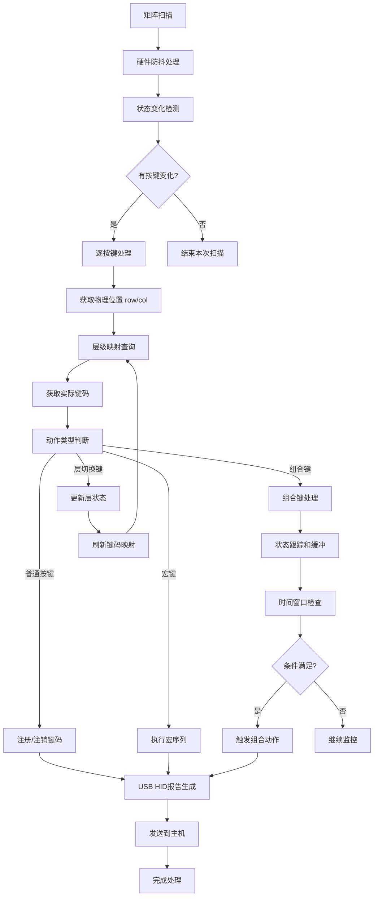
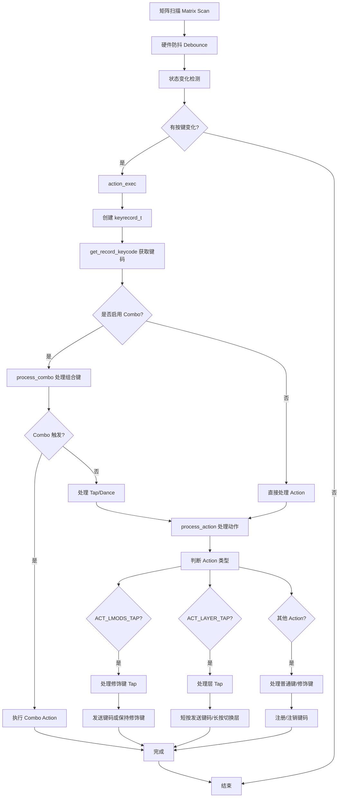

# CLAUDE.md

This file provides guidance to Claude Code (claude.ai/code) when working with code in this repository.

## Project Overview

This is a **modular keyboard framework** designed for multi-mode wireless keyboards and touchpads. It provides a cross-platform, layered architecture supporting multiple MCU platforms (PixArt 2860, WCH CH584, Nordic nRF52 series). The framework is inspired by QMK firmware's key processing pipeline and implements a clean separation of concerns through HAL (Hardware Abstraction Layer), driver, middleware, and application layers.

## Repository Structure

```
keyboard-framework/
├── hal/                        # Hardware Abstraction Layer
│   ├── interface/              # HAL interfaces (GPIO, ADC, PWM, I2C, UART, Timer, Power)
│   └── platforms/              # Platform-specific HAL implementations
├── drivers/                    # Device Drivers
│   ├── communication/          # BLE, USB, 2.4G wireless protocols
│   ├── input/                  # Keyboard matrix, touchpad, buttons
│   ├── output/                 # LEDs, backlight, indicators
│   ├── storage/                # EEPROM, Flash storage
│   ├── power/                  # Battery monitoring, power management
│   └── system/                 # Timers, watchdog, event management
├── middleware/                 # Middleware Services
│   ├── config/                 # Configuration management
│   ├── protocol/               # HID protocol processing
│   └── keyboard/               # Key mapping, combo handling
├── keyboards/                  # Product-specific configurations
├── application/                # Application layer
│   ├── main.c                  # Test application with Unity framework
│   ├── mode/                   # Operation/power/connection modes
│   └── service/                # Input/output/communication services
├── utils/                      # Utilities (ring buffer, CRC, logger)
└── test/                       # Test utilities and Unity framework
```

## Build System

### Configuration

- **CMake**: Minimum version 3.29
- **C Standard**: GNU C11
- **Build Generators**: Visual Studio 17 2022 or Ninja
- **Platform**: Windows (cross-platform support planned for HAL layer)

### Build Commands

```bash
# Create build directory
mkdir cmake-build-debug && cd cmake-build-debug

# Configure with Visual Studio (recommended on Windows)
cmake -G "Visual Studio 17 2022" ..

# Build the project
cmake --build .

# Or build with specific configuration
cmake --build . --config Debug

# Alternative: Use Ninja generator (requires Ninja)
cmake -G Ninja ..
ninja

# Clean rebuild
rm -rf cmake-build-debug
mkdir cmake-build-debug && cd cmake-build-debug
cmake -G "Visual Studio 17 2022" ..
cmake --build .
```

### CMake Configuration Key Points

- Source files are automatically discovered via `file(GLOB_RECURSE)` from drivers/, middleware/, and utils/
- The main executable is built from `main.c` which contains Unity-based unit tests
- Include paths configured for all major directories (drivers, hal, middleware, keyboards, utils)

## Key Components

### 1. Matrix Scanning (`drivers/input/keyboard/matrix.c`)

- Core matrix scanning implementation supporting COL2ROW and ROW2COL diode directions
- Platform-agnostic implementation with GPIO abstraction
- Reads key states row-by-row or column-by-column depending on hardware configuration
- Integrates with debounce module for signal filtering

### 2. Debounce System (`drivers/input/keyboard/debounce.c`)

- Multiple debounce algorithms: sym_defer_pk, sym_eager_pk, asym_eager_defer_pk
- Per-key, per-row, and global tracking options
- Configurable debounce timing via `DEBOUNCE` macro
- Provides clean key state transitions

### 3. GPIO HAL (`hal/gpio.h`)

- Abstract GPIO interface with functions:
  - `gpio_set_pin_input/output_push_pull/output_open_drain`
  - `gpio_write_pin_high/low`
  - `gpio_read_pin`
  - `gpio_toggle_pin`
- Platform-specific implementations in `hal/platforms/${PLATFORM}/`

### 4. Product Configuration (`keyboards/product_config.h`)

- Matrix configuration (rows, cols, pins, diode direction)
- USB and BLE parameters
- Feature toggles (tap, combo, leader key configurations)
- Pin definitions and IO settings

### 5. System Configuration (`application/sys_config.h`)

- Chip type selection (CH584M, PAR2860)
- Debug/logging configuration with levels (ASSERT, DEBUG, INFO, WARN, ERROR, VERBOSE)
- Feature enables (USB, BLE)
- Platform UART configuration for logging

## Testing Framework

The project uses a **custom Unity-based testing framework** integrated in `main.c`:

### Test Structure

- `RUN_TEST(test_func)` - Macro to execute tests with setup/teardown
- `TEST_ASSERT_TRUE/FALSE/EQUAL/EQUAL_HEX16` - Assertion macros
- `setUp()` / `tearDown()` - Test initialization/cleanup hooks

### Available Tests (in main.c)

1. `test_matrix_scan_basic` - Basic matrix scanning functionality
2. `test_matrix_multiple_keys_scan` - Multiple simultaneous key presses
3. `test_matrix_scan_sequence` - Key press/release sequences
4. `test_matrix_is_on` - Individual key state checking
5. `test_matrix_row_boundaries` - Boundary condition testing

### Running Tests

```bash
# Build and run tests
cd cmake-build-debug
cmake --build .
.\Debug\keyboard_framework.exe

# Or from project root
.\cmake-build-debug\Debug\keyboard_framework.exe
```

Test output includes:

- Test execution counter
- Pass/fail counts
- Detailed failure messages with file and line numbers

## Configuration Options

### Matrix Configuration (keyboards/product_config.h)

- `MATRIX_ROWS`, `MATRIX_COLS` - Matrix dimensions
- `MATRIX_ROW_PINS`, `MATRIX_COL_PINS` - GPIO pin assignments
- `DIODE_DIRECTION` - COL2ROW or ROW2COL
- `MATRIX_INPUT_PRESSED_STATE` - Active low/high configuration

### Debounce Configuration

- `DEBOUNCE` - Debounce delay in milliseconds
- `DEBOUNCE_ALGORITHM` - Algorithm selection (DEBOUNCE_SYM_DEFER_PK, etc.)
- `MAX_MATRIX_ROWS` - Maximum supported rows

### Platform Features (application/sys_config.h)

- `CHIP_TYPE` - Target MCU (CH584M, PAR2860)
- `USB_ENABLE` - Enable USB HID support
- `BLE_ENABLE` - Enable Bluetooth support
- `PRINTF_LEVEL` - Debug logging verbosity

## Development Workflow

### Adding New Features

1. **Hardware abstraction**: Add platform-specific code to `hal/platforms/${PLATFORM}/`
2. **Drivers**: Implement device drivers in `drivers/` following the existing pattern
3. **Product config**: Define hardware-specific settings in `keyboards/product_config.h`
4. **Testing**: Add unit tests to `main.c` using the provided macros

### Platform Porting

1. Create platform directory: `hal/platforms/${PLATFORM_NAME}/`
2. Implement GPIO and other HAL interfaces
3. Update `CMakeLists.txt` to include platform-specific source files
4. Configure product settings in `keyboards/product_config.h`

### Code Style

- Follow QMK coding conventions (see `code_example/qmk_firmware/docs/coding_conventions_c.md`)
- Use `#pragma once` for header guards
- Prefix platform-specific functions with platform name or use HAL abstraction
- Document all public APIs with Doxygen-style comments

## Current Status

### Implemented

- Matrix scanning core logic
- Debounce system with multiple algorithms
- GPIO abstraction layer interface
- Unity-based test framework
- Basic build system with CMake

### In Progress / Planned

- Platform-specific HAL implementations
- Communication stack (BLE, USB, 2.4G)
- Touchpad driver integration
- Power management system
- Event management framework

## Common Tasks

### Modify Matrix Configuration

Edit `keyboards/product_config.h`:

```c
#define MATRIX_ROWS 6
#define MATRIX_COLS 13
#define MATRIX_ROW_PINS { 0, 1, 2, 3, 4, 5 }
#define MATRIX_COL_PINS { 6, 7, 8, 9, 10, 11, 12, 13, 14, 15, 16, 17, 18 }
```

### Add New Test Case

In `main.c`, add a new test function:

```c
void test_my_feature(void) {
    printf("Testing my feature...\n");
    // Test implementation
    TEST_ASSERT_TRUE(condition);
}

int main(void) {
    // ...
    RUN_TEST(test_my_feature);
    // ...
}
```

### Debug Logging

Enable debug output by setting appropriate level in `application/sys_config.h`:

```c
#define PRINTF_LEVEL PRINTF_LEVEL_DEBUG
```

Use logging macros (defined in logger.h when implemented):

```c
LOG_DEBUG("Matrix scan changed: %d", changed);
LOG_INFO("Battery level: %d%%", battery_level);
```

## Troubleshooting

### Build Errors

- **Character encoding**: Files contain UTF-8 Chinese comments - ensure editor preserves encoding
- **Missing platform files**: Platform-specific HAL files may be missing
- **Linker errors**: Verify all source files are included in CMakeLists.txt

### Runtime Issues

- **Matrix scan not working**: Check pin definitions in product_config.h
- **Debounce issues**: Verify DEBOUNCE algorithm and timing settings
- **Test failures**: Check TEST_ASSERT statements and expected vs actual values

### Platform-Specific Issues

- **GPIO not responding**: Verify HAL implementation for your platform
- **Compilation errors**: Check C standard (-std=gnu11) and include paths

## Process

### 1.按键流程






