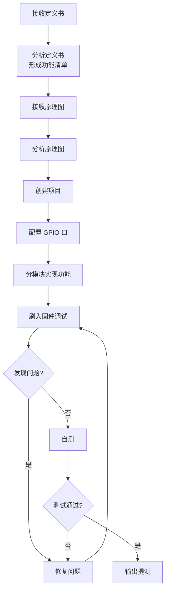
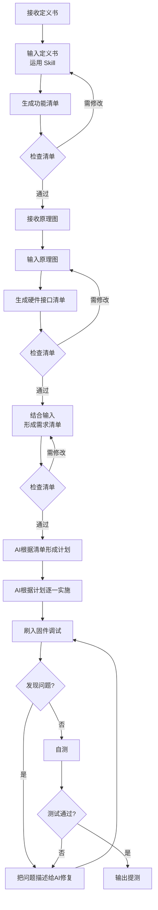

# Claude Code 使用分享

> 本次我将分享个人在 AI 编程实践中的一些方法和心得，希望能帮助大家更高效地使用 AI 工具。

## 一、开场引入

### 开场提问

> "大家平时写代码遇到问题，第一反应是什么？"
>
> - 搜索引擎查资料？
> - 问 ChatGPT？
> - 翻看旧代码找参考？
>
> "如果有一个工具，能**读懂你整个项目**，直接帮你改代码，你愿意试试吗？"

### 分享背景

- **分享主题**：Claude Code —— AI 编程协作工具实战

### 为什么聊这个话题

| 现状痛点 | AI 编程的价值 |
|---------|--------------|
| 重复性代码写到手软 | 让 AI 处理模板化工作 |
| 理解旧项目耗时长 | AI 快速分析项目结构 |
| Debug 靠经验和直觉 | AI 辅助定位问题根因 |
| 文档和注释总是滞后 | AI 自动生成技术文档 |

> **核心观点**：AI 编程不是取代程序员，而是**放大程序员的能力**。

### 今天的分享大纲

```
┌─────────────────────────────────────────────────────┐
│  1. Claude Code 概述        （是什么、能做什么）     │
├─────────────────────────────────────────────────────┤
│  2. 核心功能详解            （命令、技能、插件）     │
├─────────────────────────────────────────────────────┤
│  3. 实战演练                （键盘固件开发案例）     │
└─────────────────────────────────────────────────────┘
```

### 你将收获

- 了解 Claude Code 与其他 AI 编程工具的区别
- 掌握核心命令和工作流
- 学会用 Skill/Plugin 定制你的 AI 助手
- 获得一套可复用的 AI 辅助开发流程

## 二、Claude Code 概述

### 什么是 Claude Code

Claude Code 是 Anthropic 推出的面向开发者的 **AI 编程协作工具**。与在聊天窗口里写几段代码不同，Claude Code 的核心目标是**理解你的整个项目**，并参与到真实的编码、修改和重构过程中。

> **Claude Code 不是代码生成器，而是一个能读项目、懂上下文、遵守约束的 AI 编程搭档。**

简单说：Claude Code 是 Claude 的命令行版本，专门为编程场景设计。它直接在终端运行，可以：

- **读取整个项目代码**：不只是单个文件，而是理解文件之间的关系
- **直接修改代码文件**：不是给建议让你手动改，而是帮你实际修改
- **执行工程级任务**：重构、测试、Debug、架构分析
- **遵守你的规则**：通过 Skills（技能包）让 AI 按你的方式工作

### 三大核心特征

| 特征           | 说明                                                       |
| -------------- | ---------------------------------------------------------- |
| **上下文感知** | 不仅理解单个文件，而是理解整个项目结构、依赖关系、调用链路 |
| **工程化导向** | 关注可维护性、代码规范、测试覆盖，而不是一次性代码         |
| **可定制行为** | 通过 Skills 和 CLAUDE.md 让 AI 遵守你的团队规则和编码习惯  |

### 核心理念：协作，而非替代

Claude Code 的设计理念非常明确——**人机协作**：

- **人负责**：目标、约束、判断、最终决策
- **AI 负责**：执行、分析、对比、重复劳动

> 成熟的使用心态是：让 Claude Code 提供高质量候选方案，而不是绝对正确答案。

### 与其他工具的区别

| 工具               | 定位       | 工作方式                                 |
| ------------------ | ---------- | ---------------------------------------- |
| **ChatGPT**        | 通用顾问   | 网页聊天，需手动粘贴代码，给建议你手动改 |
| **Copilot/Cursor** | 智能输入法 | 编辑器内实时补全，边写边提示             |
| **Claude Code**    | 编程搭档   | 命令行对话，理解整个项目，直接修改代码   |

**Claude Code 的优势**：
- 对整个项目的理解能力更强
- 可通过 Skills 定制行为
- 更适合理解旧代码、大规模重构等场景

**Claude Code 的局限**：
- 需要主动调用（不如 Copilot 无感）
- 学习曲线稍高

### 能做什么

| 能力           | 示例                                                    |
| -------------- | ------------------------------------------------------- |
| **代码理解**   | "这个函数是干什么的？" "为什么这里报错？"               |
| **多文件分析** | "这个函数在哪些地方被调用了？" "整个项目架构是怎样的？" |
| **工程级修改** | "把所有 var 改成 let" "给所有接口加上错误处理"          |
| **重构优化**   | "把这个函数拆成三个小函数" "提取公共逻辑"               |
| **测试生成**   | "给这个模块生成单元测试"                                |

### 不能做什么

- 不能替你做技术决策的最终判断
- 不能保证生成代码 100% 无 Bug
- 不能理解你没有明确说明的业务语义
- 不适合在你完全不理解的情况下全自动接管项目

### 适用人群

| 人群           | 价值                                                 |
| -------------- | ---------------------------------------------------- |
| **编程新手**   | 用人话解释代码、帮你 Debug、教你写更好的代码         |
| **独立开发者** | 快速理解第三方库、自动生成测试、重构混乱代码         |
| **团队开发**   | 通过 Skills 统一规范、帮新人理解项目、提交前检查质量 |
| **技术负责人** | 用 AI 辅助团队规范落地、降低新人培养成本             |

### 典型场景

| 场景       | 说明                   |
| ---------- | ---------------------- |
| 项目初始化 | 快速理解新项目代码结构 |
| 代码重构   | 大规模代码改动和优化   |
| Bug 修复   | 定位问题并自动修复     |
| 功能开发   | 根据需求编写新功能     |
| 代码审查   | 检查代码质量和潜在问题 |
| 文档生成   | 自动生成技术文档       |

## 三、功能详解

### 核心命令

#### `/init` - 项目初始化

#### 介绍

`/init` 命令让 Claude Code 全面扫描并理解项目，生成项目知识库文件。

#### 作用

- 自动遍历所有代码文件
- 分析项目结构和技术栈
- 生成 `CLAUDE.md` 知识文件
- 为后续对话建立上下文基础

#### 实战

```bash
# 进入项目目录后执行
> /init

# Claude Code 会：
# 1. 扫描所有源代码文件
# 2. 识别框架、依赖、配置
# 3. 理解代码组织结构
# 4. 生成项目说明文档
```

**生成的 CLAUDE.md 示例**：

```markdown
# Project Overview
This is a React + TypeScript web application...

## Tech Stack
- Frontend: React 18, TypeScript, Tailwind CSS
- State: Redux Toolkit
- Build: Vite

## Key Files
- src/App.tsx - 主入口组件
- src/store/ - Redux 状态管理
...
```

---

#### `/compact` - 上下文压缩

##### 介绍

在长时间对话后，上下文会变得臃肿，`/compact` 可以智能压缩历史记录。

##### 作用

- **提高 AI 专注力**：减少无关信息干扰
- **降低 Token 消耗**：节省 API 调用成本
- **保持核心记忆**：关键信息不丢失

##### 实战

```bash
# 当对话变长时执行
> /compact

# 或指定保留的重点
> /compact 保留关于数据库设计的讨论
```

**使用时机**：
- 对话超过 50 轮时
- 切换到新子任务时
- 感觉 AI 回复质量下降时

---

##### `/clear` - 清除对话

##### 介绍

完全清除当前对话记录，开始全新会话。

##### 作用

- 清空所有对话历史
- 重置 AI 状态
- 适合开始全新任务

##### 实战

```bash
# 完成一个任务后，开始新任务
> /clear

# 注意：项目知识（CLAUDE.md）会保留
```

**与 `/compact` 的区别**：

| 命令       | 效果               | 适用场景     |
| ---------- | ------------------ | ------------ |
| `/compact` | 压缩但保留关键信息 | 继续当前任务 |
| `/clear`   | 完全清空           | 开始新任务   |

---

#### `/ide` - IDE 集成

##### 介绍

`/ide` 命令将 Claude Code 与 VS Code 等 IDE 打通，实现深度集成。

##### 作用

- **代码感知**：AI 能看到 IDE 中的诊断信息
- **差异对比**：代码修改以 diff 形式展示
- **快速跳转**：支持点击跳转到代码位置
- **错误同步**：IDE 中的语法错误自动传递给 AI

##### 实战

**安装 VS Code 扩展**：

1. 在 VS Code 中搜索 "Claude Code"
2. 安装官方扩展
3. 在 Claude Code 中执行：

```bash
> /ide
# 选择 VS Code 进行连接
```

**集成后的工作流**：

```bash
# Claude Code 修改代码后
> 修改 src/utils.ts 添加防抖函数

# VS Code 中会显示：
# - 代码差异高亮
# - 左侧显示原代码，右侧显示新代码
# - 可以逐个接受或拒绝改动
```
---

#### 思考模式 - `think` / `think hard`

##### 介绍

通过特定关键词触发 AI 进行更深度的思考，这是官方支持的功能。

##### 作用

- 增加 AI 推理链长度
- 处理复杂问题时获得更好答案
- 减少 AI "偷懒" 的情况

##### 实战

```bash
# 简单问题
> 解释这个函数的作用

# 复杂问题 - 使用 think
> think 分析这个模块的设计模式是否合理

# 更复杂问题 - 使用 think hard
> think hard 重构这个支付模块，需要考虑并发、幂等性、错误恢复
```

**思考强度级别**：

| 关键词       | 思考深度 | 适用场景   |
| ------------ | -------- | ---------- |
| (无)         | 标准     | 简单查询   |
| `think`      | 深入     | 设计决策   |
| `think hard` | 最深     | 架构规划   |
| `ultrathink` | 极限     | 极复杂问题 |

---

#### `!` - 命令行模式

##### 介绍

使用叹号 `!` 前缀可以临时切换到命令行模式，执行 shell 命令。

##### 作用

- 快速执行系统命令
- 命令结果自动加入 AI 上下文
- 无需退出 Claude Code

##### 实战

```bash
# 查看 git 状态
> !git status

# 运行测试
> !npm test

# 查看文件内容
> !cat package.json

# 执行后 Claude Code 会分析结果并继续对话
```

**实际场景**：

```bash
> !npm run build
# 输出: Error: Cannot find module 'lodash'

> 帮我修复这个构建错误
# Claude Code 已经知道错误内容，直接给出解决方案
```

---

### 高级功能

#### Sub Agent - 并行子任务

##### 介绍

Sub Agent 允许 Claude Code 创建多个子任务并行执行，类似多线程处理。

##### 作用

- 同时处理多个独立任务
- 提高复杂任务执行效率
- 每个子任务有独立上下文

##### 实战

```bash
# 查看可用的 Agent 类型
> /agents

# 创建并行任务示例
> 并行执行以下任务：
> 1. 分析 src/api/ 目录的代码质量
> 2. 检查 src/components/ 的组件结构
> 3. 审查 src/utils/ 的工具函数

# Claude Code 会创建 3 个 Sub Agent 同时工作
```

**Agent 类型说明**：

| Agent 类型      | 用途           |
| --------------- | -------------- |
| Explore         | 快速探索代码库 |
| Plan            | 制定实施计划   |
| Bash            | 执行命令行任务 |
| general-purpose | 通用任务处理   |

---

### MCP 模型上下文协议

#### 介绍

MCP (Model Context Protocol) 是 AI 与外部工具交互的标准协议，作为中间层连接 Claude Code 和各种服务。

#### 作用

- 扩展 AI 能力边界
- 连接外部数据源
- 调用第三方服务
- 实现自动化工作流

#### 安装 MCP Server

```bash
# 查看已安装的 MCP
claude mcp list

# 安装 MCP server
claude mcp add --header "CONTEXT7_API_KEY: ctx7sk-d68c1231-c854-4aa0-9070-e02ec41c2167" --transport http context7 https://mcp.context7.com/mcp

# 选择安装级别
# - Project: 仅当前项目可用
# - User: 所有项目可用
```

#### 实战：使用 [Context7 MCP](https://github.com/upstash/context7) 查询最新文档

```bash
查询context7最新的API 文档


```

#### 删除 MCP Server

```bash
> claude mcp remove context7
```

#### 远程 MCP Server

MCP 支持通过网络协议远程调用：

```bash
# SSE 协议
> claude mcp add --transport sse https://your-mcp-server.com/sse

# Streamable HTTP 协议
> claude mcp add --transport http https://your-mcp-server.com/mcp
```

**应用场景**：
- 团队共享的 MCP 服务
- 需要认证的企业内部服务
- 资源密集型任务外包到服务器

---

### Skill 技能系统

#### 介绍

Skill（技能）是 Claude Code 提供的可复用工作流模块，通过 `/skill-name` 格式调用。每个 Skill 封装了特定领域的专业知识和操作流程，让 Claude Code 能够以标准化方式处理复杂任务。

#### 作用

- **标准化工作流**：将常见任务封装为可重复使用的流程
- **专业领域知识**：每个 Skill 包含特定领域的最佳实践
- **提高效率**：一键触发复杂操作序列
- **团队协作**：共享标准化的开发流程

#### 内置 Skill 类型

| Skill 类型            | 用途               | 调用方式               |
| --------------------- | ------------------ | ---------------------- |
| `feature-planning`    | 功能规划与任务分解 | `/feature-planning`    |
| `git-pushing`         | Git 提交与推送     | `/git-pushing`         |
| `review-implementing` | 处理代码审查反馈   | `/review-implementing` |
| `test-fixing`         | 修复失败测试       | `/test-fixing`         |
| `skill-creator`       | 创建新 Skill       | `/skill-creator`       |

#### 实战

##### 示例 1：功能规划

```bash
# 将功能需求分解为可执行的任务计划
> /feature-planning 实现用户认证系统

# Claude Code 会：
# 1. 分析需求
# 2. 分解为具体任务
# 3. 生成实施计划
# 4. 标识依赖关系
```

##### 示例 2：Git 提交流程

```bash
# 自动化 Git 提交流程
> /git-pushing

# Claude Code 会：
# 1. 检查文件变更
# 2. 生成规范的提交信息
# 3. 执行 commit 和 push
```

##### 示例 3：修复测试

```bash
# 运行测试并修复失败用例
> /test-fixing

# Claude Code 会：
# 1. 运行测试套件
# 2. 分析失败原因
# 3. 按错误类型分组
# 4. 系统性修复问题
```

#### 创建自定义 Skill

Skill 通过 `SKILL.md` 文件定义，存放在项目的 `.claude/skills/` 目录下。

##### 文件结构

```
.claude/
└── skills/
    └── my-skill/
        └── SKILL.md
```

##### SKILL.md 格式

```markdown
---
name: my-skill
description: 我的自定义技能描述
---

# 技能指令

当用户调用此技能时，请执行以下操作：

1. 第一步操作说明
2. 第二步操作说明
3. ...

## 输入参数

- `$ARGUMENTS` - 用户提供的参数

## 输出要求

- 输出格式要求
- 必须包含的内容
```

##### 实战：创建代码审查 Skill

```bash
# 使用内置的 skill-creator 创建新 Skill
> /skill-creator

# 或手动创建 .claude/skills/code-review/SKILL.md：
```

```markdown
---
name: code-review
description: 执行全面的代码审查
---

# 代码审查技能

请对指定的代码文件进行全面审查：

## 审查维度

1. **代码质量**：可读性、命名规范、代码结构
2. **潜在问题**：Bug、边界条件、错误处理
3. **性能考虑**：算法效率、资源使用
4. **安全性**：输入验证、敏感数据处理
5. **可维护性**：注释、模块化、测试覆盖

## 输出格式

### 严重问题
- [问题描述及修复建议]

### 改进建议
- [优化建议]

### 良好实践
- [值得肯定的代码]

审查目标：$ARGUMENTS
```

**使用自定义 Skill**：

```bash
> /code-review src/utils/payment.ts
```

#### 查看可用 Skill

```bash
# 查看所有可用的 Skill
> /help

# Skill 会显示在可用命令列表中
```

#### Skill vs 自定义命令

| 特性     | Skill                 | 自定义命令          |
| -------- | --------------------- | ------------------- |
| 存放位置 | `.claude/skills/`     | `.claude/commands/` |
| 复杂度   | 支持多步骤工作流      | 简单提示模板        |
| 元数据   | 支持 YAML frontmatter | 纯 Markdown         |
| 工具访问 | 可指定工具权限        | 继承默认权限        |
| 适用场景 | 复杂自动化流程        | 快速提示封装        |

---

### Plugin 插件系统

#### 介绍

Plugin（插件）是 Claude Code 中**最高级别的扩展机制**，用于将命令、代理、Skills、钩子、MCP 等能力**打包、版本化、共享和分发**。

> **插件 = 一组可复用的 Claude Code 扩展能力集合**

一个插件可以包含：
- 斜杠命令（Slash Commands）
- 子代理（Agents）
- Skills（能力说明）
- Hooks（事件钩子）
- MCP 服务器（外部工具/服务）

#### 插件 vs 独立配置

| 方式                          | 命令形式             | 适合场景                   |
| ----------------------------- | -------------------- | -------------------------- |
| **独立配置**（`.claude/`）    | `/hello`             | 个人使用、单项目、快速实验 |
| **插件**（`.claude-plugin/`） | `/plugin-name:hello` | 团队共享、跨项目、版本化   |

**最佳实践**：先在 `.claude/` 中迭代 → 稳定后打包为插件

#### 插件管理命令

```bash
# 打开插件管理器
> /plugin

# 安装插件
> /plugin install plugin-name@marketplace

# 卸载插件
> /plugin uninstall plugin-name

# 启用/禁用插件
> /plugin enable plugin-name
> /plugin disable plugin-name

# 管理插件市场
> /plugin marketplace add <url>
> /plugin marketplace rm <name>
```

#### 安装插件

##### 方式一：从官方市场安装

```bash
# 打开插件管理器，选择 Discover
> /plugin

# 或直接安装指定插件
> /plugin install plugin-name@claude-plugins-official

> /plugin marketplace add obra/superpowers-marketplace
```

##### 方式二：本地开发测试

```bash
# 使用 --plugin-dir 加载本地插件目录
claude --plugin-dir ./my-plugin

# 同时加载多个插件
claude --plugin-dir ./plugin-a --plugin-dir ./plugin-b
```

#### 插件安装范围

| 范围         | 说明                   | 适用场景     |
| ------------ | ---------------------- | ------------ |
| **用户范围** | 仅你自己，所有项目可用 | 个人效率工具 |
| **项目范围** | 当前仓库，团队共享     | 团队工具     |
| **本地范围** | 当前仓库，仅你可用     | 个人项目配置 |

#### 创建插件

##### 插件目录结构

```
my-plugin/
├── .claude-plugin/
│   └── plugin.json     # 插件清单（必需）
├── commands/           # 斜杠命令
├── agents/             # 子代理
├── skills/             # Skills
├── hooks/              # 钩子
└── .mcp.json           # MCP 配置
```

##### plugin.json 示例

```json
{
  "name": "my-plugin",
  "description": "我的自定义插件",
  "version": "1.0.0",
  "author": { "name": "Your Name" }
}
```

| 字段          | 作用                    |
| ------------- | ----------------------- |
| `name`        | 唯一标识 + 命令命名空间 |
| `description` | 插件市场中展示          |
| `version`     | 语义化版本控制          |
| `author`      | 归属说明（可选）        |

##### 添加斜杠命令

在 `commands/` 目录创建 Markdown 文件：

```markdown
# commands/hello.md
---
description: 向用户打招呼
---

向用户 "$ARGUMENTS" 热情打招呼，并询问有什么可以帮助的。
```

**使用命令**：

```bash
> /my-plugin:hello 张三
```

#### 典型插件分类

| 类型           | 用途               | 示例                   |
| -------------- | ------------------ | ---------------------- |
| **代码智能**   | 跳转定义、类型检查 | TypeScript、Python LSP |
| **外部集成**   | 连接第三方服务     | GitHub、Jira、Notion   |
| **开发工作流** | 自动化流程         | Git 提交、代码审查     |

#### 从 `.claude/` 迁移到插件

| 原配置位置            | 插件位置                  |
| --------------------- | ------------------------- |
| `.claude/commands/`   | `plugin/commands/`        |
| `.claude/agents/`     | `plugin/agents/`          |
| `.claude/skills/`     | `plugin/skills/`          |
| `settings.json hooks` | `plugin/hooks/hooks.json` |

**何时需要迁移**：
- 你在反复复制 `.claude/` 配置
- 团队成员问你"这个怎么配置？"
- 需要版本控制、升级、回滚

---

### 权限与安全

#### `/permissions` - 权限管理

##### 介绍

控制 Claude Code 可以执行哪些操作，保护系统安全。

##### 作用

- 限制文件访问范围
- 控制命令执行权限
- 管理 MCP 调用权限

##### 实战

```bash
# 查看当前权限设置
> /permissions

# 添加允许规则
> /permissions allow "Bash(npm *)"  # 允许所有 npm 命令
> /permissions allow "Read(src/*)"   # 允许读取 src 目录

# 添加禁止规则
> /permissions deny "Bash(rm -rf *)" # 禁止危险删除
> /permissions deny "Write(.env)"     # 禁止修改环境变量
```

**权限规则格式**：

```
Tool(pattern)
```

| Tool  | 说明       | 示例            |
| ----- | ---------- | --------------- |
| Bash  | Shell 命令 | `Bash(git *)`   |
| Read  | 读取文件   | `Read(*.ts)`    |
| Write | 写入文件   | `Write(src/*)`  |
| Edit  | 编辑文件   | `Edit(*.md)`    |
| MCP   | MCP 调用   | `MCP(context7)` |

#### 最高权限模式

**警告**：仅在完全信任的环境中使用！

```bash
# 启动时赋予最高权限
claude --dangerously-allow-permissions

# 此模式下 Claude Code 可以：
# - 执行任何命令
# - 读写任何文件
# - 调用任何 MCP
```

---

### 自定义扩展

#### 自定义命令

##### 介绍

创建自己的快捷命令，封装常用操作。

##### 创建方法

在 `.claude/commands/` 目录下创建文件，文件名即为命令名：

```bash
# 创建命令目录
mkdir -p .claude/commands

# 创建自定义命令
touch .claude/commands/review.md
```

##### 实战

**创建代码审查命令** (`.claude/commands/review.md`)：

```markdown
# Code Review Command

请对以下代码进行全面审查：

## 审查要点
1. 代码规范性
2. 潜在 Bug
3. 性能问题
4. 安全隐患
5. 可维护性

## 输出格式
- 严重问题
- 建议改进
- 良好实践

请审查：$ARGUMENTS
```

**使用自定义命令**：

```bash
> /review src/utils/payment.ts
```

#### Hook 机制

##### 介绍

Hook 让 Claude Code 在特定事件节点自动执行操作。

##### 作用

- 自动格式化代码
- 运行 lint 检查
- 执行测试
- 触发构建

##### 配置方法

在 `.claude/settings.json` 中配置：

```json
{
  "hooks": {
    "PreToolUse": [
      {
        "matcher": "Write|Edit",
        "command": "echo 'About to modify files...'"
      }
    ],
    "PostToolUse": [
      {
        "matcher": "Write|Edit",
        "command": "npx prettier --write $FILE"
      }
    ],
    "Notification": [
      {
        "matcher": ".*",
        "command": "notify-send 'Claude Code' '$MESSAGE'"
      }
    ]
  }
}
```

##### 实战：自动格式化

```json
{
  "hooks": {
    "PostToolUse": [
      {
        "matcher": "Write|Edit",
        "command": "npx prettier --check $FILE && npx eslint $FILE"
      }
    ]
  }
}
```

**Hook 事件类型**：

| 事件         | 触发时机   |
| ------------ | ---------- |
| PreToolUse   | 工具执行前 |
| PostToolUse  | 工具执行后 |
| Notification | 通知消息时 |
| Stop         | 任务停止时 |

---


### 历史与导出

#### `/resume` - 恢复历史对话

##### 介绍

找回之前的对话记录，继续未完成的任务。

##### 实战

```bash
# 查看历史对话列表
> /resume

# 会显示类似：
# 1. [2024-01-15] 重构支付模块
# 2. [2024-01-14] 修复登录 Bug
# 3. [2024-01-13] 添加单元测试

# 按 ESC 可以快速跳转到具体对话
```

#### `cc-undo` - 回退操作

```bash
# 回退到上一步
> cc-undo

# 回退多步
> cc-undo 3
```

**注意**：`cc-undo` 不仅回退对话，还会回退代码改动。

#### `/export` - 导出对话

##### 介绍

将对话内容导出，用于保存或分享。

##### 实战

```bash
# 导出为 Markdown
> /export

# 导出后可以：
# - 保存为文档
# - 发送给团队成员
# - 用其他 AI 验证结果
```

---

### 最佳实践总结

#### 命令速查表

| 命令/操作              | 用途          | 示例                           |
| ---------------------- | ------------- | ------------------------------ |
| `/init`                | 初始化项目    | `/init`                        |
| `/compact`             | 压缩上下文    | `/compact`                     |
| `/clear`               | 清除对话      | `/clear`                       |
| `think`                | 深度思考      | `think 分析架构`               |
| `!`                    | 执行命令      | `!git status`                  |
| `#`                    | 记录记忆      | `# 使用4空格缩进`              |
| `/ide`                 | IDE集成       | `/ide`                         |
| `/agents`              | 子任务        | `/agents`                      |
| `/permissions`         | 权限管理      | `/permissions`                 |
| `/resume`              | 恢复对话      | `/resume`                      |
| `/export`              | 导出对话      | `/export`                      |
| `claude mcp add`       | 添加MCP       | `claude mcp add context7`      |
| `claude mcp list`      | 查看已安装MCP | `claude mcp list`              |
| `claude mcp remove`    | 删除MCP       | `claude mcp remove context7`   |
| `claude -p`            | 非交互模式    | `claude -p "问题"`             |
| `/feature-planning`    | 功能规划      | `/feature-planning 实现登录`   |
| `/git-pushing`         | Git提交推送   | `/git-pushing`                 |
| `/test-fixing`         | 修复测试      | `/test-fixing`                 |
| `/skill-creator`       | 创建新Skill   | `/skill-creator`               |
| `/review-implementing` | 处理审查反馈  | `/review-implementing`         |
| `/plugin`              | 插件管理器    | `/plugin`                      |
| `/plugin install`      | 安装插件      | `/plugin install name@market`  |
| `/plugin uninstall`    | 卸载插件      | `/plugin uninstall name`       |
| `--plugin-dir`         | 加载本地插件  | `claude --plugin-dir ./plugin` |

#### 工作流建议

##### 新项目启动

```bash
cd your-project
claude
> /init
> # 记录项目规范和偏好
```

##### 日常开发

```bash
# 1. 恢复昨天的对话（如需要）
> /resume

# 2. 开始新任务前清理
> /clear

# 3. 执行开发任务
> 实现用户登录功能

# 4. 定期压缩
> /compact
```

##### 复杂任务处理

```bash
# 1. 使用深度思考
> think hard 设计微服务架构

# 2. 启用并行处理
> /agents

# 3. 检查结果
> !npm test
```

#### 注意事项

1. **定期压缩**：长对话记得 `/compact`
2. **权限控制**：生产环境谨慎授权
3. **及时导出**：重要对话记得 `/export`
5. **版本控制**：大改动前先 `git commit`

---

### 参考资源

- [Claude Code 官方文档](https://docs.anthropic.com/claude-code)
- [MCP 协议规范](https://modelcontextprotocol.io)
- [GitHub CLI 文档](https://cli.github.com/manual)
- [CLAUDIA 项目主页](https://github.com/anthropics/claudia)

## 四、实战演练

以键盘嵌入式固件开发为案例，对比**现有工作流**与**AI Coding 开发工作流**。

### 现有工作流



### AI Coding 开发工作流



### 两种工作流对比

| 对比项 | 现有工作流 | AI Coding 工作流 |
|--------|-----------|------------------|
| **文档处理** | 人工分析理解 | AI 辅助解析生成 |
| **清单生成** | 手动整理 | Skill 自动生成 |
| **质量控制** | 后期调试发现 | 每步检查确认 |
| **迭代效率** | 线性流程 | 多点反馈循环 |
| **知识复用** | 依赖个人经验 | 框架化标准化 |


