# 沁恒低功耗蓝牙 软件开发参考手册

V1.7 2022 年 9 月 30 日

# 目录

| 目  | 录    |                               | . 1 |
|----|------|-------------------------------|-----|
| 前  | 言    |                               | . 4 |
| 1. | 概述   |                               | . 5 |
|    | 1. 1 | 介绍                            | . 5 |
|    | 1. 2 | 低功耗蓝牙协议栈基本介绍                  | . 5 |
| 2. | 开发   | 平台                            | . 7 |
|    | 2. 1 | 概述                            | . 7 |
|    | 2. 2 | 配置                            | . 7 |
|    | 2. 3 | 软件概述                          | . 7 |
| 3. | 任务   | 管理系统(TMOS)                    | . 8 |
|    | 3. 1 | 概述                            | . 8 |
|    |      | 任务初始化                         |     |
|    | 3. 3 | 任务事件及事件的执行                    | . 8 |
|    | 3. 4 | 内存管理                          | 10  |
|    | 3. 5 | TMOS 数据传递                     | 10  |
| 4. | 应用作  | 例程简析                          | 12  |
|    | 4. 1 | 概述                            | 12  |
|    | 4. 2 | 工程预览                          | 12  |
|    | 4. 3 | 始于 main()                     | 13  |
|    | 4. 4 | 应用初始化                         | 13  |
|    |      | 4.4.1 低功耗蓝牙库初始化               | 13  |
|    |      | 4. 4. 2 HAL 层初始化              | 13  |
|    |      | 4.4.3 低功耗蓝牙从机初始化              | 14  |
|    | 4. 5 | 事件处理                          | 16  |
|    |      | 4.5.1 定时事件                    | 17  |
|    |      | 4.5.2 TMOS 消息传递               | 17  |
|    | 4. 6 | 回调                            | 17  |
| 5. | 低功   | 耗蓝牙协议栈                        | 18  |
|    | 5. 1 | 概述                            | 18  |
|    | 5. 2 | 通用访问配置文件(GAP)                 | 18  |
|    |      | 5. 2. 1 概述                    | 18  |
|    |      | 5. 2. 2 GAP 抽象层               | 20  |
|    |      | 5. 2. 3 GAP 层配置               | 21  |
|    | 5. 3 | GAPRole 任务                    | 21  |
|    |      | 5.3.1 外围设备角色(Peripheral Role) | 21  |
|    |      | 5.3.2 中心设备角色(Central Role)    | 23  |
|    | 5. 4 | GAP 绑定管理                      | 24  |
|    |      | 5.4.1 关闭配对                    | 25  |
|    |      | 5.4.2 直接配对但不绑定                | 25  |
|    |      | 5.4.3 通过中间人配对绑定               | 25  |
|    | 5. 5 | 通用属性配置文件(GATT)                | 26  |
|    |      | 5. 5. 1 GATT 特征及属性            | 26  |

|    |      | 5.5.2 GATT 服务与协议                  | 27 |
|----|------|-----------------------------------|----|
|    |      | 5.5.3 GATT 客户端抽象层                 | 27 |
|    |      | 5.5.4 GATT 服务器抽象层                 | 29 |
|    | 5. 6 | 逻辑链路控制和适配协议                       | 36 |
|    | 5. 7 | 主机与控制器交互                          | 36 |
| 6. | 创建-  | 一个 BLE 应用程序                       | 37 |
|    | 6. 1 | 概述                                | 37 |
|    | 6. 2 | 配置蓝牙协议栈                           | 37 |
|    | 6. 3 | 定义低功耗蓝牙行为                         | 37 |
|    | 6. 4 | 定义应用程序任务                          | 37 |
|    | 6. 5 | 应用配置文件                            | 37 |
|    | 6. 6 | 在低功耗蓝牙工作期间限制应用程序处理                | 37 |
|    |      | 中断                                |    |
| 7. |      | -                                 |    |
| •  |      | 概述                                |    |
|    |      | 配置协议栈                             |    |
|    |      | 定义应用程序任务                          |    |
|    |      | 应用配置文件                            |    |
|    |      | RF 通信                             |    |
|    | 7.0  | 7. 5. 1 Basic 模式                  |    |
|    |      | 7. 5. 2 Auto 模式                   |    |
| 8  | ΔPI  | 7. 5. 2 Nd to 15. 5.              |    |
| Ο. |      | TMOS API                          |    |
|    | 0. 1 | 8.1.1 指令                          |    |
|    | 8 2  | GAP API                           |    |
|    | 0. 2 | 8.2.1 指令                          |    |
|    |      | 8. 2. 2 配置参数                      |    |
|    |      | 8. 2. 3 事件                        |    |
|    | Qγ   | GAPRole API                       |    |
|    | 0. 3 | 8. 3. 1 GAPRole Common Role API   |    |
|    |      |                                   |    |
|    |      | 8. 3. 2 GAPPa la Control Pala API |    |
|    | 0.4  | 8.3.3 GAPRole Central Role API    |    |
|    | 8. 4 | GATT API                          |    |
|    |      | 8.4.1 指令                          |    |
|    |      | 8. 4. 2 返回                        |    |
|    |      | 8. 4. 3 事件                        |    |
|    |      | 8. 4. 4 GATT 指令与相应的 ATT 事件        |    |
|    |      | 8. 4. 5 ATT_ERROR_RSP 错误码         |    |
|    | 8. 5 | GATTServApp API                   |    |
|    |      | 8.5.1 指令                          |    |
|    | 8. 6 | GAPBondMgr API                    |    |
|    |      | 8.6.1 指令                          |    |
|    |      | 8. 6. 2 配置参数                      | 64 |
|    | 8. 7 | RF PHY API                        | 65 |

| 8. 7. 1 | 指令   |  |
|---------|------|--|
| 8. 7. 2 | 配置参数 |  |
| 8. 7. 3 | 回调函数 |  |
| 修订记录    |      |  |

# 前言

本手册针对沁恒低功耗蓝牙的软件开发进行了简单介绍。包括了软件的开发平台,软件 开发的基本框架和低功耗蓝牙协议栈等。为方便理解,本手册均以 CH58x 芯片作为例子进行 介绍,本司其他低功耗蓝牙芯片的软件开发同样可参考本手册。

CH58x 是一颗 RISC-V 芯片,片上集成两个独立全速 USB 主机和设备控制器及收发器、 12-bit ADC,触摸按键检测模块、RTC、电源管理等。有关 CH58x 的详细信息,请参考 CH583DS1.PDF 手册文档。

# 1. 概述

# 1.1 介绍

蓝牙自 4.0 版本支持两种无线技术:

- ·蓝牙基本速率/增强数据速率(通常称为 BR/EDR 经典蓝牙)
- ·低功耗蓝牙

低功耗蓝牙协议的创建旨在于一次传输非常小的数据包,因此与经典蓝牙相比功耗大大 下降。

可支持经典蓝牙和低功耗蓝牙的设备称之为双模设备,如移动手机。仅支持低功耗蓝牙 的设备称之为单模设备。这些设备主要用于低功耗的应用,如使用纽扣电池供电的应用。

# 1.2 低功耗蓝牙协议栈基本介绍

低功耗蓝牙协议栈结果如图 1-1 所示。

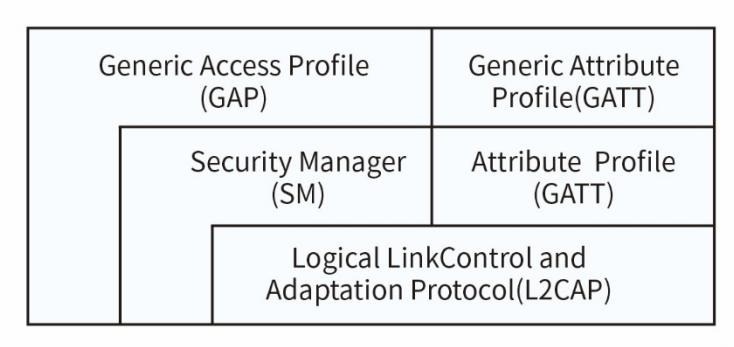

| Host-Controller Interface(HCI) |
|--------------------------------|
| Link Layer(LL)                 |
| Physical Layer(PHY)            |

图 1-1

协议栈由 Host(主机协议层)和 Controller(控制协议层)组成,并且这两部分一般 是分开执行的。

配置和应用程序是在协议栈的通用访问配置文件(GAP)和通用属性配置文件(GATT) 层中实现的。

物理层(PHY)是 BLE 协议栈最底层,它规定了 BLE 通信的基础射频参数,包括信号频 率、调制方案等。

物理层是在 2.4GHz 频道,使用高斯频移键控(GFSK - Gauss frequency Shift Keying)技术进行调制。

BLE 5.0 的物理层有三种实现方案,分别是 1Mbps 的无编码物理层、2Mbps 的无编码物 理层和 1Mbps 的编码物理层。其中 1Mbps 的无编码物理层与 BLE 4.0 系列协议的物理层兼 容,另外两种物理层则分别扩展了通信速率和通信距离。

链路层(LinkLayer)控制设备处于准备(standby)、广播(advertising)、监听/扫 描(scanning)、发起(initiating)、连接(connected)这五种状态中一种。围绕这几种 状态,BLE 设备可以执行广播和连接等操作,链路层定义了在各种状态下的数据包格式、 时序规范和接口协议。

通用访问协议(Generic Access Profile)是BLE 设备内部功能对外接口层。它规定 了三个方面:GAP 角色、模式和规程、安全问题。主要管理蓝牙设备的广播,连接和设备 绑定。

广播者——不可以连接的一直在广播的设备

观察者——可以扫描广播设备,但不能发起建立连接的设备

从机——可以被连接的广播设备,可以在单个链路层连接中作为从机

主机——可以扫描广播设备并发起连接,在单个链路层或多链路层中作为主机

逻辑链路控制协议(Logical Link Control and Adaptation Protocol)是主机与控 制器直接的适配器,提供数据封装服务。它向上连接应用层,向下连接控制器层,使上层 应用操作无需关心控制器的数据细节,。

安全管理协议(Security Manager)提供配对和密匙分发服务,实现安全连接和数据 交换。

属性传输协议(Attribute Protocol)定义了属性实体的概念,包括UUID、句柄和属 性值,规定了属性的读、写、通知等操作方法和细节。

通用属性规范(Generic Attribute Profile)定义了使用ATT的服务框架和协议的结 构,两个设备应用数据的通信是通过协议栈的GATT层实现。

GATT 服务器——为GATT 客户端提供数据服务的设备

GATT 客户端——从GATT 服务器读写应用数据的设备

# 2. 开发平台

# 2.1 概述

CH58x 是集成 BLE 无线通讯的 32 位 RISC-V 微控制器。片上集成 2Mbps 低功耗蓝牙通讯 模块,两个全速 USB 主机和设备控制器收发器,2 个 SPI,RTC 等丰富外设资源。本手册均 以 CH58x 开发平台举例说明,本司其他低功耗蓝牙芯片同样可参考此手册。

# 2.2 配置

CH58x 是真正的单芯片解决方案,控制器,主机,配置文件和应用程序均在 CH58x 上实 现。可参考 Central 和 Peripheral 例程。

# 2.3 软件概述

软件开发包包括以下六个主要组件:

- ·TMOS
- ·HAL
- ·BLE Stack
- ·Profiles
- ·RISC-V Core
- ·Application

软件包提供了四个 GAP 配置文件:

- ·Peripheralrole
- ·Centralrole
- ·Broadcasterrole
- ·Observerrole

同时也提供了一些 GATT 配置文件以及应用程序。

详细请参考 CH58xEVT 软件包。

# 3. 任务管理系统(TMOS)

# 3.1 概述

低功耗蓝牙协议栈以及应用均基于 TMOS(Task Management Operating System),TMOS 是一个控制循环,通过 TMOS 可设置事件的执行方式。TMOS 作为调度核心,BLE 协议栈、 profile 定义、所有的应用都围绕它来实现。TMOS 不是传统意义上的操作系统,而是一种以 实现多任务为核心的系统资源管理机制。

对于一个任务,独一无二的任务 ID,任务的初始化以及任务下可执行的事件都是不可 或缺的。

# 3.2 任务初始化

首先,为保证 TMOS 持续运行,需要在 main()的最后循环执行 TMOS\_SystemProcess()。 而初始化任务需要调用 tmosTaskID TMOS\_ProcessEventRegister(pTaskEventHandlerFn eventCb) 函数,将事件的回调函数注册到 TMOS 中,并生成唯一的 8 位任务 ID。不同的任 务初始化后任务 ID 依次递增,而任务 ID 越小任务优先级最高。协议栈任务必须具有最高的 优先级。

1. halTaskID = TMOS\_ProcessEventRegister( HAL\_ProcessEvent );

# 3.3 任务事件及事件的执行

TMOS 通过轮询的方式进行调度,系统时钟一般来源于 RTC,单位为 625μs。用户通过注 册任务(Task)将自定义的事件(Event)添加到 TMOS 的任务链表中,再由 TMOS 调度运行。 在任务初始化完成之后,TMOS 就会在循环中轮询任务事件,事件的标志存储在 16 位变量中, 其中每一位在同一任务中对应一个唯一的事件。标志位为 1 代表该位对应的事件运行,为 0 则为不运行。每个Task 用户最多可以自定义 15 个事件,0x8000 为系统预留的SYS\_EVENT\_MSG 事件,即系统消息传递事件,不可被定义。详情请参照 3.5 节。

任务执行的基本结构如图 3.1 所示,TMOS 根据任务的优先级轮询其是否有事件需要执 行,系统任务,如 2.4G 自动模式中发送结束自动接收应答和蓝牙中相关事务,拥有最高优 先级。待系统任务执行完成,若存在用户事件则执行相应的回调函数。当一个循环结束之后, 若还有时间空余,系统会进入空闲或睡眠模式。

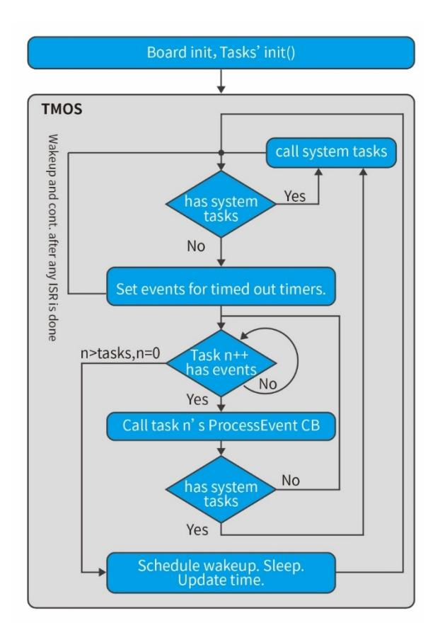

图 3.1 TMOS 任务管理示意图

为了说明 TMOS 处理事件的通用代码格式,以 HAL 层的 HAL\_TEST\_EVENT 事件为例,这里 的 HAL\_TEST\_EVENT 替换为其他事件同样适用。如果想要在 HAL 层定义一个 TEST 事件,可以 在 HAL 层的任务初始化完成之后,在任务回调函数中添加事件 HAL\_TEST\_EVEN,其基本格式 如下:

```
1. if ( events & HAL_TEST_EVENT ) 
2. { 
3. PRINT( "* \n" ); 
4. return events ^ HAL_TEST_EVENT; 
5. }
```

事件执行完成后需要返回对应的 16 位事件变量以清除事件,防止重复处理同一事件, 以上代码通过 return events ^ HAL\_TEST\_EVENT;清除了 HAL\_TEST\_EVENT 标志。

事件添加完成后,调用 tmos\_set\_event( halTaskID, HAL\_TEST\_EVENT)函数即可立即执 行对应的事件,事件只执行一次。其中 halTaskID 为选择执行的任务,HAL\_TEST\_EVENT 为 任务下对应的事件。

```
tmos_start_task( halTaskID, HAL_TEST_EVENT, 1000 );
```

若不想立即执行某个事件,可调用 tmos\_start\_task( tmosTaskID taskID, tmosEvents event, tmosTimer time)函数,其功能与 tmos\_set\_event 类似,区别在于在设置好想要执 行的任务的任务 ID 及事件标志后,还需添加第三个参数:事件执行的超时时间。即事件会

在达到超时时间后执行一次。那么在事件中定义下次任务执行的时间即可定时循环执行某个 事件。

```
1. if ( events & HAL_TEST_EVENT ) 
2. { 
3. PRINT( "* \n" ); 
4. tmos_start_task( halTaskID, HAL_TEST_EVENT, MS1_TO_SYSTEM_TIME( 1000 )); 
5. return events ^ HAL_TEST_EVENT; 
6. }
```

此时 TMOS 中仅有一个定时事件 HAL\_TEST\_EVENT,系统在执行完这个时间后便会进入空 闲模式,若打开睡眠功能,则会进入睡眠模式。其实际效果图如图 3.2。

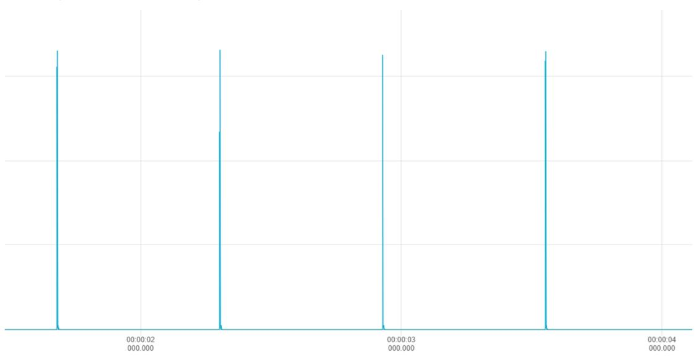

图 3.2 定时任务

# 3.4 内存管理

TMOS 单独使用一块内存,用户可以自定义内存的使用地址以及大小。TMOS 中的任务事 件管理均使用此内存,可通过开启蓝牙绑定功能,加密功能来分析内存的使用情况。

由于低功耗蓝牙的协议栈也是用此内存,所以需要在最大预期工作条件下对其进行测试。

# 3.5 TMOS 数据传递

TMOS 为不同的任务传递提供了一种接收和发送数据的通信方案。数据的类型是任意的, 且在内存足够的情况下长度也可以是任意的。

可按照以下步骤发送一个数据:

- 1. 使用 tmos\_msg\_allocate()函数为发送的数据申请内存,若申请成功,则返回内存 地址,若失败则返回 NULL。
- 2. 将数据拷贝到内存中。
- 3. 调用 tmos\_msg\_send()函数向指定的任务发送数据的指针。

```
1. // Register Key task ID
```

```
2. HAL_KEY_RegisterForKeys( centralTaskId ) 
3. // Send the address to the task 
4. msgPtr = ( keyChange_t * ) tmos_msg_allocate( sizeof(keyChange_t)); 
5. if ( msgPtr ) 
6. { 
7. msgPtr->hdr.event = KEY_CHANGE; 
8. msgPtr->state = state; 
9. msgPtr->keys = keys; 
10. tmos_msg_send( registeredKeysTaskID, ( uint8_t * ) msgPtr ); 
11. }
```

数据发送成功后,SYS\_EVENT\_MSG 被置为有效,此时系统将执行 SYS\_EVENT\_MSG 事件, 在实践中通过调用 tmos\_msg\_receive()函数检索数据。在数据处理完成后,必须使用 tmos\_msg\_deallocate()函数释放内存。详情请参考例程。

假设将消息送给 central 的任务 ID,central 的系统事件将会接收到此消息。

```
1. uint16_t Central_ProcessEvent( uint8_t task_id, uint16_t events ){ 
2. if ( events & SYS_EVENT_MSG ) { 
3. uint8_t *pMsg; 
4. if ( (pMsg = tmos_msg_receive( centralTaskId )) != NULL ){ 
5. central_ProcessTMOSMsg( (tmos_event_hdr_t *)pMsg ); 
6. // Release the TMOS message 
7. tmos_msg_deallocate( pMsg ); 
8. }
```

#### 查询到 KEY\_CHANGE 的事件:

```
1. static void central_ProcessTMOSMsg( tmos_event_hdr_t *pMsg ) 
2. { 
3. switch ( pMsg->event ){ 
4. case KEY_CHANGE:{ 
5. ...
```

# 4. 应用例程简析

### 4.1 概述

低功耗蓝牙 EVT 例程包括一个简单的 BLE 工程:Peripheral。将此工程烧录至 CH58x 芯 片中便可实现一个简单的低功耗蓝牙从机设备。

# 4.2 工程预览

载入.WVPROJ 文件后,在 MounRiverStudio 左侧窗口可看到工程文件:

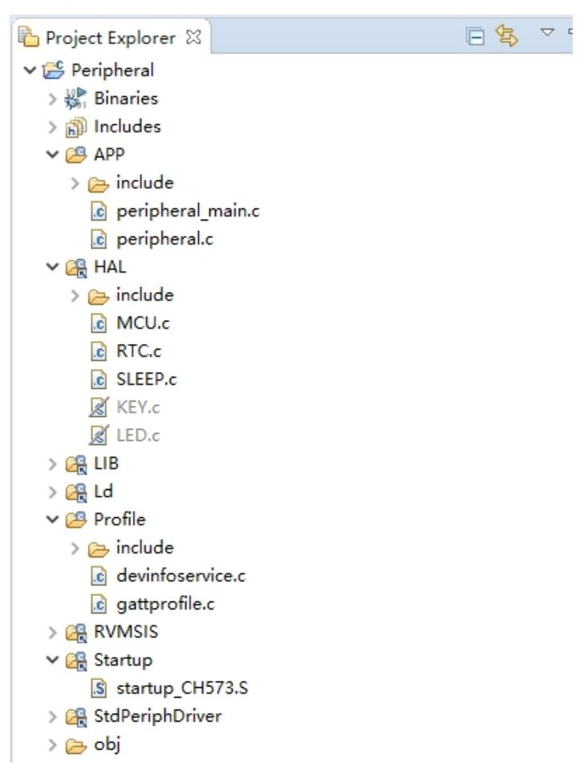

图 4.1 工程文件

#### 文件可分为以下几类:

- 1. APP –有关应用的源文件和头文件均可放置于此,例程的 main 函数也在这里。
- 2. HAL 此文件夹中为 HAL 层的源代码与头文件,HAL 层即蓝牙协议栈与芯片硬件 驱动交互层。
- 3. LIB 为低功耗蓝牙的协议栈库文件。
- 4. LD 链接脚本。
- 5. Profile 该文件从包含 GAP 角色配置文件,GAP 安全配置文件和 GATT 配置文件 的源代码与头文件,同时也包含 GATT 服务所需的头文件。详情请参考第 5 节。
- 6. RVMSIS RISC-V 内核访问的源代码与头文件。
- 7. Startup 启动文件。

- 8. StdPeriphDriver 包括芯片外设的底层驱动文件。
- 9. obj 编译器生成的文件,包括 map 文件与 hex 文件等。

### 4.3 始于 main()

Main()函数为程序运行的起点,此函数首先对系统时钟进行初始化;然后配置 IO 口状 态,防止浮空状态导致工作电流不稳定;接着初始化串口进行打印调试,最后初始化 TMOS 以及低功耗蓝牙。Peripheral 工程的 main()函数如下所示:

```
1. int main( void ) 
2. { 
3. #if (defined (DCDC_ENABLE)) && (DCDC_ENABLE == TRUE) 
4. PWR_DCDCCfg( ENABLE ); 
5. #endif 
6. SetSysClock( CLK_SOURCE_PLL_60MHz ); //设定系统时钟
7. GPIOA_ModeCfg( GPIO_Pin_All, GPIO_ModeIN_PU ); //配置 IO 口
8. GPIOB_ModeCfg( GPIO_Pin_All, GPIO_ModeIN_PU ); 
9. #ifdef DEBUG 
10. GPIOA_SetBits(bTXD1); //配置串口
11. GPIOA_ModeCfg(bTXD1, GPIO_ModeOut_PP_5mA); 
12. UART1_DefInit( ); //初始化串口
13. #endif 
14. PRINT("%s\n",VER_LIB); 
15. CH58X_BLEInit( ); //初始化蓝牙库
16. HAL_Init( ); 
17. GAPRole_PeripheralInit( ); 
18. Peripheral_Init( ); 
19. while(1){ 
20. TMOS_SystemProcess( ); //主循环
21. } 
22. }
```

# 4.4 应用初始化

#### 4.4.1 低功耗蓝牙库初始化

低功耗蓝牙库初始化函数 CH58X\_BLEInit(),通过配置参数 bleConfig\_t 配置库的内存, 时钟,发射功率等参数,然后通过 BLE\_LibInit()函数将配置参数传进库中。

#### 4.4.2 HAL 层初始化

注册 HAL 层任务,对硬件参数进行初始化,如 RTC 时钟,睡眠唤醒,RF 校准等。

```
1. void HAL_Init() 
2. { 
3. halTaskID = TMOS_ProcessEventRegister( HAL_ProcessEvent ); 
4. HAL_TimeInit();
```

```
5. #if (defined HAL_SLEEP) && (HAL_SLEEP == TRUE) 
6. HAL_SleepInit(); 
7. #endif 
8. #if (defined HAL_LED) && (HAL_LED == TRUE) 
9. HAL_LedInit( ); 
10. #endif 
11. #if (defined HAL_KEY) && (HAL_KEY == TRUE) 
12. HAL_KeyInit( ); 
13. #endif 
14. #if ( defined BLE_CALIBRATION_ENABLE ) && ( BLE_CALIBRATION_ENABLE == TRUE )
15. tmos_start_task( halTaskID, HAL_REG_INIT_EVENT, MS1_TO_SYSTEM_TIME( BLE_CA
   LIBRATION_PERIOD ) ); // 添加校准任务,单次校准耗时小于 10ms 
16. #endif 
17. tmos_start_task( halTaskID, HAL_TEST_EVENT, 1000 ); // 添加一个测试任务 
18. }
```

#### 4.4.3 低功耗蓝牙从机初始化

此过程包括两个部分:

- 1. GAP 角色的初始化,此过程由低功耗蓝牙库完成;
- 2. 低功耗蓝牙从机应用初始化,包括从机任务的注册,参数配置(如广播参数,连接 参数,绑定参数等),GATT 层服务的注册,以及回调函数的注册。详见 5.5.3.2 节。

图 4.2 显示了例程 Peripheral 的完整属性表,可作为低功耗蓝牙通讯时的参考。详细 信息请参考第五章。

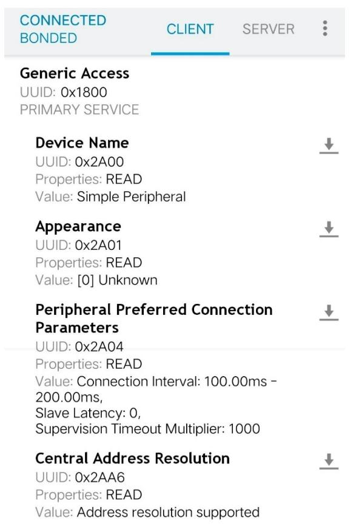

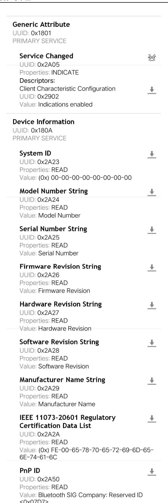

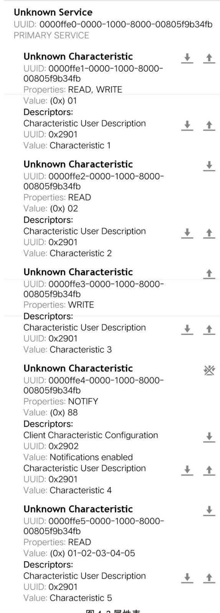

### 图 4.2 属性表

# 4.5 事件处理

初始化 完 成 后 , 开 启 事件( 即 在 事 件 中 置 一 个 位 ), 应 用 程 序 任 务 将 处 理 Peripheral\_ProcessEvent 中的事件,以下各小节将描述事件的可能来源。

### 4.5.1 定时事件

如下所示的程序段(该程序段位于例程 peripheral.c 中),应用程序包含一个名为 SBP\_PERIODIC\_EVT 的 TMOS 事件。TMOS 定时器令 SBP\_PERIODIC\_EVT 事件周期性的发生。在 SBP\_PERIODIC\_EVT 处理完成后,定时器超时值被设定为 SBP\_PERIODIC\_EVT(默认为 5000ms)。 每 5 秒发生一次周期事件,并调用 performPeriodicTask()函数实现功能。

```
1. if(events & SBP_PERIODIC_EVT) 
2. { 
3. // Restart timer 
4. if(SBP_PERIODIC_EVT_PERIOD) 
5. { 
6. tmos_start_task(Peripheral_TaskID, SBP_PERIODIC_EVT,
   SBP_PERIODIC_EVT_PERIOD); 
7. } 
8. // Perform periodic application task
9. performPeriodicTask(); 
10. return (events ^ SBP_PERIODIC_EVT); 
11. }
```

这个周期性事件处理仅仅是个示例,但突出显示了如何在周期性任务中执行自定义操作。 在处理周期性事件之前将启动一个新的 TMOS 定时器,以用来设定下一个周期性任务。

### 4.5.2 TMOS 消息传递

TMOS 消息可能来源于 BLE 协议栈各层,有关这部分的内容参见 3.5 TMOS 数据传递

### 4.6 回调

应用程序的代码既可以写在事件处理的代码段中,也可以写在回调函数中,如 simpleProfileChangeCB()和 peripheralStateNotificationCB()。协议栈与应用程序之间 的通信是由回调函数实现的,例如 simpleProfileChangeCB()可以将特征值的变化通知给应 用程序。

# 5. 低功耗蓝牙协议栈

# 5.1 概述

低功耗蓝牙协议栈的代码在库文件中,并不会提供原代码。但是使用者应该了解这些层 的功能,因为他们直接与应用程序进行交互。

# 5.2 通用访问配置文件(GAP)

### 5.2.1 概述

低功耗蓝牙协议栈的 GAP 层定义了设备以下几种状态,如图 5.1 所示

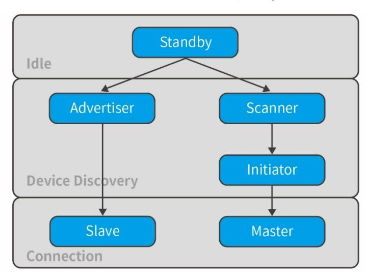

图 5.1 GAP 状态

### 其中:

Standby:低功耗蓝牙协议栈未启用的空闲状态;

Advertiser:设备使用特定的数据进行广播,广播中可包含设备的名称、地址等数据。 广播可表明此设备可被连接。

Scanner:当接收到广播数据后,扫描设备发送扫描请求包给广播者,广播者会返回扫 描相应包。扫描者会读取广播者的信息并且判断其是否可以连接。此过程描述了发现设备的 过程。

Initiator:建立连接时,连接发起者必须指定用于连接的设备地址,如果地址匹配, 则会与广播者建立连接。连接发起者在建立连接时将初始化连接参数。

Master or Slave:如果设备在连接前是广播者,则其在连接时是从机;如果设备在连 接前是发起者,则其在连接后为主机。

#### 5.2.1.1 连接参数

此节描述了连接建立时的连接参数,这些连接参数主机和从机均可修改。

·连接间隔(ConnectionInterval)– 低功耗蓝牙采用的是跳频方案,设备在特定的 时间在特点的通道上发送和接收数据。两个设备的一次数据发送与接收成为一个连接事件。 连接间隔则为两个连接事件之间的时间,其时间单位为 1.25ms。连接间隔的范围为 7.5ms~4s。

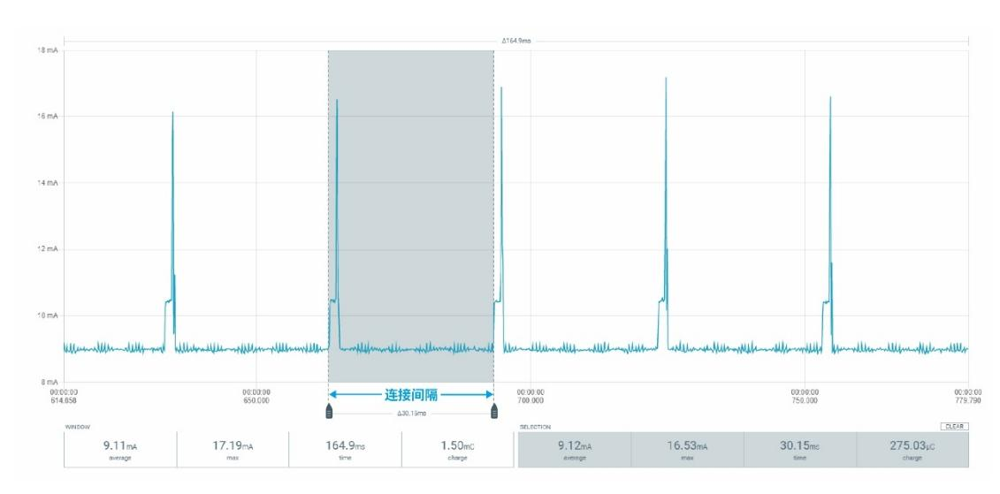

图 5.2 连接事件与连接间隔

不同的应用可能会需要不同的连接间隔,较小的连接间隔会减少数据的响应时间,相应 的也会增大功耗。

·从设备延迟(SlaveLatency)–此参数可以让从机跳过部分连接事件。如果设备没有 数据需要用发送,那么从机延时可以跳过连接事件并在连接事件期间停止射频,从而降低功 耗。从设备延时的值表示可以跳过的最大事件数,其范围为 0~499。但需保证有效连接间隔 小于 16s。关于有效连接间隔请参考 5.2.1.2

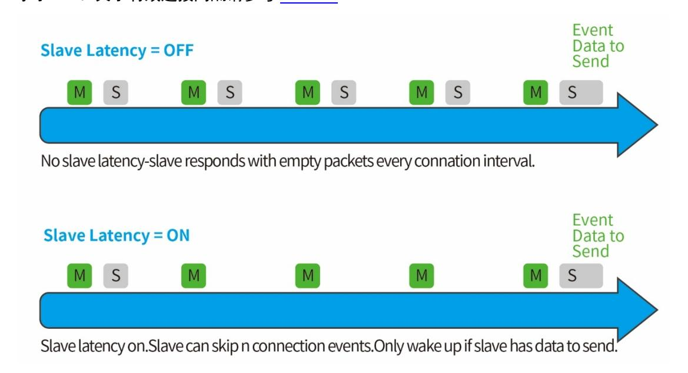

图 5.3 从设备延时

·监督超时(SupervisionTime-out) -此参数为两个有效连接事件间的最大时间。如 果超过此时间没有有效的连接事件,则认为连接已断开,设备退回未连接状态。监督超时的 范围为 10(100ms)~3200(32s)。超时时间必须大于有效连接间隔。

#### 5.2.1.2 有效连接间隔

在从设备延迟启用且没有数据传输的情况下,有效连接间隔为两个连接事件之间的时间。 若不启用从设备延迟或其值为 0 的情况下,有效连接间隔即配置的连接间隔。

其计算公式如下:

有效连接间隔 = 连接间隔 × (1 + 从设备延迟)

当

连接间隔:为 80(100ms)

从设备延迟:4

有效连接间隔:(100ms) × (1 + 4) = 500ms

那么在没有数据传输的情况下,从机将每隔 500ms 发起一次连接事件。

#### 5.2.1.3 连接参数注意事项

合理的连接参数有助于优化低功耗蓝牙的功耗以及性能,以下总结了连接参数设置中的 折衷方案:

减少连接间隔将:

- ·增加主机从机功耗
- ·增加两个设备之间的吞吐量
- ·减少数据往返两设备所需的时间

#### 增加连接间隔将:

- ·减少主机从机功耗
- ·减少两个设备之间的吞吐量
- ·增大数据往返两设备所需的时间

减少从设备延迟或将其设置为 0 将:

- ·增加从机的的功耗
- ·减少主机向从机发送数据所需要的时间

增加从设备延迟将:

- ·当没有数据需要发送给主机时,减少从机的功耗
- ·增加主机向从机发送数据所需要的时间

#### 5.2.1.4 连接参数更新

在一些应用中,从机可能需要在连接期间根据应用程序更改连接参数。从机可以将连接 参数更新请求发送至主机以更新连接参数。对于蓝牙 4.0,协议栈的 L2CAP 层将处理此请求。

该请求包含以下参数:

- ·最小连接间隔
- ·最大连接间隔
- ·从设备延迟
- ·监督超时

这些参数为从机所请求的连接参数,但是主机可以拒绝该请求。

#### 5.2.1.5 终止连接

主机或从机可以出于任何原因终止连接。当任一设备启用终止连接时,另一设备必须在 两设备断开连接之前作出终止连接的响应。

### 5.2.2 GAP 抽象层

应用程序可以通过调用 GAP 层的 API 函数来实现响应的 BLE 功能,如广播与连接。


图 5.4 GAP 抽象层

#### 5.2.3 GAP 层配置

GAP 层大部分功能都是在库中实现,用户可以在 CH58xBLE\_LIB.h 中找到相应的函数声 明。

第8.1节定义了GAP API,可通过GAPRole\_SetParameter()和GAPRole\_GetParamenter() 来设置和检测参数,如广播间隔,扫描间隔等。GAP 层配置示例如下:

```
1. // Setup the GAP Peripheral Role Profile 
2. { 
3. uint8_t initial_advertising_enable = TRUE; 
4. uint16_t desired_min_interval = DEFAULT_DESIRED_MIN_CONN_INTERVAL; 
5. uint16_t desired_max_interval = DEFAULT_DESIRED_MAX_CONN_INTERVAL; 
6. GAPRole_SetParameter( GAPROLE_MIN_CONN_INTERVAL, sizeof( uint16_t ), &de
   sired_min_interval ); 
7. GAPRole_SetParameter( GAPROLE_MAX_CONN_INTERVAL, sizeof( uint16_t ), &de
   sired_max_interval ); 
8. 
9. }
```

# 5.3 GAPRole 任务

正如 4.4 节所描述的那样,GAPRole 是一个单独的任务(GAPRole\_PeripheralInit), GAPRole 大部代码在蓝牙库中运行,从而简化应用层程序。该任务在初始化期间由应用程序 启动和配置。且存在回调,应用程序可向 GAPRole 任务注册回调函数。

根据设备的配置,GAP 层可以运行以下四种角色:

- ·广播者(Broadcaster) 仅广播无法被连接
- ·观察者(Observer) -仅扫描广播而无法建立连接
- ·外围设备(Peripheral) -可广播且可作为从机在链路层建立连接
- ·中心设备(Central) 可扫描广播也可作为主机在链路层建立单个或多个连接 下面介绍外围设备(Peripheral)以及中心设备(Central)这两个角色。
- 5.3.1 外围设备角色(Peripheral Role) 初始化外围设备的常规步骤如下:
- 1. 初始化 GAPRole 参数,如以下代码所示。
- 1. // Setup the GAP Peripheral Role Profile

```
2. { 
3. uint8_t initial_advertising_enable = TRUE; 
4. uint16_t desired_min_interval = DEFAULT_DESIRED_MIN_CONN_INTERVAL; 
5. uint16_t desired_max_interval = DEFAULT_DESIRED_MAX_CONN_INTERVAL; 
6. 
7. // Set the GAP Role Parameters 
8. GAPRole_SetParameter( GAPROLE_ADVERT_ENABLED, sizeof( uint8_t ), &initial_
   advertising_enable ); 
9. GAPRole_SetParameter( GAPROLE_SCAN_RSP_DATA, sizeof ( scanRspData ), scanR
   spData ); 
10. GAPRole_SetParameter( GAPROLE_ADVERT_DATA, sizeof( advertData ), advertDat
   a ); 
11. GAPRole_SetParameter( GAPROLE_MIN_CONN_INTERVAL, sizeof( uint16_t ), &desi
   red_min_interval ); 
12. GAPRole_SetParameter( GAPROLE_MAX_CONN_INTERVAL, sizeof( uint16_t ), &desi
   red_max_interval ); 
13. } 
14. 
15. // Set the GAP Characteristics 
16. GGS_SetParameter( GGS_DEVICE_NAME_ATT, GAP_DEVICE_NAME_LEN, attDeviceName 
   ); 
17. 
18. // Set advertising interval 
19. { 
20. uint16_t advInt = DEFAULT_ADVERTISING_INTERVAL; 
21. 
22. GAP_SetParamValue( TGAP_DISC_ADV_INT_MIN, advInt ); 
23. GAP_SetParamValue( TGAP_DISC_ADV_INT_MAX, advInt ); 
24. }
```

2. 初始化 GAPRole 任务,包括将函数指针传递给应用程序回调函数。

```
1. if ( events & SBP_START_DEVICE_EVT ){ 
2. // Start the Device 
3. GAPRole_PeripheralStartDevice( Peripheral_TaskID, &Peripheral_BondMgrCBs, 
   &Peripheral_PeripheralCBs ); 
4. return ( events ^ SBP_START_DEVICE_EVT ); 
5. }
```

3. 从应用层发送 GAPRole 命令 应用层进行连接参数更新。

```
1. // Send connect param update request 
2. GAPRole_PeripheralConnParamUpdateReq(peripheralConnList.connHandle, 
3. DEFAULT_DESIRED_MIN_CONN_INTERVAL, 
4. DEFAULT_DESIRED_MAX_CONN_INTERVAL, 
5. DEFAULT_DESIRED_SLAVE_LATENCY, 
6. EFAULT_DESIRED_CONN_TIMEOUT, 
7. Peripheral_TaskID);
```

协议栈接收到命令,执行参数更新操作,并返回相应状态。

4. GAPRole 任务将协议栈与 GAP 有关的事件传递给应用层。 蓝牙协议栈接收到连接断开的命令并传递给 GAP 层。 GAP 层收到命令,直接通过回调函数传递给应用层。

```
1. static void peripheralStateNotificationCB( gapRole_States_t newState, gapRol
  eEvent_t * pEvent ) 
2. { 
3. switch ( newState & GAPROLE_STATE_ADV_MASK ) 
4. { 
5. . . . 
6. case GAPROLE_ADVERTISING: 
7. if( pEvent->gap.opcode == GAP_LINK_TERMINATED_EVENT ) 
8. { 
9. ...
```

# 5.3.2 中心设备角色(Central Role)

初始化中心设备的常规操作如下:

1. 初始化 GAPRole 参数,如以下代码所示。

```
1. uint8_t scanRes = DEFAULT_MAX_SCAN_RES; 
2. GAPRole_SetParameter( GAPROLE_MAX_SCAN_RES, sizeof( uint8_t ), &scanRes );
```

2. 初始化 GAPRole 任务,包括将函数指针传递给应用程序回调函数。

```
1. if ( events & START_DEVICE_EVT ) 
2. { 
3. // Start the Device 
4. GAPRole_CentralStartDevice( centralTaskId, &centralBondCB, &centralRoleCB 
   ); 
5. return ( events ^ START_DEVICE_EVT ); 
6. }
```

3. 从应用层发送 GAPRole 命令 应用层调用应用函数,发送 GAP 命令。

```
1. GAPRole_CentralStartDiscovery( DEFAULT_DISCOVERY_MODE, 
2. DEFAULT_DISCOVERY_ACTIVE_SCAN, 
3. DEFAULT_DISCOVERY_WHITE_LIST );
```

GAP 层发送命令给蓝牙协议栈,协议栈收到命令,执行扫描操作,并返回相应状态

4. GAPRole 任务将协议栈与 GAP 有关的事件传递给应用层。 蓝牙协议栈接收到连接断开的命令并传递给 GAP 层。 GAP 层收到命令,直接通过回调函数传递给应用层。

```
1. static void centralEventCB( gapRoleEvent_t *pEvent ) 
2. { 
3. switch ( pEvent->gap.opcode ) 
4. { 
5. ... 
6. case GAP_DEVICE_DISCOVERY_EVENT: 
7. { 
8. uint8_t i; 
9. // See if peer device has been discovered 
10. for ( i = 0; i < centralScanRes; i++ ) 
11. { 
12. if (tmos_memcmp( PeerAddrDef, centralDevList[i].addr, B_ADDR_LEN))
13. break; 
14. } 
15. ...
```

# 5.4 GAP 绑定管理

GAPBondMgr 协议处理低功耗蓝牙连接中的安全管理,使得某些数据仅在经过身份验证 后才能被读写。

表 5.1 GAP 绑定管理术语

| 术语               | 描述                                  |
|------------------|-------------------------------------|
| 配对(Pairing)      | 密钥交互的过程                             |
| 加密(Encryption)   | 配对后数据被加密,或是重新加密                     |
| 验<br>证           | 配对过程以中间人(MITM:Manin theMiddle)保护完成  |
| (Authentication) |                                     |
| 绑定(Bonding)      | 将加密密钥存储在非易失性存储器中,用于下一个加密序列          |
| 授<br>权           | 除身份验证外,还进行附加的应用程序级密钥交换              |
| (Authorization)  |                                     |
| 无线之外(OOB)        | 密钥不是通过无线的方式交换,而是通过诸如串口或<br>NFC<br>等 |
|                  | 其他来源进行交换。这也提供了<br>MITM<br>保护。       |
| 中间人(MITM)        | 中间人保护。这样可以防止监听无线传输的密钥来破解加密          |
|                  | 直接连接(JustWorks)无中间人的配对方式。           |

建立安全连接的一般过程如下:

- 1. 密钥配对(包括以下两种方式)。
  - A. JustWorks,通过无线发送密钥
  - B. MITM,通过中间人发送密钥
- 2. 通过密钥加密连接。
- 3. 绑定密钥,存储密钥。
- 4. 当再次连接时,使用存储的密钥加密连接。

### 5.4.1 关闭配对

```
1. uint8_t pairMode = GAPBOND_PAIRING_MODE_NO_PAIRING; 
2. GAPBondMgr_SetParameter( GAPBOND_PERI_PAIRING_MODE, sizeof ( uint8_t ), &pa
   irMode );
```

当关闭配对,协议栈将拒绝任何配对尝试。

### 5.4.2 直接配对但不绑定

```
1. uint8_t mitm = FALSE; 
2. uint8_t bonding = FALSE; 
3. uint8_t pairMode = GAPBOND_PAIRING_MODE_WAIT_FOR_REQ; 
4. GAPBondMgr_SetParameter( GAPBOND_PERI_PAIRING_MODE, sizeof ( uint8_t ), &pai
   rMode ); 
5. GAPBondMgr_SetParameter( GAPBOND_PERI_MITM_PROTECTION, sizeof ( uint8_t ), &
   mitm ); 
6. GAPBondMgr_SetParameter( GAPBOND_PERI_BONDING_ENABLED, sizeof ( uint8_t ), &
   bonding );
```

需要注意的是,开启配对功能,还需要配置设备的 IO 功能,即设备是否支持显示输出 和键盘输入,若设备实际不支持键盘输入,但是配置为通过设备输入密码,则无法建立配对。

```
1. uint8_t ioCap = GAPBOND_IO_CAP_DISPLAY_ONLY; 
2. GAPBondMgr_SetParameter( GAPBOND_PERI_IO_CAPABILITIES, sizeof ( uint8_t ), &
   ioCap );
```

### 5.4.3 通过中间人配对绑定

```
1. uint32_t passkey = 0; // passkey "000000" 
2. uint8_t pairMode = GAPBOND_PAIRING_MODE_WAIT_FOR_REQ; 
3. uint8_t mitm = TRUE; 
4. uint8_t bonding = TRUE; 
5. uint8_t ioCap = GAPBOND_IO_CAP_DISPLAY_ONLY; 
6. GAPBondMgr_SetParameter( GAPBOND_PERI_DEFAULT_PASSCODE, sizeof ( uint32_t ), 
   &passkey );
```

- 7. GAPBondMgr\_SetParameter( GAPBOND\_PERI\_PAIRING\_MODE, **sizeof** ( uint8\_t ), &pai rMode );
- 8. GAPBondMgr\_SetParameter( GAPBOND\_PERI\_MITM\_PROTECTION, **sizeof** ( uint8\_t ), & mitm );
- 9. GAPBondMgr\_SetParameter( GAPBOND\_PERI\_IO\_CAPABILITIES, **sizeof** ( uint8\_t ), & ioCap );
- 10. GAPBondMgr\_SetParameter( GAPBOND\_PERI\_BONDING\_ENABLED, **sizeof** ( uint8\_t ), & bonding );

使用中间人进行配对并绑定,通过 6 位密码生成密钥。

# 5.5 通用属性配置文件(GATT)

GATT 层供应用程序在两个连接设备之间进行数据通讯,数据以特征的形式传递和储存。 在 GATT 中,当两个设备连接时,它们将各种扮演以下两种角色之一:

- · GATT 服务器– 该设备提供 GATT 客户端读取或写入特征数据库。
- · GATT 客户端– 该设备从 GATT 服务器读写数据。

图 5.5 显示了低功耗蓝牙服务器和客户端的关系,其中外围设备(低功耗蓝牙模块)为 GATT 服务器,中央设备(智能手机)为 GATT 客户端。

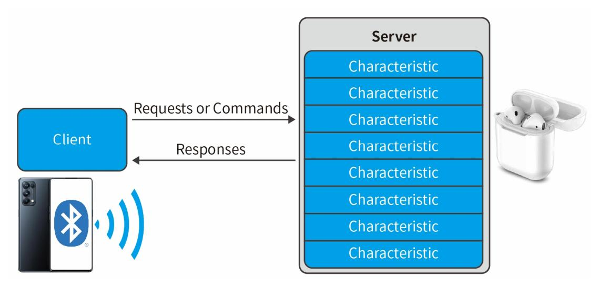

图 5.5 GATT 服务器和客户端

通常 GATT 的服务器和客户端角色是独立于 GAP 的中央设备外围设备角色。外围设备可 以是 GATT 客户端或服务器,中央设备也可以是 GATT 服务器或客户端。设备还可以同时充当 GATT 服务器或客户端。

# 5.5.1 GATT 特征及属性

典型特征由以下属性构成:

- ·特征值(Characteristic Value):此值为特征的数据值。
- ·特征声明(Characteristic Declaration):存储特征值的属性,位置以及类型。
- ·客户端特征配置(Client Characteristic Configuration):通过此配置,GATT 服务 器可以配置需要发送到 GATT 服务器的属性(notified),或者发送到 GATT 服务器并且期望 得到一个回应(indicated)。
  - ·特征用户描述(CharacteristicUserDescription):描述特征值的 ASCII 字符串。

这些属性存储在 GATT 服务器的属性表中,以下特征与每个属性相关联:

- ·句柄(Handle) -表中属性的索引,每个属性都有唯一的句柄。
- ·类型(Type) 此属性指示属性代表什么,称为通用唯一标识符(UUID)。部分 UUID 由 BluetoothSIG 定义,其他一些 UUID 可由用户自定义。
  - ·权限(Permissions) -用于限制 GATT 客户端访问该属性的值的权限与方式。
- ·值(pValue)– 指向属性值的指针,在初始化后其长度无法改变。最大大小 512 字 节。

### 5.5.2 GATT 服务与协议

GATT 服务是特征的集合。

以下为 Peripheral 项目中对应于 gattprofile 服务(gattprofile 服务是用于测试和 演示的示例配置文件,完整源代码在 gattprofile.c 和 gattprofile.h 中)的属性表。

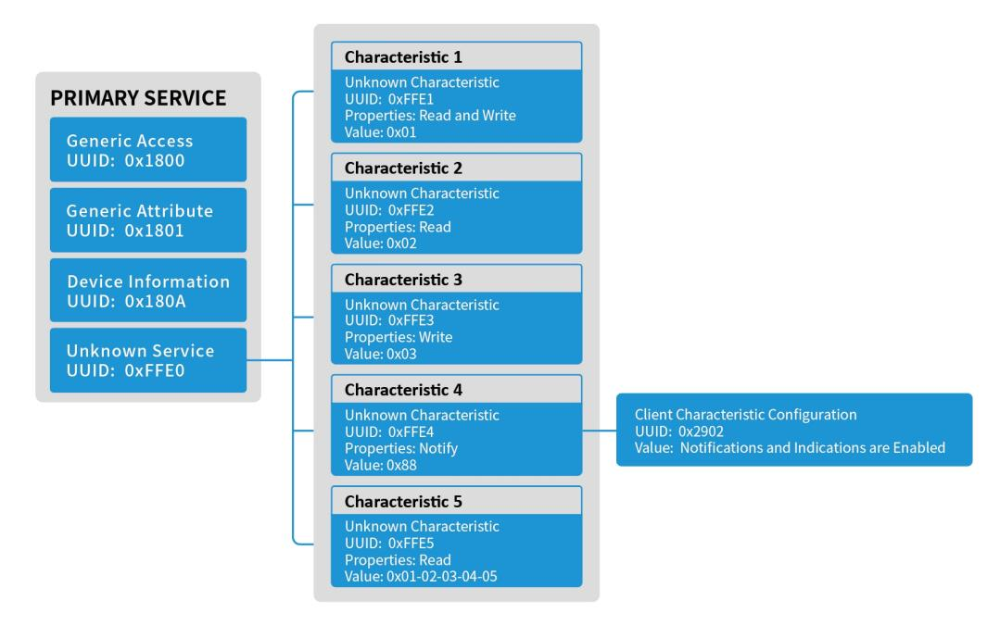

图 5.6 GATT 属性表

#### Gattprofile 包含以下五个特征:

- ·simpleProfilechar1 可以从 GATT 客户端设备读取或写入 1 个字节。
- ·simpleProfilechar2 可以从 GATT 客户端设备读取 1 个字节,但不能写入。
- ·simpleProfilechar3 可以从 GATT 客户端设备写入 1 个字节,但不能读取。
- ·simpleProfilechar4 可以配置为发送到 GATT 客户端设备 1 个字节的通知,但不能 读取或写入。
  - ·simpleProfilechar5 可以从 GATT 客户端设备读取 5 个字节,但不能写入。

#### 以下是一些相关的属性:

- ·0x02:允许读取特征值
- ·0x04:允许在没有响应的情况下写入特征值
- ·0x08:允许写入特征值(带有响应)
- ·0x10:特征值通知的许可(无确认)
- ·0x20:允许特征值通知(带确认)

### 5.5.3 GATT 客户端抽象层

GATT 客户端没有属性表,因为客户端是接收信息而非提供信息。GATT 层大多数接口直 接来自应用程序。


图 5.6 GATT 客户端抽象层

#### 5.5.3.1 GATT 层的应用

此节描述了如何直接在应用中使用GATT客户端。可以在例程Central找到相应的源码。

1. 初始化 GATT 客户端。

```
1. // Initialize GATT Client 
2. GATT_InitClient();
```

2. 注册相关信息以接收传入的 ATT 指示和通知。

```
1. // Register to receive incoming ATT Indications/Notifications 
2. GATT_RegisterForInd( centralTaskId );
```

- 3. 执行客户端的程序,如 GATT\_WriteCharValue(),即向服务器发送数据。
- 1. bStatus\_t GATT\_WriteCharValue( uint16\_t connHandle, attWriteReq\_t \*pReq, uin t8\_t taskId )
- 4. 应用程序接收并处理 GATT 客户端的响应,以下为"写"操作的响应。 首先协议栈接收到写响应,并通过任务 TMOS 消息发送至应用层。

```
1. uint16_t Central_ProcessEvent( uint8_t task_id, uint16_t events ) 
2. { 
3. if ( events & SYS_EVENT_MSG ) 
4. { 
5. uint8_t *pMsg; 
6. if ( (pMsg = tmos_msg_receive( centralTaskId )) != NULL ) 
7. { 
8. central_ProcessTMOSMsg( (tmos_event_hdr_t *)pMsg ); 
9. ...
```

#### 应用层的任务查询到 GATT 消息:

```
1. static void central_ProcessTMOSMsg( tmos_event_hdr_t *pMsg ) 
2. { 
3. switch ( pMsg->event ) 
4. { 
5. case GATT_MSG_EVENT: 
6. centralProcessGATTMsg( (gattMsgEvent_t *) pMsg );
```

#### 根据接收内容,应用层可作出相应功能:

```
1. static void centralProcessGATTMsg( gattMsgEvent_t *pMsg ) 
2. { 
3. ... 
4. else if ( ( pMsg->method == ATT_WRITE_RSP ) || 
5. ( ( pMsg->method == ATT_ERROR_RSP ) && 
6. ( pMsg->msg.errorRsp.reqOpcode == ATT_WRITE_REQ ) ) ) 
7. { 
8. //Application 
9. ...
```

#### 应用处理完成后清除消息:

```
1. // Release the TMOS message 
2. tmos_msg_deallocate( pMsg ); 
3. } 
4. // return unprocessed events 
5. return (events ^ SYS_EVENT_MSG); 
6. }
```

### 5.5.4 GATT 服务器抽象层

作为 GATT 服务器,大多数 GATT 功能都能通过 GATTServApp 进行配置。

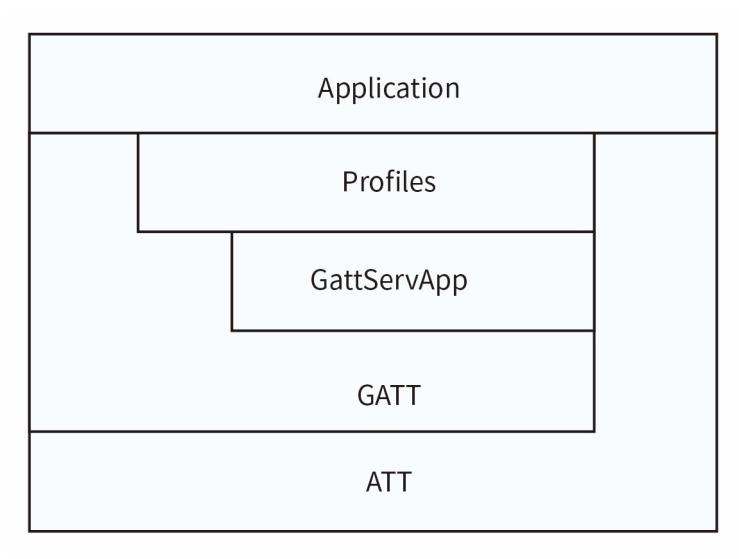

图 5.7 GATT 服务器抽象层

#### GATT 的使用规范如下:

- 1. 创建 GATT 配置文件(GATT Profile)对 GATTServApp 模块进行配置。
- 2. 使用 GATTServApp 模块中的 API 接口对 GATT 层进行操作。

#### 5.5.4.1 GATTServApp 模块

GATTServApp 模块用于存储和管理应用程序的属性表,各种配置文件都是使用该模块将 其特征值添加到属性表中。其功能包括:查找特定的属性,读取客户端的特征值以及修改客 户端的特征值。详细请参考 API 章节。

每一次初始化,应用程序都会使用 GATTServApp 模块添加服务构建 GATT 表。每一个服 务的内容包括:UUID,值,权限以及读/写权限。图 5.8 描述了 GATTServApp 模块添加服务 的过程。

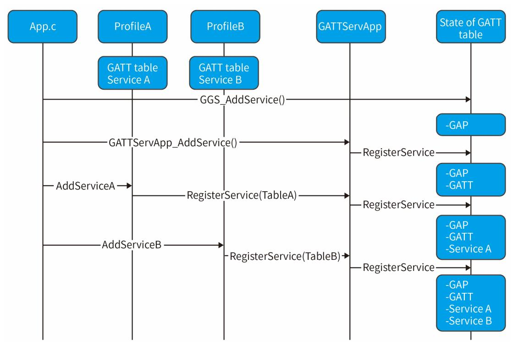

图 5.8 属性表初始化

GATTServApp 的初始化可在 Peripheral\_Init()函数中找到。

```
1. // Initialize GATT attributes 
2. GGS_AddService( GATT_ALL_SERVICES ); // GAP 
3. GATTServApp_AddService( GATT_ALL_SERVICES ); // GATT attributes 
4. DevInfo_AddService(); // Device Information Service
5. SimpleProfile_AddService( GATT_ALL_SERVICES ); // Simple GATT Profile
```

#### 5.5.4.2 配置文件架构

本节介绍了配置文件的基本架构,并提供了 Peripheral 工程中的 GATTProfile 的使用 示例。

#### 5.5.4.2.1 创建属性表

每一个服务必须定义一个固定大小的属性表,用于传递给 GATT 层。 在 Peripheral 工程中,定义如下:

```
1. static gattAttribute_t simpleProfileAttrTbl[] = 
2. ...
```

#### 每一个属性的格式如下:

```
1. typedef struct attAttribute_t 
2. { 
3. gattAttrType_t type; //!< Attribute type (2 or 16 octet UUIDs) 
4. uint8_t permissions; //!< Attribute permissions 
5. uint16_t handle; //!< Attribute handle - assigned internally by
6. //!< attribute server 
7. uint8_t *pValue; //!< Attribute value - encoding of the octet 
8. //!< array is defined in the applicable 
9. //!< profile. The maximum length of an
10. //!< attribute value shall be 512 octets. 
11. } gattAttribute_t;
```

#### 属性中的各个元素:

·type -与属性相关的 UUID。

```
1. typedef struct 
2. { 
3. uint8_t len; //!< Length of UUID (2 or 16) 
4. const uint8_t *uuid; //!< Pointer to UUID 
5. } gattAttrType_t;
```

其中 len 可以是 2 bytes 也可以是 16 bytes。\*uuid 可以是指向保存在蓝牙 SIG 中的 数字也可以是用于自定义的 UUID 指针。

- ·Permission 配置 GATT 客户端设备是否可以访问属性的值。可配置的权限如下:
  - GATT\_PERMIT\_READ //可读
- GATT\_PERMIT\_WRITE // 可写
- GATT\_PERMIT\_AUTHEN\_READ // 需身份验证读
- GATT\_PERMIT\_AUTHEN\_WRITE //需身份验证写
- GATT\_PERMIT\_AUTHOR\_READ // 需授权读
- GATT\_PERMIT\_ENCRYPT\_READ // 需加密读
- GATT\_PERMIT\_ENCRYPT\_WRITE // 需加密写
- ·Handle GATTServApp 分配的句柄,句柄是按照顺序自动分配的。
- ·pValue 指向属性值的指针。在初始化后其长度无法改变。最大大小 512 字节。

下面创建 Peripheral 工程中的属性表:

首先创建服务属性:

```
1. // Simple Profile Service 
2. { 
3. { ATT_BT_UUID_SIZE, primaryServiceUUID }, /* type */ 
4. GATT_PERMIT_READ, /* permissions */ 
5. 0, /* handle */ 
6. (uint8_t *)&simpleProfileService /* pValue */ 
7. },
```

此属性为 Bluetooth SIG定义的主要服务 UUID(0x2800)。GATT客户端必须读取此属性, 所以将权限设置为可读。pValue 是指向服务的 UUID 的指针,自定义为 0xFFE0。

```
1. // Simple Profile Service attribute 
2. static const gattAttrType_t simpleProfileService = { ATT_BT_UUID_SIZE, simpl
   eProfileServUUID };
```

然后创建特征的声明,值,用户说明,以及客户端特征配置,5.5.1 节对此进行了介绍。

```
1. // Characteristic 1 Declaration 
2. { 
3. { ATT_BT_UUID_SIZE, characterUUID }, 
4. GATT_PERMIT_READ, 
5. 0, 
6. &simpleProfileChar1Props 
7. },
```

属性特征声明(Characteristic Declaration)的类型需要设置成 BluetoothSIG 定义的 特征 UUID 值(0x2803),而 GATT 客户端必须读取此 UUID,所以其权限设置为可读。声明 的值指的是此特征的属性,为可读可写。

```
1. // Simple Profile Characteristic 1 Properties
```

```
2. static uint8_t simpleProfileChar1Props = GATT_PROP_READ | GATT_PROP_WRITE; 
3. 
4. // Characteristic Value 1 
5. { 
6. { ATT_BT_UUID_SIZE, simpleProfilechar1UUID }, 
7. GATT_PERMIT_READ | GATT_PERMIT_WRITE, 
8. 0, 
9. simpleProfileChar1 
10. },
```

特征值中,类型设置为自定义的 UUID(0xFFF1),由于特征值的属性是可读可写的,所 以设置值的权限为可读可写。pValue 指向实际值的位置,如下:

```
1. // Characteristic 1 Value 
2. static uint8_t simpleProfileChar1[SIMPLEPROFILE_CHAR1_LEN] = { 0 }; 
3. 
4. // Characteristic 1 User Description 
5. { 
6. { ATT_BT_UUID_SIZE, charUserDescUUID }, 
7. GATT_PERMIT_READ, 
8. 0, 
9. simpleProfileChar1UserDesp 
10. },
```

用户说明中,类型设置为 Bluetooth SIG 定义的特征 UUID 值(0x2901),其权限设置为 可读。值为用户自定义的字符串,如下:

```
1. // Simple Profile Characteristic 1 User Description 
2. static uint8_t simpleProfileChar1UserDesp[] = "Characteristic 1\0"; 
3. 
4. // Characteristic 4 configuration 
5. { 
6. { ATT_BT_UUID_SIZE, clientCharCfgUUID }, 
7. GATT_PERMIT_READ | GATT_PERMIT_WRITE, 
8. 0, 
9. (uint8_t *)simpleProfileChar4Config 
10. },
```

该类型须设置为 Bletooth SIG 定义的客户端特征配置 UUID(0x2902),GATT 客户端必 须要对此进行读写,所以权限设置为可读可写。pValue 指向客户端特征配置数值的地址。

```
1. static gattCharCfg_t simpleProfileChar4Config[4];
```

#### 5.5.4.2.2 添加服务

当蓝牙协议栈初始化时,须添加它支持的 GATT 服务。服务包括协议栈所必需的 GATT 服 务,如 GGS\_AddService 和 GATTServApp\_AddService,以及用户自定义的一些服务,如 Peripheral 工程中的 SimpleProfile\_AddService.以 SimpleProfile\_AddService()为例, 这些函数执行以下操作:

首先需要定义客户端特征配置即 Client Characteristic Configuration(CCC)。

```
1. static gattCharCfg_t simpleProfileChar4Config[4];
```

然后初始化 CCC。

对于配置文件中的每个 CCC,必须调用 GATTServApp\_InitCharCfg()函数。此函数使用 来自先前绑定连接的信息初始化 CCC。如果函数找不到信息,将初始值设置为默认值。

```
1. // Initialize Client Characteristic Configuration attributes 
2. GATTServApp_InitCharCfg(INVALID_CONNHANDLE, simpleProfileChar4Config);
```

最后通过 GATTServApp 注册配置文件。

GATTServApp\_RegisterService()函数将配置文件的属性表 simpleProfileAttrTb1 传 递给 GATTServApp,以便将配置文件的属性添加到由协议栈管理的应用程序范围的属性表中。

```
1. // Register GATT attribute list and CBs with GATT Server App 
2. status = GATTServApp_RegisterService( simpleProfileAttrTbl, 
3. GATT_NUM_ATTRS( simpleProfileAttrTbl ), 
4. GATT_MAX_ENCRYPT_KEY_SIZE, 
5. &simpleProfileCBs );
```

#### 5.5.4.2.3 注册应用程序回调函数

在 Peripheral 工程中,每当 GATT 客户端写入特征值时,GATTProfile 就会调用应用程 序回调。要使用回调函数,首先需要在初始化时设置回调函数。

```
1. bStatus_t SimpleProfile_RegisterAppCBs( simpleProfileCBs_t *appCallbacks ) 
2. { 
3. if ( appCallbacks ) 
4. { 
5. simpleProfile_AppCBs = appCallbacks; 
6. 
7. return ( SUCCESS ); 
8. } 
9. else 
10. { 
11. return ( bleAlreadyInRequestedMode ); 
12. } 
13. }
```

#### 回调函数如下:

```
1. // Callback when a characteristic value has changed 
2. typedef void (*simpleProfileChange_t)( uint8_t paramID ); 
3. 
4. typedef struct 
5. { 
6. simpleProfileChange_t pfnSimpleProfileChange; // Called when chara
7. cteristic value changes 
8. } simpleProfileCBs_t;
```

#### 回调函数必须指向此类型的应用程序,如下:

```
1. // Simple GATT Profile Callbacks 
2. static simpleProfileCBs_t Peripheral_SimpleProfileCBs = 
3. { 
4. simpleProfileChangeCB // Charactersitic value change callback 
5. };
```

#### 5.5.4.2.4 读写回调函数

当配置文件被读写时,需要有相应的回调函数,其注册方法与应用程序回调函数一致, 具体可参考 Peripheral 工程。

#### 5.5.4.2.5 配置文件的获取与设置

配置文件包含读取与写入特征功能,图 5.9 描述了应用程序设置配置文件参数的逻辑。

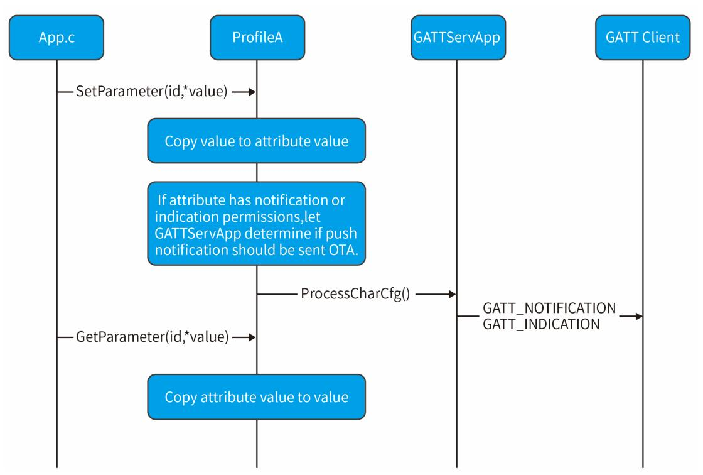

图 5.9 获取和设置配置文件参数

#### 应用程序代码如下:

1. SimpleProfile\_SetParameter( SIMPLEPROFILE\_CHAR1, SIMPLEPROFILE\_CHAR1\_LEN, ch arValue1 );

# 5.6 逻辑链路控制和适配协议

逻辑链路控制和适配协议层(L2CAP)位于 HCI 层的顶部,并在主机的上层(GAP 层, GATT 层,应用层等)与下层协议栈之间传输数据。这个上层具有 L2CAP 的分割和重组功能, 使更高层次的协议和应用能够以 64KB 的长度发送和接收数据包。它还能够处理协议的多路 复用,以提供多种连接和多个连接类型(通过一个空中接口),同时提供服务质量支持和成组 通讯。CH58x 蓝牙协议栈支持有效最大 MTU 为 247。

# 5.7 主机与控制器交互

HCI(HostControllerInterface),它连接主机和控制器,将主机的操作转化成 HCI 指 令传给控制器。BLE CoreSpec 支持的 HCI 种类有四种:UART,USB,SDIO,3-Wire UART。

对于全协议栈的单颗蓝牙芯片,只需要调用 API 接口函数即可,此时 HCI 为函数调用以 及回调;对于只有控制器的产品,即使用主控芯片对 BLE 芯片进行操作,BLE 芯片作为外挂 芯片接到主控芯片上。此时主控芯片只需要通过标准的 HCI 指令(通常是 UART)与 BLE 芯 片进行交互。

本指南所讨论的 HCI 均是函数调用与函数回调。

# 6. 创建一个 BLE 应用程序

# 6.1 概述

阅读了前面的章节后,您应该了解如何实现低功耗蓝牙应用程序。这一章将介绍如何开 始编写低功耗蓝牙应用程序,以及一些注意事项。

# 6.2 配置蓝牙协议栈

首先需要确定此设备的角色,我们提供以下几种角色:

- ·Central
- ·Peripheral
- ·Broadcaster
- ·Observer

选择不同的角色需要调用不同的角色初始化 API,详细参考 5.3 节。

# 6.3 定义低功耗蓝牙行为

使用低功耗蓝牙协议栈的 API 定义系统行为,如添加配置文件,添加 GATT 数据库,配 置安全模式等等。详见第五章。

# 6.4 定义应用程序任务

确保应用程序中包含对协议栈的回调函数以及来自 TMOS 的事件处理程序。可参考第三 章中所介绍的添加其他任务。

# 6.5 应用配置文件

在 config.h 文件中配置 DCDC 使能,RTC 的时钟,睡眠功能,MAC 地址,低功耗蓝牙协 议栈使用 RAM 大小等等,详见 config.h 文件。

需要注意的是,WAKE\_UP\_RTC\_MAX\_TIME 即等待 32M 晶体稳定的时间。此稳定时间受晶 体,电压,稳定等因素影响。您需要在唤醒时间上添加一个缓冲的时间,以提高稳定性。

# 6.6 在低功耗蓝牙工作期间限制应用程序处理

由于低功耗蓝牙协议的时间依赖性,控制器必须在每个连接事件或广播事件来临之前就 进行处理。如果未及时处理,则会导致重传或者连接断开。且 TOMS 不是多线程的,所以当 低功耗蓝牙有事务处理时,必须停止其他任务让控制器处理。所以确保应用程序中不要占用 大量的事件,如需复杂的处理,请参考 3.3 节将其拆分。

### 6.7 中断

在低功耗蓝牙工作期间,需要通过 RTC 定时器计算时间,所以在此期间,不要禁止全局 中断,且单个中断服务程序所占用的时间不宜过长,否则长期打断低功耗蓝牙工作会导致连 接断开。

# 7. 创建一个简单的 RF 应用程序

# 7.1 概述

RF 应用程序是基于 RF 发送与接收的 PHY,实现 2.4GHz 频段的无线通讯。与 BLE 的区别 在于,RF 应用程序并没有建立 BLE 的协议。

# 7.2 配置协议栈

首先初始化蓝牙库:

```
1. CH58X_BLEInit( );
```

然后配置此设备的角色为 RF Role:

```
1. RF_RoleInit ( );
```

# 7.3 定义应用程序任务

注册 RF 任务,初始化 RF 功能,以及注册 RF 的回调函数:

```
1. taskID = TMOS_ProcessEventRegister( RF_ProcessEvent ); 
2. rfConfig.accessAddress = 0x71764129; // 禁止使用 0x55555555 以及
3. 0xAAAAAAAA ( 建议不超过 24 次位反转,且不超过连续的 6 个 0 或 1 ) 
4. rfConfig.CRCInit = 0x555555; 
5. rfConfig.Channel = 8; 
6. rfConfig.Frequency = 2480000;
7. rfConfig.LLEMode = LLE_MODE_BASIC|LLE_MODE_EX_CHANNEL|LLE_MODE_NON_RSSI;
8. // 使能 LLE_MODE_EX_CHANNEL 表示选择 rfConfig.Frequency 作为通信频点 
9. rfConfig.rfStatusCB = RF_2G4StatusCallBack; 
10. state = RF_Config( &rfConfig );
```

# 7.4 应用配置文件

在 config.h 文件中配置 DCDC 使能,RTC 的时钟,睡眠功能,MAC 地址,低功耗蓝牙协 议栈使用 RAM 大小等等,详见 config.h 文件。

需要注意的是,WAKE\_UP\_RTC\_MAX\_TIME 即等待 32M 晶体稳定的时间。此稳定时间与晶 体,电压,稳定等因素影响。您需要在唤醒时间上添加一个缓冲的时间,以提高稳定性。

# 7.5 RF 通信

### 7.5.1 Basic 模式

在 Basic 模式只需保持接收方一直处于接收模式,即调用 RF\_RX()函数。但是需要注意 的是,在接收到数据后,需要再次调用 RF\_RX()函数使设备再次处于接收模式,且不要直接 在 RF\_2G4StatusCallBack()回调函数中调用 RF 收发函数,这样可能会造成其状态混乱。

#### 通信示意图如下:

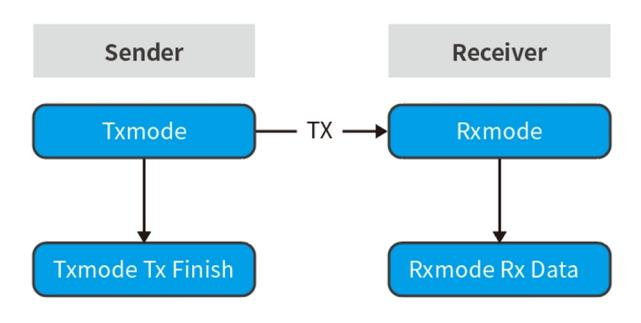

图 7.1 Basic 模式通信示意图

RF 发送的 API 为 RF\_Tx(),详情请参照 8.6 节。

RF 接收到数据则会进入调函数 RF\_2G4StatusCallBack(),在回调函数中获取接收到的 数据。

### 7.5.2 Auto 模式

由于 Basic 模式仅为单向传输,用户便无法得知此次通信是否成功,由此产生 Auto 模 式。

Auto 模式在 Basic 模式的基础上,增加了接收响应的机制,即接收方在接收到数据后, 会向发送方发送数据,以通知发送方已成功接收数据。

通信示意图如下:

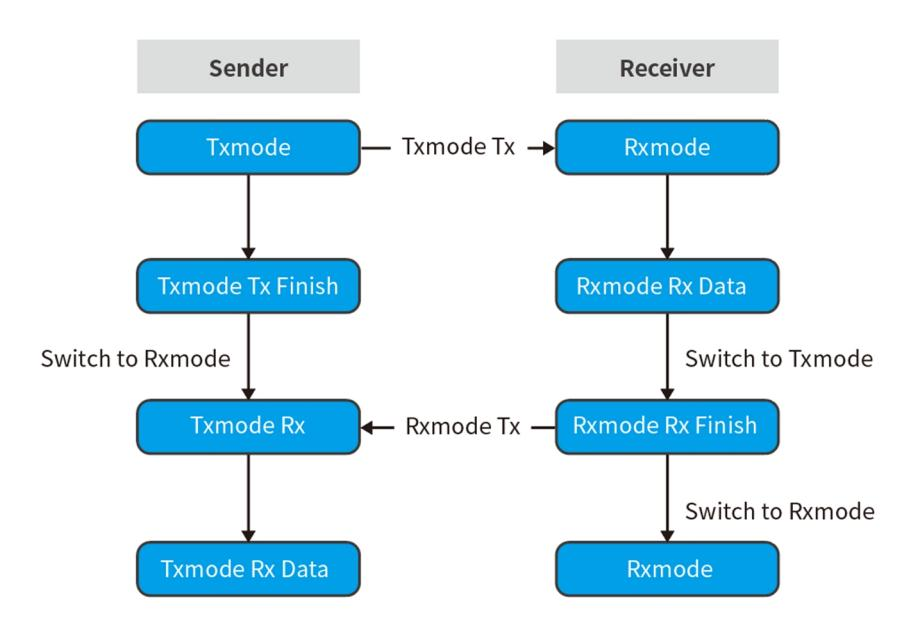

图 7.2 Auto 模式通信示意图

Auto 模式下,RF 发送完数据后会自动切换至接收模式,此接收模式超时时间为 3ms, 若 3ms 内未接收到数据则会关闭接收模式。接收到的数据,以及超时状态均通过回调函数返 回至应用层。

#### 7.5.2.1 自动跳频

基于 RF Auto 模式设计的自动跳频方案,可有效解决 2.4GHz 信道的干扰问题。 使用跳频功能需主动开启跳频接收或跳频发送事件:

#### 1. // 开启跳频发送

2. **if**( events & SBP\_RF\_CHANNEL\_HOP\_TX\_EVT ){

```
3. PRINT("\n------------- hop tx...\n"); 
4. if( RF_FrequencyHoppingTx( 16 ) ){ 
5. tmos_start_task( taskID , SBP_RF_CHANNEL_HOP_TX_EVT ,100 ); 
6. } 
7. return events^SBP_RF_CHANNEL_HOP_TX_EVT; 
8. } 
9. // 开启跳频接收 
10. if( events & SBP_RF_CHANNEL_HOP_RX_EVT ){ 
11. PRINT("hop rx...\n"); 
12. if( RF_FrequencyHoppingRx( 200 ) ) 
13. { 
14. tmos_start_task( taskID , SBP_RF_CHANNEL_HOP_RX_EVT ,400 ); 
15. } 
16. else 
17. { 
18. RF_Rx( TX_DATA,10,0xFF,0xFF ); 
19. } 
20. return events^SBP_RF_CHANNEL_HOP_RX_EVT; 
21. }
```

在配置 RF 通信模式为自动模式后,发送方开启跳频发送事件:

```
1. tmos_set_event( taskID , SBP_RF_CHANNEL_HOP_TX_EVT );
```

接收发开启跳频接收事件:

```
1. tmos_set_event( taskID , SBP_RF_CHANNEL_HOP_RX_EVT );
```

即可实现跳频功能。

需要注意的是,接收方若已经处于接收模式,需要先关闭 RF(调用 RF\_Shut()函数), 然后再开启跳频接收事件。

# 8. API

### 8.1 TMOS API

### 8.1.1 指令

1. bStatus\_t TMOS\_TimerInit( pfnGetSysClock fnGetClock )

#### TMOS 时钟初始化。

| 参数             | 描述                                      |
|----------------|-----------------------------------------|
| pfnGetSysClock | 0:选择<br>RTC<br>作为系统时钟                   |
|                | 其他有效值:其他时钟获取接口,如<br>SYS_GetSysTickCnt() |
| 返回             | 0: SUCCESS                              |
|                | 1: FAILURE                              |

1. tmosTasklD TMOS\_ProcessEventRegister( pTaskEventHandIerFn eventCb )

注册事件回调函数,一般用于注册任务时首先执行。

| 参数      | 描述                          |
|---------|-----------------------------|
| eventCb | TMOS<br>任务回调函数              |
| 返回      | 分配的<br>ID<br>值,OxFF<br>表示无效 |

1. bStatus\_t tmos\_set\_event( tmosTaskID taskID, tmosEvents event )

立即启动 taskID 任务中对应的 event 事件,调用一次执行一次。

| 参数     | 描述                  |  |
|--------|---------------------|--|
| taskID | tmos<br>分配的任务<br>ID |  |
| event  | 任务中的事件              |  |
| 返回     | 0:成功                |  |

1. bStatus\_t tmos\_start\_task( tmosTaskID taskID, tmosEvents event, tmosTimer time )

延迟 time\*625μs 后启动 taskID 任务中对应的 event 事件,调用一次执行一次。

| 参数     | 描述                  |
|--------|---------------------|
| taskID | tmos<br>分配的任务<br>ID |
| event  | 任务中的事件              |
| time   | 延迟的时间               |
| 返回     | 0:成功                |

1. bStatus\_t tmos\_stop\_event( tmosTaskID taskID, tmosEvents event )

停止一个 event 事件,调用此函数后,该事件将不会生效。

| 参数     | 描述                  |
|--------|---------------------|
| taskID | tmos<br>分配的任务<br>ID |
| event  | 任务中的事件              |
| 返回     | 0:成功                |

1. bStatus\_t tmos\_clear\_event( tmosTaskID taskID, tmosEvents event )

清理一个已经超时的 event 事件,注意不能在它自己的 event 函数内执行。

| 参数     | 描述                  |
|--------|---------------------|
| taskID | tmos<br>分配的任务<br>ID |
| event  | 任务中的事件              |
| 返回     | 0:成功                |

1. bStatus\_t tmos\_start\_reload\_task( tmosTaskID taskID, tmosEvents event, tmosTimer time )

延迟 time\*625μs 执行 event 事件,调用一次循环执行,除非运行 tmos\_stop\_task 关 掉。

| 参数     | 描述                  |
|--------|---------------------|
| taskID | tmos<br>分配的任务<br>ID |
| event  | 任务中的事件              |
| time   | 延迟的时间               |
| 返回     | 0:成功                |

1. tmosTimer tmos\_get\_task\_timer( tmosTaskID taskID, tmosEvents event )

获取事件距离到期事件的滴答数。

| 参数     | 描述                  |
|--------|---------------------|
| taskID | tmos<br>分配的任务<br>ID |
| event  | 任务中的事件              |
| 返回     | !0:事件距离到期的滴答数       |
|        | 0:事件未找到             |

1. uint32\_t TMOS\_GetSystemClock( void )

返回 tmos 系统运行时长,单位为 625μs,如 1600=1s。

| 参数 | 描述 |
|----|----|
|    |    |

| 返回 | TMOS<br>运行时长 |  |
|----|--------------|--|
|----|--------------|--|

1. void TMOS\_SystemProcess( void )

tmos 的系统处理函数,需要在主函数中不断运行。

1. bStatus\_t tmos\_msg\_send( tmosTaskID taskID, uint8\_t \*msg\_ptr )

发送消息到某个任务,当调用此函数时,对应任务的消息事件 event 会立即置 1 生效。

| 参数      | 描述                          |
|---------|-----------------------------|
| taskID  | tmos<br>分配的任务<br>ID         |
| msg_ptr | 消息指针                        |
| 返回      | SUCCESS:成功                  |
|         | INVALID_TASK:任务<br>ID<br>无效 |
|         | INVALID_MSG_POINTER:消息指针无效  |

1. uint8\_t \*tmos\_msg\_receive( tmosTaskID taskID )

#### 接收消息。

| 参数     | 描述                   |
|--------|----------------------|
| taskID | tmos<br>分配的任务<br>ID  |
| 返回     | 接收到的消息或者无消息待接收(NULL) |

1. uint8\_t \*tmos\_msg\_allocate( uint16\_t len )

#### 为消息申请内存空间。

| 参数  | 描述        |
|-----|-----------|
| len | 消息的长度     |
| 返回  | 申请到的缓冲区指针 |
|     | NULL:申请失败 |

1. bStatus\_t tmos\_msg\_deallocate( uint8\_t \*msg\_ptr )

#### 释放消息占用的内存空间。

| 参数      | 描述   |
|---------|------|
| msg_ptr | 消息指针 |
| 返回      | 0:成功 |

1. uint8\_t tmos\_snv\_read( uint8\_t id, uint8\_t len, void \*pBuf )

从 NV 读取数据。

注:NV 区的读写操作尽量在 TMOS 系统运行之前调用。

| 参数   | 描述                    |
|------|-----------------------|
| id   | 有效的<br>NV<br>项目<br>ID |
| len  | 读取数据的长度               |
| pBuf | 要读取的数据指针              |
| 返回   | SUCCESS               |
|      | NV_OPER_FAILED:失败     |

1. void TMOS\_TimerIRQHandler( void )

TMOS 定时器中断函数。

以下函数较 C 语言库函数更加节省内存空间

1. uint32\_t tmos\_rand( void )

生成伪随机数。

| 参数 | 描述   |
|----|------|
| 返回 | 伪随机数 |

1. bool tmos\_memcmp( const void \*src1, const void \*src2, uint32\_t len )

把存储区 src1 和存储区 src2 的前 len 个字节进行比较。

| 参数   | 描述       |  |  |
|------|----------|--|--|
| src1 | 内存块指针    |  |  |
| src2 | 内存块指针    |  |  |
| len  | 要被比较的字节数 |  |  |
| 返回   | 1:相同     |  |  |
|      | 0:不同     |  |  |

1. bool tmos\_isbufset( uint8\_t \*buf, uint8\_t val, uint32\_t len )

比较给定数据是否都是给定数值。

| 参数  | 描述    |
|-----|-------|
| Buf | 缓冲区地址 |
| val | 数值    |
| len | 数据的长度 |
| 返回  | 1:相同  |
|     | 0:不同  |

1. uint32\_t tmos\_strlen( char \*pString )

计算字符串 pString 的长度,直到空结束字符,但不包括空结束字符。

| 参数      | 描述        |
|---------|-----------|
| pString | 要计算长度的字符串 |
| 返回      | 字符串的长度    |

1. void tmos\_memset( void \* pDst, uint8\_t Value, uint32\_t len )

复制字符 Value 到参数 pDst 所指向的字符串的前 len 个字符。

| 参数    | 描述                   |
|-------|----------------------|
| pDst  | 要填充的内存块              |
| Value | 要被设置的值               |
| len   | 要被设置为该值的字符数          |
| 返回    | 指向存储区<br>pDst<br>的指针 |

1. void tmos\_memcpy( void \*dst, const void \*src, uint32\_t len )

从存储区 src 复制 len 个字节到存储区 dst。

| 参数  | 描述                                |  |
|-----|-----------------------------------|--|
| dst | 用于存储复制内容的目标数组,类型强制转换为<br>void* 指针 |  |
| src | 要复制的数据源,类型强制转换为<br>void* 指针       |  |
| len | 要被复制的字节数                          |  |
| 返回  | 指向目标存储区<br>dst<br>的指针             |  |

### 8.2 GAP API

### 8.2.1 指令

1. bStatus\_t GAP\_SetParamValue( uint16\_t paramID, uint16\_t paramValue )

设置 GAP 参数值。使用此功能更改默认 GAP 参数值。

| 参数         | 描述                                           |
|------------|----------------------------------------------|
| paramID    | 参数的<br>ID,参考<br>8.1.2                        |
| paramValue | 新的参数值                                        |
| 返回         | SUCCESS<br>或<br>INVALIDPARAMETER(无效参数<br>ID) |

1. uint16 GAP\_GetParamValue( uint16\_t paramID )

获取 GAP 参数值。

| 参数      | 描述                                      |
|---------|-----------------------------------------|
| paramID | 参数的<br>ID,参考<br>8.1.2                   |
| 返回      | GAP<br>的参数值;若参数<br>ID<br>无效返回<br>0xFFFF |

#### 8.2.2 配置参数

以下为常用的参数 ID,详细的参数 ID 请参考 CH58xBLE.LIB.h。

| 参数<br>ID                     | 描述                         |
|------------------------------|----------------------------|
| TGAP_GEN_DISC_ADV_MIN        | 通用广播模式的广播时长,单位:0.625ms(默   |
|                              | 认值:0)                      |
| TGAP_LIM_ADV_TIMEOUT         | 限时可发现广播模式的广播时长,单位:1s(默     |
|                              | 认值:180)                    |
| TGAP_DISC_ADV_INT_MIN        | 最小广播间隔,单位:0.625ms(默认值:160) |
| TGAP_DISC_ADV_INT_MAX        | 最大广播间隔,单位:0.625ms(默认值:160) |
| TGAP_DISC_SCAN               | 扫描时长,单位:0.625ms(默认值:16384) |
| TGAP_DISC_SCAN_INT           | 扫描间隔,单位:0.625ms(默认值:16)    |
| TGAP_DISC_SCAN_WIND          | 扫描窗口,单位:0.625ms(默认值:16)    |
| TGAP_CONN_EST_SCAN_INT       | 建立连接的扫描间隔,单位:0.625ms(默认值:  |
|                              | 16)                        |
| TGAP_CONN_EST_SCAN_WIND      | 建立连接的扫描窗口,单位:0.625ms(默认值:  |
|                              | 16)                        |
| TGAP_CONN_EST_INT_MIN        | 建立连接的最小连接间隔,单位:1.25ms(默认   |
|                              | 值:80)                      |
| TGAP_CONN_EST_INT_MAX        | 建立连接的最大连接间隔,单位:1.25ms(默认   |
|                              | 值:80)                      |
| TGAP_CONN_EST_SUPERV_TIMEOUT | 建立连接的连接管理超时时间,单位:10ms(默    |
|                              | 认值:2000)                   |
| TGAP_CONN_EST_LATENCY        | 建立连接的从设备延迟(默认值:0)          |

### 8.2.3 事件

本节介绍了 GAP 层相关的事件,可以在 CH58xBLE\_LIB.h 文件中找到相关声明。其中一 些事件是直接传递给应用程序,一些是由 GAPRole 和 GAPBondMgr 处理。

无论是传递给哪一层,它们都将作为带标头的 GAP\_MSG\_EVENT 传递:

```
1. typedef struct 
2. { 
3. tmos_event_hdr_t hdr; //!< GAP_MSG_EVENT and status 
4. uint8_t opcode; //!< GAP type of command. Ref: @ref GAP
5. _MSG_EVENT_DEFINES 
6. } gapEventHdr_t;
```

以下为常用事件名称以及事件传递消息的格式。详细请参考 CH58xBLE\_LIB.h。

·GAP\_DEVICE\_INIT\_DONE\_EVENT:当设备初始化完成置此事件。

```
1. typedef struct 
2. {
```

```
3. tmos_event_hdr_t hdr; //!< GAP_MSG_EVENT and status 
4. uint8_t opcode; //!< GAP_DEVICE_INIT_DONE_EVENT 
5. uint8_t devAddr[B_ADDR_LEN]; //!< Device's BD_ADDR 
6. uint16_t dataPktLen; //!< HC_LE_Data_Packet_Length 
7. uint8_t numDataPkts; //!< HC_Total_Num_LE_Data_Packets 
8. } gapDeviceInitDoneEvent_t;
```

·GAP\_DEVICE\_DISCOVERY\_EVENT:设备发现过程完成时置此事件。

```
1. typedef struct 
2. { 
3. tmos_event_hdr_t hdr; //!< GAP_MSG_EVENT and status 
4. uint8_t opcode; //!< GAP_DEVICE_DISCOVERY_EVENT 
5. uint8_t numDevs; //!< Number of devices found during scan 
6. gapDevRec_t *pDevList; //!< array of device records 
7. } gapDevDiscEvent_t;
```

·GAP\_END\_DISCOVERABLE\_DONE\_EVENT:当广播结束时置此事件。

```
1. typedef struct 
2. { 
3. tmos_event_hdr_t hdr; //!< GAP_MSG_EVENT and status 
4. uint8_t opcode; //!< GAP_END_DISCOVERABLE_DONE_EVENT 
5. } gapEndDiscoverableRspEvent_t;
```

·GAP\_LINK\_ESTABLISHED\_EVENT:建立连接后置此事件。

```
1. typedef struct 
2. { 
3. tmos_event_hdr_t hdr; //!< GAP_MSG_EVENT and status 
4. uint8_t opcode; //!< GAP_LINK_ESTABLISHED_EVENT 
5. uint8_t devAddrType; //!< Device address type: @ref GAP_ADDR_TYPE_
6. DEFINES 
7. uint8_t devAddr[B_ADDR_LEN]; //!< Device address of link 
8. uint16_t connectionHandle; //!< Connection Handle from controller used t
9. o ref the device 
10. uint8_t connRole; //!< Connection formed as Master or Slave 
11. uint16_t connInterval; //!< Connection Interval 
12. uint16_t connLatency; //!< Connection Latency 
13. uint16_t connTimeout; //!< Connection Timeout 
14. uint8_t clockAccuracy; //!< Clock Accuracy 
15. } gapEstLinkReqEvent_t;
```

·GAP\_LINK\_TERMINATED\_EVENT:连接断开后置此事件。

```
1. typedef struct 
2. { 
3. tmos_event_hdr_t hdr; //!< GAP_MSG_EVENT and status 
4. uint8_t opcode; //!< GAP_LINK_TERMINATED_EVENT 
5. uint16_t connectionHandle; //!< connection Handle 
6. uint8_t reason; //!< termination reason from LL 
7. uint8_t connRole; 
8. } gapTerminateLinkEvent_t;
```

·GAP\_LINK\_PARAM\_UPDATE\_EVENT:接收到参数更新事件后置此事件。

```
1. typedef struct 
2. { 
3. tmos_event_hdr_t hdr; //!< GAP_MSG_EVENT and status 
4. uint8_t opcode; //!< GAP_LINK_PARAM_UPDATE_EVENT 
5. uint8_t status; //!< bStatus_t 
6. uint16_t connectionHandle; //!< Connection handle of the update 
7. uint16_t connInterval; //!< Requested connection interval 
8. uint16_t connLatency; //!< Requested connection latency 
9. uint16_t connTimeout; //!< Requested connection timeout 
10. } gapLinkUpdateEvent_t;
```

·GAP\_DEVICE\_INFO\_EVENT:在发现设备期间发现设备置此事件。

```
1. typedef struct 
2. { 
3. tmos_event_hdr_t hdr; //!< GAP_MSG_EVENT and status 
4. uint8_t opcode; //!< GAP_DEVICE_INFO_EVENT 
5. uint8_t eventType; //!< Advertisement Type: @ref GAP_ADVERTISEMEN
6. T_REPORT_TYPE_DEFINES 
7. uint8_t addrType; //!< address type: @ref GAP_ADDR_TYPE_DEFINES
8. uint8_t addr[B_ADDR_LEN]; //!< Address of the advertisement or SCAN_RSP
9. int8_t rssi; //!< Advertisement or SCAN_RSP RSSI 
10. uint8_t dataLen; //!< Length (in bytes) of the data field (evtD
11. ata) 
12. uint8_t *pEvtData; //!< Data field of advertisement or SCAN_RSP 
13. } gapDeviceInfoEvent_t;
```

### 8.3.1 GAPRole Common Role API

#### 8.3.1.1 指令

1. bStatus\_t GAPRole\_SetParameter( uint16\_t param, uint16\_t len, **void** \*pValue )

#### 设置 GAP 角色参数。

| 参数     | 描述                                 |  |
|--------|------------------------------------|--|
| param  | 配置参数<br>ID,详见<br>8.2.1.2<br>节      |  |
| len    | 写入的数据长度                            |  |
| pValue | 指向设置参数值的指针。该指针取决于参数<br>ID,并将被强制转换成 |  |
|        | 合适的数据类型。                           |  |
| 返回     | SUCCESS                            |  |
|        | INVALIDPARAMETER:参数无效              |  |
|        | bleInvalidRange:参数长度无效             |  |
|        | blePending:上次参数更新未结束               |  |
|        | bleIncorrectMode:模式错误              |  |

1. bStatus\_t GAPRole\_GetParameter( uint16\_t param, **void** \*pValue )

#### 获取 GAP 角色参数。

| 参数     | 描述                                 |  |
|--------|------------------------------------|--|
| param  | 配置参数<br>ID,详见<br>8.2.1.2<br>节      |  |
| pValue | 指向获取参数的位置的指针。该指针取决于参数<br>ID,并将被强制转 |  |
|        | 换成合适的数据类型。                         |  |
| 返回     | SUCCESS                            |  |
|        | INVALIDPARAMETER:参数无效              |  |

1. bStatus\_t GAPRole\_TerminateLink( uint16\_t connHandle )

#### 断开当前 connHandle 指定的连接。

| 参数         | 描述                    |
|------------|-----------------------|
| connHandle | 连接句柄                  |
| 返回         | SUCCESS               |
|            | bleIncorrectMode:模式错误 |

1. bStatus\_t GAPRole\_ReadRssiCmd( uint16\_t connHandle )

#### 读取当前 connHandle 指定连接的 RSSI 值。

| 参数         | 描述      |
|------------|---------|
| connHandle | 连接句柄    |
| 返回         | SUCCESS |

#### 0x02:无有效连接

#### 8.3.1.2 常用可配置参数

| 参数                      | 读/写  | 大小     | 描述                  |
|-------------------------|------|--------|---------------------|
| GAPROLE_BD_ADDR         | 只读   | uint8  | 设备地址                |
| GAPRPLE_ADVERT_ENABLE   | 可读可写 | uint8  | 使能或关闭广播,默认使能        |
| GAPROLE_ADVERT_DATA     | 可读可写 | ≤240   | 广播数据,默认全<br>0。      |
| GAPROLE_SCAN_RSP_DATA   | 可读可写 | ≤240   | 扫描应答数据,默认全<br>0     |
| GAPROLE_ADV_EVENT_TYPE  | 可读可写 | uint8  | 广播类型,默认可连接非定向广播     |
| GAPROLE_MIN_CONN_INTERV | 可读可写 | uint16 | 最小连接间隔,范围:1.5ms~4s, |
| AL                      |      |        | 默认<br>8.5ms。        |
| GAPROLE_MAX_CONN_INTERV | 可读可写 | uint16 | 最大连接间隔,范围:1.5ms~4s, |
| AL                      |      |        | 默认<br>8.5ms。        |

#### 8.3.1.3 回调函数

```
1. /**
2. * Callback when the device has read a new RSSI value during a connection.
3. */ 
4. typedef void (*gapRolesRssiRead_t)(uint16_t connHandle, int8_t newRSSI )
```

此函数为读取 RSSI 的回调函数,其指针指向应用程序,以便 GAPRole 可以将事件返回 给应用程序。传递方式如下:

```
1. // GAP Role Callbacks 
2. static gapCentralRoleCB_t centralRoleCB = 
3. { 
4. centralRssiCB, // RSSI callback 
5. centralEventCB, // Event callback 
6. centralHciMTUChangeCB // MTU change callback 
7. };
```

#### 8.3.2 GAPRolePeripheral Role API

#### 8.3.2.1 指令

1. bStatus\_t GAPRole\_PeripheralInit( **void** )

#### 蓝牙从机 GAPRole 任务初始化。

| 参数 | 描述                     |
|----|------------------------|
| 返回 | SUCCESS                |
|    | bleInvalidRange:参数超出范围 |

1. bStatus\_t GAPRole\_PeripheralStartDevice( uint8\_t taskid, gapBondCBs\_t \*pCB,g apRolesCBs\_t \*pAppCallbacks )

#### 蓝牙从机设备初始化。

| 参数            | 描述                                         |  |  |  |
|---------------|--------------------------------------------|--|--|--|
| taskid        | tmos<br>分配的任务<br>ID                        |  |  |  |
| pCB           | 绑定回调函数,包括密钥回调,配对状态回调                       |  |  |  |
| pAppCallbacks | GAPRole<br>回调函数,包括设备的状态回调,RSSI<br>回调,参数更新回 |  |  |  |
|               | 调                                          |  |  |  |
| 返回            | SUCCESS                                    |  |  |  |
|               | bleAlreadyInRequestedMode:设备已经初始化过         |  |  |  |

```
1. bStatus_t GAPRole_PeripheralConnParamUpdateReq( uint16_t connHandle, 
2. uint16_t minConnInterval, 
3. uint16_t maxConnInterval, 
4. uint16_t latency, 
5. uint16_t connTimeout, 
6. uint8_t taskId)
```

### 蓝牙从机连接参数更新。

注 : 与 GAPRole\_UpdateLink() 不 同 , 此 为 从 机 与 主 机 协 商 连 接 参 数 , 而 GAPRole\_UpdateLink()是主句直接配置连接参数。

| 参数              | 描述                          |  |  |
|-----------------|-----------------------------|--|--|
| connHandle      | 连接句柄                        |  |  |
| minConnInterval | 最小连接间隔                      |  |  |
| maxConnInterval | 最大连接间隔                      |  |  |
| latency         | 从设备延迟事件数                    |  |  |
| connTimeout     | 连接超时                        |  |  |
| taskID          | toms<br>分配的任务<br>ID         |  |  |
| 返回              | SUCCESS:参数上传成功              |  |  |
|                 | BleNotConnected:无连接所以参数无法更新 |  |  |
|                 | bleInvalidRange:参数错误        |  |  |

#### 8.3.2.2 回调函数

```
1. typedef struct 
2. { 
3. gapRolesStateNotify_t pfnStateChange; //!< Whenever the device changes 
4. state
5. gapRolesRssiRead_t pfnRssiRead; //!< When a valid RSSI is read from 
6. controller
7. gapRolesParamUpdateCB_t pfnParamUpdate; //!< When the connection 
8. parameteres are updated
9. } gapRolesCBs_t;
```

#### 从机状态回调函数:

```
1. /**
2. * Callback when the device has been started. Callback event to
3. * the Notify of a state change.
4. */ 
5. void (*gapRolesStateNotify_t )( gapRole_States_t newState, 
   gapRoleEvent_t *pEvent);
```

#### 其中,状态分为以下几种:

- ·GAPROLE\_INIT //等待启动
- ·GAPROLE\_STARTED //初始化完成但是未未广播
- ·GAPROLE\_ADVERTISING //正在广播
- ·GAPROLE\_WAITING //设备启动了但是未广播,此时正在等待再次广播
- ·GAPROLE\_CONNECTED //连接状态
- ·GAPROLE\_CONNECTED\_ADV //连接状态且在广播
- ·GAPROLE\_ERROR//无效状态,若为此状态表明错误

#### 从机参数更新回调函数:

```
1. /**
2. * Callback when the connection parameteres are updated.
3. */ 
4. typedef void (*gapRolesParamUpdateCB_t)( uint16_t connHandle, 
5. uint16_t connInterval, 
6. uint16_t connSlaveLatency, 
7. uint16_t connTimeout );
```

#### 参数更新成功调用此回调函数。

- 8.3.3 GAPRole Central Role API
- 8.3.3.1 指令
- 1. bStatus\_t GAPRole\_CentralInit( **void** )

#### 主机 GAPRole 任务初始化。

| 参数 | 描述                     |
|----|------------------------|
| 返回 | SUCCESS                |
|    | bleInvalidRange:参数超出范围 |

1. bStatus\_t GAPRole\_CentralStartDevice( uint8\_t taskid, gapBondCBs\_t \*pCB, gap CentralRoleCB\_t \*pAppCallbacks )

#### 以主机角色启动设备。此函数通常在系统启动期间调用一次。

| 参数            | 描述                                         |
|---------------|--------------------------------------------|
| taskid        | tmos<br>分配的任务<br>ID                        |
| pCB           | 绑定回调函数,包括密钥回调,配对状态回调                       |
| pAppCallbacks | GAPRole<br>回调函数,包括设备的状态回调,RSSI<br>回调,参数更新回 |
|               | 调                                          |
| 返回            | SUCCESS                                    |
|               | bleAlreadyInRequestedMode:设备已经启动           |

1. bStatus\_t GAPRole\_CentralStartDiscovery( uint8\_t mode, uint8\_t activeScan, u int8\_t whiteList )

#### 主机扫描参数配置。

| 参数         | 描述                                |  |
|------------|-----------------------------------|--|
| mode       | 扫描模式,分为:                          |  |
|            | DEVDISC_MODE_NONDISCOVERABLE:不作设置 |  |
|            | DEVDISC_MODE_GENERAL:扫描通用可发现设备    |  |
|            | DEVDISC_MODE_LIMITED:扫描有限的可发现设备   |  |
|            | DEVDISC_MODE_ALL:扫描所有             |  |
| activeScan | TRUE<br>为使能扫描                     |  |
| whiteList  | TRUE<br>为只扫描白名单设备                 |  |
| 返回         | SUCCESS                           |  |

1. bStatus\_t GAPRole\_CentralCancelDiscovery( **void** )

#### 主机停止扫描。

| 参数 | 描述                        |
|----|---------------------------|
| 返回 | SUCCESS                   |
|    | bleInvalidTaskID:没有任务正在扫描 |
|    | bleIncorrectMode:不在扫描模式   |

1. bStatus\_t GAPRole\_CentralEstablishLink( uint8\_t highDutyCycle, uint8\_t white List, uint8\_t addrTypePeer, uint8\_t \*peerAddr )

#### 与对端设备进行连接。

| 参数            | 描述                      |  |
|---------------|-------------------------|--|
| highDutyCycle | TURE<br>使能高占空比扫描        |  |
| whiteList     | TURE<br>使用白名单           |  |
| addrTypePeer  | 对端设备的地址类型,包括:           |  |
|               | ADDRTYPE_PUBLIC:BD_ADDR |  |
|               | ADDRTYPE_STATIC:静态地址    |  |

|          | ADDRTYPE_PRIVATE_NONRESOLVE:不可解析私有地址 |
|----------|--------------------------------------|
|          | ADDRTYPE_PRIVATE_RESOLVE:可解析的私有地址    |
| peerAddr | 对端设备地址                               |
| 返回       | SUCCESS:成功连接                         |
|          | bleIncorrectMode:无效的配置文件             |
|          | bleNotReady:正在进行扫描                   |
|          | bleAlreadyInRequestedMode:暂时无法处理     |
|          | bleNoResources:连接过多                  |

#### 8.3.3.2 回调函数

这些回调函数的指针从应用程序传递到 GAPRole,以便 GAPRole 可以将事件返回给应用 程序。它们按如下方式传递:

```
1. typedef struct
2. { 
3. gapRolesRssiRead_t rssiCB; //!< RSSI callback.
4. pfnGapCentralRoleEventCB_t eventCB; //!< Event callback.
5. pfnHciDataLenChangeEvCB_t ChangCB; //!< Length Change Event Callback.
6. } gapCentralRoleCB_t; // gapCentralRoleCB_t
```

#### 主机 RSSI 回调函数:

```
1. /**
2. * Callback when the device has read a new RSSI value during a connection.
3. */ 
4. typedef void ( *gapRolesRssiRead_t )( uint16_t connHandle, int8_t newRSSI )
```

此函数将 RSSI 报告给应用程序。

#### 主机事件回调函数:

```
1. /**
2. * Central Event Callback Function
3. */ 
4. typedef void ( *pfnGapCentralRoleEventCB_t ) ( gapRoleEvent_t *pEvent ); 
5. //!< Pointer to event structure.
```

此回调用于将 GAP 状态更改事件传递给应用程序。 回调事件可参考 8.1.3 节。

#### MTU 交互回调函数:

```
1. typedef void (*pfnHciDataLenChangeEvCB_t) 
2. ( 
3. uint16_t connHandle, 
4. uint16_t maxTxOctets, 
5. uint16_t maxRxOctets 
6. );
```

即与低功耗蓝牙交互的数据包大小。

# 8.4 GATT API

- 8.4.1 指令
- 8.4.1.1 从机指令
- 1. bStatus\_t GATT\_Indication( uint16\_t connHandle, attHandleValueInd\_t \*pInd, u int8\_t authenticated, uint8\_t taskId )

服务器向客户端指示一个特征值并期望属性协议层确认已经成功收到指示。 需要注意的是,当返回失败时需要释放内存。

| 参数            | 描述                  |
|---------------|---------------------|
| connHandle    | 连接句柄                |
| pInd          | 指向要发送的指令            |
| authenticated | 是否需要经过身份验证的连接       |
| taskId        | tmos<br>分配的任务<br>ID |

1. bStatus\_t GATT\_Notification( uint16\_t connHandle, attHandleValueNoti\_t \*pNot i, uint8\_t authenticated )

服务器向客户端通知特征值,但不期望任何属性协议层确认已经成功收到通知。 需要注意的是,当返回失败时需要释放内存。

| 参数            | 描述            |
|---------------|---------------|
| connHandle    | 连接句柄          |
| pInd          | 指向要通知的指令      |
| authenticated | 是否需要经过身份验证的连接 |

#### 8.4.1.2 主机指令

1. bStatus\_t GATT\_ExchangeMTU( uint16\_t connHandle, attExchangeMTUReq\_t \*pReq, uint8\_t taskId )

当客户端支持的值大于属性协议默认 ATT\_MTU 的值时,客户端使用此程序将 ATT\_MTU 设 置为两个设备均可支持的最大可能值。

| 参数         | 描述           |
|------------|--------------|
| connHandle | 连接句柄         |
| pReq       | 指向要发送的指令     |
| taskID     | 通知的任务的<br>ID |

1. bStatus\_t GATT\_DiscAllPrimaryServices( uint16\_t connHandle, uint8\_t taskId)

发现服务器上的所有主服务。

| 参数         | 描述           |
|------------|--------------|
| connHandle | 连接句柄         |
| taskID     | 通知的任务的<br>ID |

1. bStatus\_t GATT\_DiscPrimaryServiceByUUID( uint16\_t connHandle, uint8\_t \*pUUID , uint8\_t len, uint8\_t taskId )

当仅知道 UUID 时,客户端可以通过此函数发现服务器上的主服务。由于主服务在服务 器上可能存在多个,所以被发现的主服务有 UUID 标识。

| 参数         | 描述                        |
|------------|---------------------------|
| connHandle | 连接句柄                      |
| pUUID      | 指向要查找的服务器的<br>UUID<br>的指针 |
| len        | 值的长度                      |
| taskID     | 通知的任务的<br>ID              |

1. bStatus\_t GATT\_FindIncludedServices( uint16\_t connHandle, uint16\_t startHan dle, uint16\_t endHandle, uint8\_t taskId )

客户端使用此函数在服务器上查找此服务。查找的服务由服务句柄范围标识。

| 参数          | 描述           |
|-------------|--------------|
| connHandle  | 连接句柄         |
| startHandle | 起始句柄         |
| endHandle   | 结束句柄         |
| taskID      | 通知的任务的<br>ID |

1. bStatus\_t GATT\_DiscAllChars( uint16\_t connHandle, uint16\_t startHandle, uint 16\_t endHandle, uint8\_t taskId )

当仅知道服务句柄范围时,客户端可使用此函数在服务器上查找所有特征声明。

| 参数          | 描述   |
|-------------|------|
| connHandle  | 连接句柄 |
| startHandle | 起始句柄 |

| endHandle | 结束句柄         |
|-----------|--------------|
| taskID    | 通知的任务的<br>ID |

1. bStatus\_t GATT\_DiscCharsByUUID( uint16\_t connHandle, attReadByTypeReq\_t \*pRe q, uint8\_t taskId )

当服务句柄范围和特征 UUID 已知时,客户端可使用此函数在服务器上发现特征。

| 参数         | 描述           |
|------------|--------------|
| connHandle | 连接句柄         |
| pReq       | 指向要发送的请求的指针  |
| taskID     | 通知的任务的<br>ID |

1. bStatus\_t GATT\_DiscAllCharDescs( uint16\_t connHandle, uint16\_t startHandle, uint16\_t endHandle, uint8\_t taskId )

当知道特征的句柄范围时,客户端可使用此程序在特征定义中查找所有特征描述符 AttributeHandles 和 AttributeTypes。

| 参数          | 描述           |
|-------------|--------------|
| connHandle  | 连接句柄         |
| startHandle | 起始句柄         |
| endHandle   | 结束句柄         |
| taskID      | 通知的任务的<br>ID |

1. bStatus\_t GATT\_ReadCharValue( uint16\_t connHandle, attReadReq\_t \*pReq, uint8 \_t taskId )

当客户端知道特征句柄后,可用此函数从服务器读取特征值。

| 参数         | 描述           |
|------------|--------------|
| connHandle | 连接句柄         |
| pReq       | 指向要发送的请求的指针  |
| taskID     | 通知的任务的<br>ID |

1. bStatus\_t GATT\_ReadUsingCharUUID( uint16\_t connHandle, attReadByTypeReq\_t \*p Req, uint8\_t taskId )

当客户端只知道特征的 UUID 而不知道特征的句柄的时候,可使用此函数从服务器读取 特征值。

| 参数         | 描述          |
|------------|-------------|
| connHandle | 连接句柄        |
| pReq       | 指向要发送的请求的指针 |

1. bStatus\_t GATT\_ReadLongCharValue( uint16\_t connHandle, attReadBlobReq\_t \*pRe q, uint8\_t taskId )

读取服务器特征值,但特征值比单个读取响应协议中可发送的长度长。

| 参数         | 描述           |
|------------|--------------|
| connHandle | 连接句柄         |
| pReq       | 指向要发送的请求的指针  |
| taskID     | 通知的任务的<br>ID |

1. bStatus\_t GATT\_ReadMultiCharValues( uint16\_t connHandle, attReadMultiReq\_t \* pReq, uint8\_t taskId )

#### 从服务器读取多个特征值。

| 参数         | 描述           |
|------------|--------------|
| connHandle | 连接句柄         |
| pReq       | 指向要发送的请求的指针  |
| taskID     | 通知的任务的<br>ID |

1. bStatus\_t GATT\_WriteNoRsp( uint16\_t connHandle, attWriteReq\_t \*pReq )

当客户端已知特征句柄可向服务器写入特征而不需要确认写入是否成功。

| 参数         | 描述          |
|------------|-------------|
| connHandle | 连接句柄        |
| pReq       | 指向要发送的命令的指针 |

1. bStatus\_t GATT\_SignedWriteNoRsp(uint16\_t connHandle, attWriteReq\_t \*pReq)

当客户端知道特征句柄且 ATT 确认未加密时,可用此函数向服务器写入特征值。仅当 Characteristic Properties 认证位使能且服务器和客户端均建立绑定。

| 参数         | 描述          |
|------------|-------------|
| connHandle | 连接句柄        |
| pReq       | 指向要发送的命令的指针 |

1. bStatus\_t GATT\_WriteCharValue( uint16\_t connHandle, attWriteReq\_t \*pReq, uin t8\_t taskId )

当客户端知道特征句柄,此函数可将特征值写入服务器。仅能写入特征值的第一个八位 数据。此函数会返回写过程是否成功。

| 参数         | 描述           |
|------------|--------------|
| connHandle | 连接句柄         |
| pReq       | 指向要发送的请求的指针  |
| taskID     | 通知的任务的<br>ID |

1. bStatus\_t GATT\_WriteLongCharDesc( uint16\_t connHandle, attPrepareWriteReq\_t \*pReq, uint8\_t taskId )

当客户端知道特征值句柄但是特征值长度大于单个写入请求属性协议中定义的长度时, 可使用此函数。

| 参数         | 描述           |
|------------|--------------|
| connHandle | 连接句柄         |
| pReq       | 指向要发送的请求的指针  |
| taskID     | 通知的任务的<br>ID |

### 8.4.2 返回

- ·SUCCESS(0x00):指令按预期执行。
- ·INVALIDPARAMETER(0x02):无效的连接句柄或请求字段。
- ·MSG\_BUFFER\_NOT\_AVAIL (0x04):HCI 缓冲区不可用。请稍后重试。
- ·bleNotConnected(0x14):设备未连接。
- ·blePending(0x17):
  - –当返回到客户端功能时,服务器或 GATT 子过程正在进行中,有待处理的响应。
  - –返回服务器功能时,来自客户端的确认待处理。
- ·bleTimeout(0x16):上一个事务超时。重新连接之前,无法发送 ATT 或 GATT 消息。
- ·bleMemAllocError(0x13):发生内存分配错误
- ·bleLinkEncrypted(0x19):链接已加密。不要在加密的链接上发送包含身份验证签 名的 PDU。

#### 8.4.3 事件

应用程序通过 TMOS 的消息(GATT\_MSG\_EVENT)接收协议栈的事件。

以下为常用事件名称以及事件传递消息的格式。详细请参考 CH58xBLE\_LIB.h。

·ATT\_ERROR\_RSP:

```
1. typedef struct 
2. { 
3. uint8_t reqOpcode; //!< Request that generated this error response 
4. uint16_t handle; //!< Attribute handle that generated error response 
5. uint8_t errCode; //!< Reason why the request has generated error resp
6. onse 
7. } attErrorRsp_t;
```

·ATT\_EXCHANGE\_MTU\_REQ:

```
1. typedef struct 
2. { 
3. uint16_t clientRxMTU; //!< Client receive MTU size
4. } attExchangeMTUReq_t; 
·ATT_EXCHANGE_MTU_RSP: 
1. typedef struct 
2. { 
3. uint16_t serverRxMTU; //!< Server receive MTU size 
4. } attExchangeMTURsp_t; 
·ATT_READ_REQ: 
1. typedef struct 
2. { 
3. uint16_t handle; //!< Handle of the attribute to be read (must be first
4. field) 
5. } attReadReq_t; 
·ATT_READ_RSP: 
1. typedef struct 
2. { 
3. uint16_t len; //!< Length of value 
4. uint8_t *pValue; //!< Value of the attribute with the handle given (0 t
5. o ATT_MTU_SIZE-1) 
6. } attReadRsp_t; 
·ATT_WRITE_REQ: 
1. typedef struct 
2. { 
3. uint16_t handle; //!< Handle of the attribute to be written (must be fi
4. rst field) 
5. uint16_t len; //!< Length of value 
6. uint8_t *pValue; //!< Value of the attribute to be written (0 to ATT_MT
7. U_SIZE-3) 
8. uint8_t sig; //!< Authentication Signature status (not included (0)
9. , valid (1), invalid (2)) 
10. uint8_t cmd; //!< Command Flag
```

#### 11. } attWriteReq\_t;

- ·ATT\_WRITE\_RSP:
- ·ATT\_HANDLE\_VALUE\_NOTI:

```
1. typedef struct 
2. { 
3. uint16_t handle; //!< Handle of the attribute that has been changed (mu
4. st be first field) 
5. uint16_t len; //!< Length of value 
6. uint8_t *pValue; //!< Current value of the attribute (0 to ATT_MTU_SIZE
7. -3) 
8. } attHandleValueNoti_t;
```

#### ·ATT\_HANDLE\_VALUE\_IND:

```
1. typedef struct 
2. { 
3. uint16_t handle; //!< Handle of the attribute that has been changed (mu
4. st be first field) 
5. uint16_t len; //!< Length of value 
6. uint8_t *pValue; //!< Current value of the attribute (0 to ATT_MTU_SIZE
7. -3) 
8. } attHandleValueInd_t;
```

- ·ATT\_HANDLE\_VALUE\_CFM:
  - Empty msg field

### 8.4.4 GATT 指令与相应的 ATT 事件

| ATT<br>响应事件                | GATT API<br>调用                |
|----------------------------|-------------------------------|
| ATT_EXCHANGE_MTU_RSP       | GATT_ExchangeMTU              |
| ATT_FIND_INFO_RSP          | GATT_DiscAllCharDescs         |
|                            | GATT_DiscAllCharDescs         |
| ATT_FIND_BY_TYPE_VALUE_RSP | GATT_DiscPrimaryServiceByUUID |
| ATT_READ_BY_TYPE_RSP       | GATT_PrepareWriteReq          |
|                            | GATT_ExecuteWriteReq          |
|                            | GATT_FindIncludedServices     |
|                            | GATT_DiscAllChars             |
|                            | GATT_DiscCharsByUUID          |
|                            | GATT_ReadUsingCharUUID        |
| ATT_READ_RSP               | GATT_ReadCharValue            |

|                          | GATT_ReadCharDesc           |
|--------------------------|-----------------------------|
| ATT_READ_BLOB_RSP        | GATT_ReadLongCharValue      |
|                          | GATT_ReadLongCharDesc       |
| ATT_READ_MULTI_RSP       | GATT_ReadMultiCharValues    |
| ATT_READ_BY_GRP_TYPE_RSP | GATT_DiscAllPrimaryServices |
| ATT_WRITE_RSP            | GATT_WriteCharValue         |
|                          | GATT_WriteCharDesc          |
| ATT_PREPARE_WRITE_RSP    | GATT_WriteLongCharValue     |
|                          | GATT_ReliableWrites         |
|                          | GATT_WriteLongCharDesc      |
| ATT_EXECUTE_WRITE_RSP    | GATT_WriteLongCharValue     |
|                          | GATT_ReliableWrites         |
|                          | GATT_WriteLongCharDesc      |

#### 8.4.5 ATT\_ERROR\_RSP 错误码

- ·ATT\_ERR\_INVALID\_HANDLE(0x01):给定的属性句柄值在此属性服务器上无效。
- ·ATT\_ERR\_READ\_NOT\_PERMITTED(0x02):无法读取属性。
- ·ATT\_ERR\_WRITE\_NOT\_PERMITTED(0x03):无法写入属性。
- ·ATT\_ERR\_INVALID\_PDU(0x04):属性 PDU 无效。
- · ATT\_ERR\_INSUFFICIENT\_AUTHEN(0x05):该属性需要进行身份验证才能被读取或写 入。
  - ·ATT\_ERR\_UNSUPPORTED\_REQ(0x06):属性服务器不支持从属性客户端收到的请求。
  - ·ATT\_ERR\_INVALID\_OFFSET(0x07):指定的偏移量超出了属性的末尾。
  - ·ATT\_ERR\_INSUFFICIENT\_AUTHOR(0x08):该属性需要授权才能被读取或写入。
  - ·ATT\_ERR\_PREPARE\_QUEUE\_FULL(0x09):准备写入的队列过多。
  - ·ATT\_ERR\_ATTR\_NOT\_FOUND(0x0A):在给定的属性句柄范围内找不到属性。
- ·ATT\_ERR\_ATTR\_NOT\_LONG(0x0B):无法使用读取 Blob 请求或准备写入请求来读取或 写入属性。
  - ·ATT\_ERR\_INSUFFICIENT\_KEY\_SIZE(0x0C):用于加密此链接的加密密钥大小不足。
  - ·ATT\_ERR\_INVALID\_VALUE\_SIZE(0x0D):属性值长度对该操作无效。
- ·ATT\_ERR\_UNLIKELY(0x0E):请求的属性请求遇到了一个不太可能发生的错误,并且 未能按要求完成。
  - ·ATT\_ERR\_INSUFFICIENT\_ENCRYPT(0x0F):该属性需要加密才能读取或写入。
- ·ATT\_ERR\_UNSUPPORTED\_GRP\_TYPE(0x10):属性类型不是更高层规范定义的受支持的 分组属性。
  - ·ATT\_ERR\_INSUFFICIENT\_RESOURCES(0x11):资源不足,无法完成请求。

### 8.5 GATTServApp API

#### 8.5.1 指令

1. **void** GATTServApp\_InitCharCfg( uint16\_t connHandle, gattCharCfg\_t \*charCfgTbl )

初始化客户端特性配置表。

| 参数         | 描述       |
|------------|----------|
| connHandle | 连接句柄     |
| charCfgTbl | 客户端特征配置表 |
| 返回         | 无        |

1. uint16\_t GATTServApp\_ReadCharCfg( uint16\_t connHandle, gattCharCfg\_t \*charCf gTbl )

#### 读取客户端的特征配置。

| 参数         | 描述       |
|------------|----------|
| connHandle | 连接句柄     |
| charCfgTbl | 客户端特征配置表 |
| 返回         | 属性值      |

1. uint8\_t GATTServApp\_WriteCharCfg( uint16\_t connHandle, gattCharCfg\_t \*charCf gTbl, uint16\_t value )

#### 向客户端写入特征配置。

| 参数         | 描述       |
|------------|----------|
| connHandle | 连接句柄     |
| charCfgTbl | 客户端特征配置表 |
| value      | 新的值      |
| 返回         | SUCCESS  |
|            | FAILURE  |

1. bStatus\_t GATTServApp\_ProcessCCCWriteReq( uint16\_t connHandle, 2. gattAttribute\_t \*pAttr, 3. uint8\_t \*pValue, 4. uint16\_t len, 5. uint16\_t offset, 6. uint16\_t validCfg );

#### 处理客户端特征配置写入请求。

| 参数         | 描述             |
|------------|----------------|
| connHandle | 连接句柄           |
| pAttr      | 指向属性的指针        |
| pvalue     | 指向写入的数据的指针     |
| len        | 数据长度           |
| offset     | 写入的第一个八位数据的偏移量 |
| validCfg   | 有效配置           |
| 返回         | SUCCESS        |

|  | FAILURE |
|--|---------|
|  |         |

### 8.6 GAPBondMgr API

### 8.6.1 指令

1. bStatus\_t GAPBondMgr\_SetParameter( uint16\_t param, uint8\_t len, **void** \*pValue )

### 设置绑定管理的参数。

| 参数     | 描述                    |
|--------|-----------------------|
| param  | 配置参数                  |
| len    | 写入长度                  |
| pValue | 指向写入数据的指针             |
| 返回     | SUCCESS               |
|        | INVALIDPARAMETER:无效参数 |

1. bStatus\_t GAPBondMgr\_GetParameter( uint16\_t param, **void** \*pValue )

#### 获取绑定管理的参数。

| 参数     | 描述                    |
|--------|-----------------------|
| param  | 配置参数                  |
| pValue | 指向读出数据的地址             |
| 返回     | SUCCESS               |
|        | INVALIDPARAMETER:无效参数 |

1. bStatus\_t GAPBondMgr\_PasscodeRsp( uint16\_t connectionHandle, uint8\_t status, uint32\_t passcode )

#### 响应密码请求。

| 参数               | 描述                                 |
|------------------|------------------------------------|
| connectionHandle | 连接句柄                               |
| status           | SUCCESS:密码可用                       |
|                  | 其他详见<br>SMP_PAIRING_FAILED_DEFINES |
| passcode         | 整数值密码                              |
| 返回               | SUCCESS:绑定记录已找到且更改                 |
|                  | bleIncorrectMode:未发现连接             |

#### 8.6.2 配置参数

常用配置参数如下表所示,详细的参数 ID 请参考 CH58xBLE.LIB.h。

| 参数<br>ID | 读写 | 大小 | 描述 |
|----------|----|----|----|

| GAPBOND_PERI_PAIRI | 可读 | uint8  | 配对的方式,默认为:                        |
|--------------------|----|--------|-----------------------------------|
| NG_MODE            | 可写 |        | GAPBOND_PAIRING_MODE_WAIT_FOR_REQ |
| GAPBOND_PERI_DEFAU |    | uint32 | 默认的中间人保护密钥,范围:0-999999,默          |
| LT_PASSCODE        |    |        | 认为<br>0。                          |
| GAPBOND_PERI_MITM_ | 可读 | uint   | 中间人(MITM)保护。默认为<br>0,关闭中间人        |
| PROTECTION         | 可写 | 8      | 保护。                               |
| GAPBOND_PERI_IO_CA | 可读 | uint   | I/O<br>能力,模默认为:                   |
| PABILITIES         | 可写 | 8      | GAPBOND_IO_CAP_DISPLAY_ONLY,即设备仅能 |
|                    |    |        | 现实。                               |
| GAPBOND_PERI_BONDI | 可读 | uint   | 如启用,则在配对过程中请求绑定。默认为<br>0,         |
| NG_ENABLED         | 可写 | 8      | 不请求绑定。                            |

### 8.7 RF PHY API

### 8.7.1 指令

1. bStatus\_t RF\_RoleInit( **void** )

#### RF 协议栈初始化。

| 参数 | 描述            |
|----|---------------|
| 返回 | SUCCESS:初始化成功 |

1. bStatus\_t RF\_Config( rfConfig\_t \*pConfig )

#### RF 参数配置。

| 参数      | 描述        |
|---------|-----------|
| pConfig | 指向配置参数的指针 |
| 返回      | SUCCESS   |

1. bStatus\_t RF\_Rx( uint8\_t \*txBuf, uint8\_t txLen, uint8\_t pktRxType, uint8\_t pktTxType )

#### RF 接受数据函数:将 RF PHY 配置为接受状态,接收到数据后需重新配置。

| 参数       | 描述                               |
|----------|----------------------------------|
| txBuf    | 自动模式下,指向<br>RF<br>收到数据后返回的数据的指针  |
| txLen    | 自动模式下,RF<br>收到数据后返回的数据的长度(0-251) |
| pkRxType | 接受的数据包类型(0xFF:接受所有类型数据包)         |
| pkTxType | 自动模式下,RF<br>收到数据后返回的数据的数据包类型     |
| 返回       | SUCCESS                          |

1. bStatus\_t RF\_Tx( uint8\_t \*txBuf, uint8\_t txLen, uint8\_t pktTxType, uint8\_t p ktRxType )

#### RF 发送数据函数。

| 参数       | 描述                                  |
|----------|-------------------------------------|
| txBuf    | 指向<br>RF<br>发送数据的指针                 |
| txLen    | RF<br>发送数据的数据长度(0-251)              |
| pkTxType | 发送的数据包的类型                           |
| pkRxType | 自动模式下,RF<br>发送数据后接收数据的数据类型(0xFF:接受所 |
|          | 有类型数据包)                             |
| 返回       | SUCCESS                             |

1. bStatus\_t RF\_Shut( **void** )

#### 关闭 RF,停止发送或接收。

| 参数 | 描述      |
|----|---------|
| 返回 | SUCCESS |

1. uint8\_t RF\_FrequencyHoppingTx( uint8\_t resendCount )

#### RF 发送端开启跳频

| 参数          | 描述                             |
|-------------|--------------------------------|
| resendCount | 发送<br>HOP_TX pdu 的最大计数(0 :无限制) |
| 返回          | 0:SUCCESS                      |

1. uint8\_t RF\_FrequencyHoppingRx( uint32\_t timeoutMS );

#### RF 接收端开启跳频

| 参数        | 描述                                                                |  |
|-----------|-------------------------------------------------------------------|--|
| timeoutMS | 等待接收<br>HOP_TX<br>pdu<br>的最长时间(Time<br>=<br>n<br>*<br>1ms, 0:无限制) |  |
| 返回        | 0:SUCCESS                                                         |  |
|           | 1:Failed                                                          |  |
|           | 2:LLEMode error(需要处于自动模式)                                         |  |

1. **void** RF\_FrequencyHoppingShut( **void** )

关闭 RF 跳频功能

### 8.7.2 配置参数

RF 配置参数 rfConfig\_t 描述如下:

| 参数            | 描述                                                   |  |  |  |
|---------------|------------------------------------------------------|--|--|--|
| LLEMode       | LLE_MODE_BASIC:Basic<br>模式,发送或接受结束后进入空闲模式            |  |  |  |
|               | LLE_MODE_AUTO:Auto<br>模式,在发送完成后自动切换至接收模式             |  |  |  |
|               | LLE_MODE_EX_CHANNEL:切换至<br>Frequency<br>配置频段         |  |  |  |
|               | LLE_MODE_NON_RSSI:将接收数据的第一字节设置为包类型                   |  |  |  |
| Channel       | RF<br>通信通道(0-39)                                     |  |  |  |
| Frequency     | RF<br>通信频率(2400000KHz-2483500KHz),建议不使用超过<br>24<br>次 |  |  |  |
|               | 位翻转且连续的<br>0<br>或<br>1<br>不超过<br>6<br>个              |  |  |  |
| AccessAddress | RF<br>通信地址                                           |  |  |  |
| CRCInit       | CRC<br>初始值                                           |  |  |  |
| RFStatusCB    | RF<br>状态回调函数                                         |  |  |  |
| ChannelMap    | 频道图,每一位对应一个频道。位值为<br>1<br>代表频道有效,反之无                 |  |  |  |
|               | 效。频道按位递增且频道<br>0<br>对应第<br>0<br>位                    |  |  |  |
| Resv          | 保留                                                   |  |  |  |
| HeartPeriod   | 心跳包间隔,为<br>100ms<br>的整数倍                             |  |  |  |
| HopPeriod     | 跳跃周期(T=32n*RTC<br>时钟),默认为<br>8                       |  |  |  |
| HopIndex      | 数据信道选择算法中跳频信道间隔值,默认为<br>17                           |  |  |  |
| RxMaxlen      | RF<br>模式下接收的最大数据长度,默认 251                            |  |  |  |
| RxMaxlen      | RF<br>模式下传输的最大数据长度,默认 251                            |  |  |  |

#### 8.7.3 回调函数

1. **void** RF\_2G4StatusCallBack( uint8\_t sta , uint8\_t crc, uint8\_t \*rxBuf )

RF 状态回调函数,发送或接收完成均会进入此回调函数。

注:不可在此函数中直接调用 RF 接收或者发送 API,需要使用事件的方式调用。

| 参数    | 描述                      |  |
|-------|-------------------------|--|
| sta   | RF<br>收发状态              |  |
| crc   | 数据包状态校验,每一位表征不同的状态:     |  |
|       | bit0:数据<br>CRC<br>校验错误; |  |
|       | bit1:数据包类型错误;           |  |
| rxBuf | 指向接收到的数据的指针             |  |
| 返回    | NULL                    |  |

# 修订记录

| 版本   | 时间        | 修订内容                                                                                                                                                                   |
|------|-----------|------------------------------------------------------------------------------------------------------------------------------------------------------------------------|
| V1.0 | 2021/3/22 | 版本发布                                                                                                                                                                   |
| V1.1 | 2021/4/19 | 增加<br>RF<br>使用示例及<br>API                                                                                                                                               |
| V1.2 | 2021/5/28 | 内容勘误,添加<br>RF<br>描述                                                                                                                                                    |
| V1.3 | 2021/7/3  | 1. 名称调整;<br>2. 修改前言以及开发平台相关<br>描述;<br>3. 图<br>3.1<br>勘误。                                                                                                               |
| V1.4 | 2021/11/2 | 1. 新增<br>7.5.2.1<br>节,描述<br>RF<br>跳频功能;<br>2. 新增<br>RF<br>跳频<br>API<br>描述;<br>3. 优化代码显示格式。                                                                             |
| V1.5 | 2022/5/6  | 1. 勘误:7.2<br>节<br>代码引用错<br>误;<br>2. 勘误:5.3.2<br>节<br>编号错误;<br>3. 3.3<br>节<br>细化<br>TMOS<br>任务执行<br>结构。                                                                 |
| V1.6 | 2022/8/19 | 1. 调整第四章标题名称;<br>2. 新增应用例程描述;<br>3. 新增<br>5.5.2<br>节,描述<br>GATT<br>服<br>务与协议;<br>4. 新增<br>TMOS API<br>描述;<br>5. 优化内容描述;<br>6. 优化图<br>4.2;<br>7. 示例代码与例程同步;<br>8. 内容勘误。 |
| v1.7 | 2022/9/30 | 1.勘误:8.7.3<br>节<br>crc<br>描述错误<br>2.页眉调整                                                                                                                               |

# 版本声明与免责声明

本手册版权所有为南京沁恒微电子股份有限公司(Copyright © Nanjing Qinheng Microelectronics Co., Ltd. All Rights Reserved),未经南京沁恒微电子股份有限公司 书面许可,任何人不得因任何目的、以任何形式(包括但不限于全部或部分地向任何人复制、 泄露或散布)不当使用本产品手册中的任何信息。

任何未经允许擅自更改本产品手册中的内容与南京沁恒微电子股份有限公司无关。

南京沁恒微电子股份有限公司所提供的说明文档只作为相关产品的使用参考,不包含任 何对特殊使用目的的担保。南京沁恒微电子股份有限公司保留更改和升级本产品手册以及手 册中涉及的产品或软件的权利。

参考手册中可能包含少量由于疏忽造成的错误。已发现的会定期勘误,并在再版中更新 和避免出现此类错误。