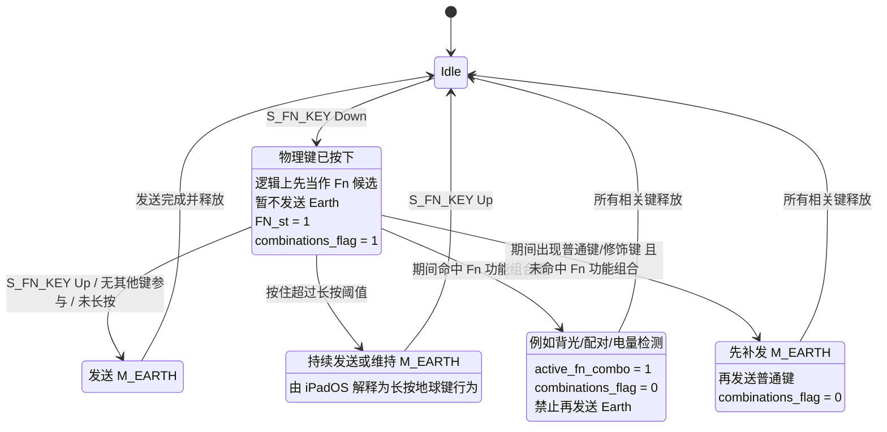
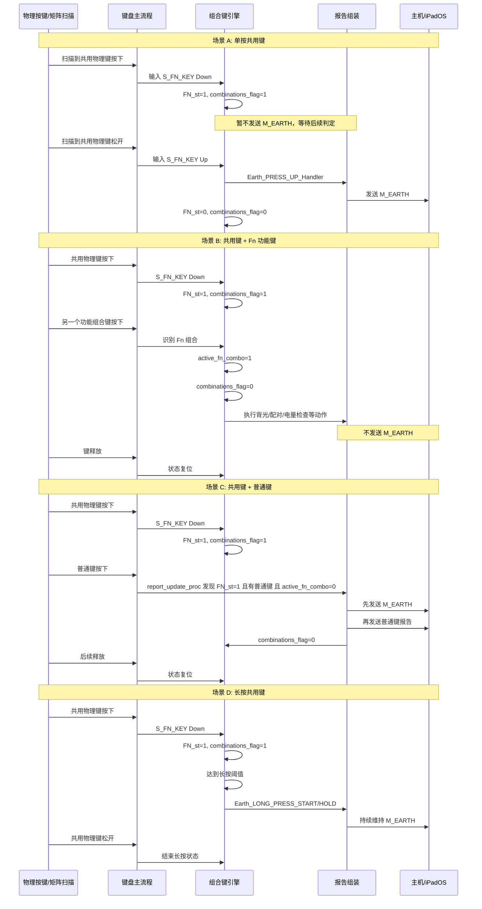

# 共用 Fn / Earth 按键需求摘要

## 1. 需求背景

当前项目需要在现有键盘输入框架中引入一颗“共用物理键”逻辑。该键在保持现有 `Fn` 能力与 `Fn` 层切换行为不变的前提下，同时承担 Apple 平台 `Earth` 键语义，并在非 Apple 平台映射为系统输入法切换快捷键。

本次需求目标不是重做整个键盘输入框架，而是在现有 `matrix -> keyboard -> combo -> report` 主链路上补齐“延迟决策”的共键状态机。

## 2. 已确认需求

### 2.1 平台范围

- 全平台启用共用键逻辑。
- Apple 平台：
  - `iPadOS / iOS` 启用 `M_EARTH`
  - `macOS` 同步采用 `M_EARTH`
- 非 Apple 平台：
  - `Windows` 使用 `Win + Space`
  - `Android` 统一使用 `Shift + Space`

### 2.2 功能定位

- 该物理键必须完整保留现有全部 `Fn` 组合能力。
- 该物理键必须继续保留现有 `Fn` 层切换行为。
- 在此基础上，额外叠加 `Earth` 共键逻辑。

### 2.3 行为要求

- 单按共用键且未参与其他键时：
  - Apple 平台发送 `M_EARTH`
  - Windows 发送 `Win + Space`
  - Android 发送 `Shift + Space`
- 当按下共用键后又按下“Fn 功能组合键”时：
  - 立即执行对应 `Fn` 功能
  - 不再发送 `Earth` 事件
- 当按下共用键后又按下“普通键 / 修饰键”，且未命中 `Fn` 功能组合时：
  - 立马发送`Earth`事件，当按键抬起时再抬起`Earth`
  - 不额外约束 `Earth` 与普通键的按下 / 抬起精细时序
- 长按共用键的 Apple 平台行为应支持系统侧 `Earth` 长按语义。

### 2.4 优先级

- 优先级顺序：行为正确 > 兼容性 > 设计整洁

## 3. 默认假设

以下内容当前按默认假设处理，后续方案设计若发现冲突，再回到需求层修订：

- 非 Apple 平台不新增独立“长按共用键”产品语义，仅维持对应平台的替代行为。
- “普通键”包含普通字符键，也包含需要与 `Earth` 共同参与系统快捷行为的修饰键。
- `Fn` 组合能力的定义以当前项目已有 `combo` 模块和现有 `Fn` 层键位为准，不在本轮需求中扩展新的业务功能。

## 4. 成功标准

- 共用键单按时，主机端能得到正确的平台输入法切换行为。
- 共用键与既有 `Fn` 功能组合同时使用时，`Earth` 不误触发。
- 共用键与普通键组合时，主机端行为与 2860 SDK 设计目标一致，不出现重复 `Earth`、漏发普通键或顺序颠倒导致的错误行为。
- 现有 `Fn` 层切换体验不被破坏，未受影响的现有按键路径保持兼容。

---

补充时序流程

