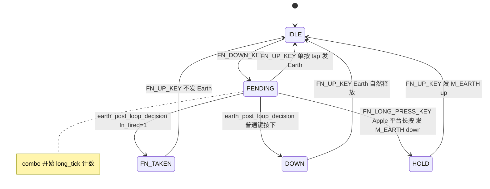

# Shared Fn/Earth Key 完整实现设计

## 1. 需求摘要

原始需求：`DOCS/plans/2026-03-17-shared-fn-earth-key-requirements.md`
需求分析：`DOCS/plans/2026-03-23-shared-fn-earth-key-requirements.md`

一颗物理键（`S_FN_KEY = QK_USER_0`）同时承担 Fn 层切换 + Earth 键语义。

| 场景 | 输入 | 行为 |
|------|------|------|
| A 单按 | S_FN_KEY 按下+松开（无其他键） | Apple=M_EARTH tap；Win=Win+Space tap；Android=Shift+Space tap |
| B Fn 组合 | S_FN_KEY + Fn 功能键 | 执行 Fn 功能，不发 Earth |
| C 普通键 | S_FN_KEY + 普通键 | 立即补发 Earth down，普通键正常上报；各自松开时抬起 |
| D 长按 | S_FN_KEY 按住 500ms+ | Apple：维持 M_EARTH down；松开发 M_EARTH up；非 Apple：无特殊行为 |
| D+普通键 | D 期间再按普通键 | Earth 继续维持，普通键并行上报 |

## 2. 现状分析

### 2.1 现有代码评估

| 场景 | 状态 | 问题 |
|------|------|------|
| A 单按 | 正常 | FN_UP_KEY 已有平台分支实现 |
| B Fn 组合 | 正常 | fn_fired 路径逻辑正确 |
| C 普通键 | 有 Bug | 条件错误，所有平台均无法触发 |
| D 长按 | 完全缺失 | 无定时器、无 EARTH_HOLD 状态 |

### 2.2 场景 C Bug 详情（kb_fn_action.c 第 120 行）

```c
// 当前（有 Bug）：
if (is_apple_platform() && has_normal_key_in_list(key_list)
    && has_normal_key_in_list(key_list_extend))

// 问题 1：is_apple_platform() 限制，Win/Android 无场景 C 逻辑
// 问题 2：key_list_extend 在场景 C 时为空（普通键不在 extend 列表中），条件永远 false
```

### 2.3 关键接口清单

| 接口/变量 | 位置 | 说明 |
|-----------|------|------|
| `earth_state` | kb_fn_action.c | 全局状态：IDLE/PENDING/DOWN/FN_TAKEN |
| `FN_st` | kb_combo_engine.c | Fn 键按下标志 |
| `combinations_flag` | kb_combo_engine.c | Fn 激活期间为 1，用于 Earth 判断 |
| `is_apple_platform()` | kb_fn_action.c:62 | 检查 IOS/MAC 平台 |
| `earth_post_loop_decision()` | kb_fn_action.c | 每帧 combo_task 末尾调用，处理 PENDING 状态分发 |
| `FN_DOWN_KEY()` | kb_fn_action.c | PRESS_DOWN 触发，设置 PENDING |
| `FN_UP_KEY()` | kb_fn_action.c | PRESS_UP 触发，按 earth_state 发送 Earth |
| `COMBO_LONG_TICKS` 宏 | kb_combo_engine.h:72 | 注册带长按的 combo |

## 3. 方案设计

### 3.1 状态机设计

新增 `EARTH_HOLD` 状态，共 5 个状态：



### 3.2 架构改动范围

仅改动 3 个文件：

| 文件 | 改动 |
|------|------|
| `middleware/keyboard/combo/kb_fn_action.h` | 新增 EARTH_HOLD 枚举值、FN_LONG_PRESS_KEY 声明、FN_EARTH_LONG_PRESS_MS 常量 |
| `middleware/keyboard/combo/kb_fn_action.c` | ①修复 earth_post_loop_decision 条件；②新增 FN_LONG_PRESS_KEY；③FN_UP_KEY 新增 EARTH_HOLD case |
| `middleware/keyboard/combo/kb_combo_map.c` | 新增 FN_LONG_PRESS_ID combo 注册 |

其余文件（kb_combo_engine.c、kb_sys_action.c、keyboard.c）不需要修改。

### 3.3 具体代码变更

#### 3.3.1 kb_fn_action.h

```c
// 新增枚举值
typedef enum {
    EARTH_IDLE,
    EARTH_PENDING,
    EARTH_DOWN,
    EARTH_FN_TAKEN,
    EARTH_HOLD,      // 新增：长按 500ms 后进入，维持 M_EARTH down
} earth_state_t;

// 新增常量（实现时在头文件或 kb_fn_action.c 顶部定义均可）
#define FN_EARTH_LONG_PRESS_MS  500

// 新增函数声明
uint8_t FN_LONG_PRESS_KEY(void);
```

#### 3.3.2 kb_fn_action.c — 修复场景 C（earth_post_loop_decision，约第 120 行）

```c
// 旧（有 Bug）：
if (is_apple_platform() && has_normal_key_in_list(key_list)
    && has_normal_key_in_list(key_list_extend)) {

// 新（修复）：移除平台限制，移除 key_list_extend 检查
if (has_normal_key_in_list(key_list)) {
    // 补发 Earth down（按平台选择键码）
    earth_send_down();
    combinations_flag = 0;
    earth_state = EARTH_DOWN;
}
```

注：`earth_send_down()` 为新增辅助函数，按平台发送对应的 Earth down 键码。

#### 3.3.3 kb_fn_action.c — 新增 FN_LONG_PRESS_KEY

```c
uint8_t FN_LONG_PRESS_KEY(void) {
    // 只在 Apple 平台且仍处于 PENDING 状态时触发
    if (is_apple_platform() && earth_state == EARTH_PENDING) {
        earth_state = EARTH_HOLD;
        combinations_flag = 0;
        add_keys_down(M_EARTH);  // 发送 M_EARTH down，持续维持
    }
    return 0;
}
```

#### 3.3.4 kb_fn_action.c — FN_UP_KEY 新增 EARTH_HOLD case，修订 EARTH_DOWN case

```c
case EARTH_DOWN:
    // 场景 C：S_FN_KEY 抬起时，Earth 与 S_FN_KEY 同步抬起
    // 需要显式发送 Earth up（按平台选键码），否则 Earth 会在主机侧粘连
    earth_send_up();
    break;

case EARTH_HOLD:
    // M_EARTH 已由 FN_LONG_PRESS_KEY 发出 down，此处发 up
    add_keys_up(M_EARTH);
    break;
```

**场景 C Earth 抬起说明：**
需求要求"当按键（S_FN_KEY）抬起时再抬起 Earth"。FN_UP_KEY 在 EARTH_DOWN case 必须显式发送 Earth up，
不能依赖"自然消失"，否则 add_keys_down 的持久寄存器会在主机侧造成 Earth 粘连。

#### 3.3.5 kb_combo_map.c — 新增 FN_LONG_PRESS_ID

```c
// FN_DOWN_combo 复用已有定义：{ S_FN_KEY, COMBO_END }
[FN_LONG_PRESS_ID] = COMBO_LONG_TICKS(FN_DOWN_combo,
                                       FN_EARTH_LONG_PRESS_MS,
                                       LONG_PRESS_START,
                                       FN_LONG_PRESS_KEY)
```

注：`FN_EARTH_LONG_PRESS_MS` 的时间单位需在实现时与 `COMBO_LONG_TICKS` 宏的单位对齐（见 Pre-check 步骤 0）。

### 3.4 场景 D + 普通键（EARTH_HOLD 下普通键并行）

EARTH_HOLD 状态下：
- `add_keys_down(M_EARTH)` 通过持久寄存器机制维持 M_EARTH 上报
- 普通键在 `_key_code_list` 中正常存在，report 合并两者
- `earth_post_loop_decision` 的 PENDING 守卫拦住此函数，不会重复发送 Earth
- 因此普通键并行上报无需额外处理

## 4. 实施前必须确认的项目（Blocker）

以下内容必须在编写代码前通过阅读源码确认，否则可能导致场景 D 完全失效：

| 编号 | 确认项 | 影响 | 确认方式 |
|------|-------|------|---------|
| P0-1 | `FN_DOWN_ID`（PRESS_DOWN combo）是否调用 `del_combo_keys()`？若是，S_FN_KEY 从 key_list 删除后 LONG_PRESS combo 无法追踪 | 场景 D 可能完全失效 | 读 kb_combo_engine.c 的 combo 遍历逻辑 |
| P0-2 | `COMBO_LONG_TICKS` 宏的时间单位（ms / tick / scan_period）| 500ms 阈值计算正确性 | 读 kb_combo_engine.h:72 附近的注释和现有用例 |
| P0-3 | `add_keys_down()` 是否为持久寄存器（持续上报到 `add_keys_up()`）| 场景 D 期间 M_EARTH 是否能持续维持 | 读 add_keys_down/up 实现 |

**备用方案（若 P0-1 确认 LONG_PRESS 无法工作）：**
在 `earth_post_loop_decision()` 中增加 EARTH_PENDING + 时间戳检测路径，记录 `fn_press_tick` 在 `FN_DOWN_KEY` 调用时，在 earth_post_loop_decision 检查超时，替代 COMBO_LONG_TICKS 机制。

## 5. 实施计划

### 步骤 0 — Pre-check（实现前验证）
- 读 `kb_combo_engine.c` 确认 del_combo_keys 调用时机（P0-1）
- 读 `kb_combo_engine.h:72` 及现有 COMBO_LONG_TICKS 使用案例确认时间单位（P0-2）
- 读 add_keys_down/up 实现确认持久性（P0-3）
- 若 P0-1 确认为 blocker，切换备用方案，继续实施

**完成标准：** 三个确认项均有明确答案，选定实现路径。

### 步骤 1 — 新增枚举和常量（kb_fn_action.h）
- 新增 `EARTH_HOLD` 枚举值
- 新增 `FN_EARTH_LONG_PRESS_MS 500` 常量
- 新增 `FN_LONG_PRESS_KEY()` 函数声明

**完成标准：** 头文件编译无错。

### 步骤 2 — 修复场景 C（kb_fn_action.c）
- 将第 120 行附近的条件修改为 `if (has_normal_key_in_list(key_list))`
- 删除 `is_apple_platform()` 限制和 `key_list_extend` 检查
- 如需，新增 `earth_send_down()` 辅助函数处理平台分支

**完成标准：** 仿真运行场景 C（Apple + Win + Android），report 中 Earth 出现在普通键之前。

### 步骤 3 — 实现 FN_LONG_PRESS_KEY 和 EARTH_HOLD 处理（kb_fn_action.c）
- 实现 `FN_LONG_PRESS_KEY()`（含 `is_apple_platform()` 守卫）
- 在 `FN_UP_KEY()` switch 中新增 `EARTH_HOLD` case

**完成标准：** 编译通过，仿真运行场景 D Apple 平台：按住超过 500ms 时 `earth_state` 转为 `EARTH_HOLD`，松开后 report 中 M_EARTH up 事件出现。

### 步骤 4 — 注册长按 combo（kb_combo_map.c）
- 新增 `FN_LONG_PRESS_ID`，使用 `COMBO_LONG_TICKS` 宏，绑定 `FN_LONG_PRESS_KEY`

**完成标准：** 编译通过，仿真场景 D（按住 500ms，Apple 平台）触发 EARTH_HOLD，report 中有 M_EARTH 持续存在。

### 步骤 5 — 全场景回归验证
运行以下测试，全部通过后完成实施：

| 测试 | 预期结果 |
|------|---------|
| A1：单按 Apple | M_EARTH press+release |
| A2：单按 Windows | GUI+Space press+release |
| A3：单按 Android | Shift+Space press+release |
| B1：Fn 功能组合 | 执行功能，report 无 M_EARTH |
| C1：普通键 Apple | M_EARTH 在普通键之前 |
| C2：普通键 Windows | GUI+Space 在普通键之前 |
| D1：长按 499ms 松开 | 走场景 A tap，不触发 HOLD |
| D2：长按 Apple 500ms+ | M_EARTH 持续，松开发 up |
| D3：长按非 Apple | 无特殊行为，走 PENDING 路径 |
| D4：长按 + 普通键 | Earth 维持，普通键并行 |

## 6. 成功标准

- 场景 A：主机端收到正确平台的输入法切换
- 场景 B：Fn 功能正常，无误触 Earth
- 场景 C：所有平台 Earth 出现在普通键之前
- 场景 D：Apple 平台长按地球键语义正常
- 现有 Fn 层切换体验不被破坏
