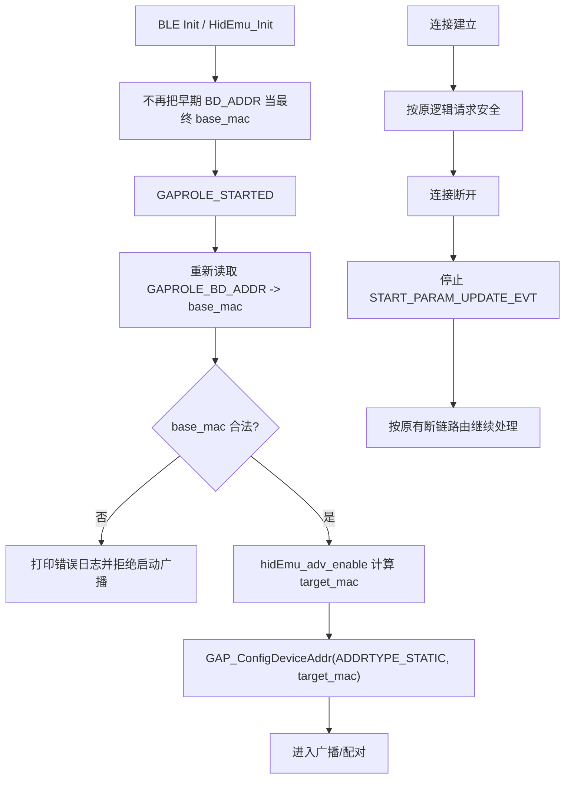

# BLE base_mac 初始化时机最小修复设计

日期: 2026-03-24

## 1. 结论

本轮新增日志后，问题根因已经收敛，不再需要继续扩大排查范围。

本次 iPad 首次连接失败的主根因是：

1. `base_mac` 读取时机错误。
2. 设备在 `GAPROLE_STARTED` 之前缓存了 `GAPROLE_BD_ADDR`，拿到的是全 0 地址。
3. 后续广播时使用这个错误的 `base_mac` 计算 `target_mac`，导致设备以错误静态地址广播。
4. iPad 连接到错误广播身份后，首次在 SMP 开始前快速断开；再次连接即使进入 `PAIR STARTED/PASSCODE`，最终也无法完成配对并超时断开。

次要问题是：

1. 连接断开后，`START_PARAM_UPDATE_EVT` 没有被停止。
2. 断链后仍持续发送连接参数更新请求，返回 `ret=0x14`。
3. 该问题会制造噪音日志，但不是本次断链主因。

## 2. 证据链

### 2.1 `base_mac` 在初始化阶段读取为全 0

日志：

- `[BT_ADDR] init cached base=0 0 0 0 0 0`

对应代码：

- `drivers/communication/bluetooth/ch584/hidkbd.c` `HidEmu_Init()`

说明：

- 当前代码在 `HidEmu_Init()` 中调用 `GAPRole_GetParameter(GAPROLE_BD_ADDR, base_mac)`。
- 但此时 GAP Peripheral Role 还未真正进入 `GAPROLE_STARTED`。
- 因此拿到的不是稳定有效的设备地址。

### 2.2 `GAPROLE_STARTED` 之后地址才有效

日志：

- `[BT_ADDR] started addr=e4 66 e5 47 9c fe cached_base=0 0 0 0 0 0`

说明：

- 同一次启动流程中，`GAPROLE_STARTED` 回调已经能读到真实地址。
- 这直接证明当前 `base_mac` 的缓存时机早于地址生效时机。

### 2.3 广播实际使用了错误地址

日志：

- `[BT_ADDR] adv base=0 0 0 0 0 0 idx=1 intent=1`
- `target_mac 0 0 1 0 0 0`
- `[BT_ADDR] config ret=0 target=0 0 1 0 0 0`

说明：

- 广播地址确实由全 0 `base_mac` 推导出来。
- 设备正在以错误的 static address 广播。

### 2.4 首次快速断链发生在 SMP 真正开始前

日志：

- `link established`
- `sec_req ret=0`
- 很快 `terminate reason=3e`
- 此前没有 `PAIR_STATE STARTED`

说明：

- 第一次失败发生在进入 BondMgr 配对状态机之前。
- 这与“广播身份错误导致链路很快被放弃”一致。

### 2.5 第二次可进入 passcode，但仍未完成配对

日志：

- `[PAIR_STATE] ... state=STARTED`
- `[PAIR_PASSCODE] ... uiIn=0 uiOut=0`
- 没有出现 `COMPLETE/BONDED/BOND_SAVED`
- 随后 `terminate reason=8`

说明：

- 第二次连接已经进入 SMP 过程，但依然没有完成配对。
- 结合错误地址问题，更符合“连接身份不稳定/不合法导致流程无法闭环”，而不是简单的 MITM / IO capability 参数不匹配。

### 2.6 `CONN_PARAM ret=14` 是断链后遗留事件

日志时间顺序：

1. 第二次连接建立：`17:29:50.867`
2. 断链：`17:29:54.488`
3. `CONN_PARAM req ret=14` 首次出现：`17:29:55.878`

协议栈定义：

- `0x14 = bleNotConnected`

说明：

- 连接参数更新请求是在断链之后继续触发的。
- 它是“断链后未清理定时器”的结果，不是触发本次断链的先因。

## 3. 本次最小修复范围

只修两个已经被日志证实的问题：

1. `base_mac` 缓存时机错误
2. 断链后 `START_PARAM_UPDATE_EVT` 未清理

明确不在本次范围内：

1. `pairing_state/intent` 语义重构
2. 默认启动走 pairing 还是 reconnect 的策略调整
3. BondMgr 安全参数调整
4. 广播过滤策略重构
5. iPad 平台兼容性专项优化

## 4. 修复方案

### 4.1 修复 `base_mac` 缓存时机

目标：

- 只有在地址已经稳定可读之后，才缓存 `base_mac`

建议改法：

1. 从 `HidEmu_Init()` 中移除“把 `GAPROLE_BD_ADDR` 作为最终 `base_mac`”的假设。
2. 在 `GAPROLE_STARTED` 回调中重新读取 `GAPROLE_BD_ADDR` 并写入 `base_mac`。
3. 后续所有 `hidEmu_adv_enable()` 的地址计算，统一以这个刷新后的 `base_mac` 为基准。

推荐保护：

1. 若 `base_mac` 仍为全 0，则不调用 `GAP_ConfigDeviceAddr()`。
2. 直接打印错误日志并拒绝启动广播。
3. 防止系统继续带着非法地址进入配对链路。

### 4.2 增加地址有效性保护

目标：

- 避免再次出现 `00:00:01:00:00:00` 这类明显异常地址被实际配置到广播中

建议改法：

1. 新增一个内部校验函数，例如：
   - 是否全 0
   - 是否全 `0xFF`
   - 是否满足本项目使用的 static address 基本合法性条件
2. 在 `hidEmu_adv_enable()` 中，先校验 `base_mac`
3. 若不合法：
   - 打印 `[BT_ADDR] invalid base_mac`
   - 直接返回，不启动广播

### 4.3 断链时停止连接参数更新定时器

目标：

- 避免断链后继续发 `GAPRole_PeripheralConnParamUpdateReq()`

建议改法：

1. 在 `hidDevGapStateCB()` 的“从 `GAPROLE_CONNECTED` 离开”分支中停止 `START_PARAM_UPDATE_EVT`
2. 在 `hidDevDisconnected()` 中也可增加一次兜底停止

这样做的价值：

1. 去掉 `ret=0x14` 噪音
2. 避免后续调试被假象干扰
3. 防止旧连接句柄残留事件污染新一轮连接

## 5. 核心流程



## 6. 伪代码

### 6.1 `GAPROLE_STARTED` 刷新地址

```c
case GAPROLE_STARTED:
{
    uint8_t started_addr[B_ADDR_LEN] = {0};
    GAPRole_GetParameter(GAPROLE_BD_ADDR, started_addr);

    if (is_valid_ble_addr(started_addr)) {
        memcpy(base_mac, started_addr, B_ADDR_LEN);
    } else {
        memset(base_mac, 0, B_ADDR_LEN);
        dprint("[BT_ADDR] invalid started addr\n");
    }
}
break;
```

### 6.2 广播前地址保护

```c
if (!is_valid_ble_addr(base_mac)) {
    dprint("[BT_ADDR] invalid base_mac, skip advertising\n");
    return;
}

memcpy(target_mac, base_mac, B_ADDR_LEN);
target_mac[3] += access_state.ble_idx;
GAP_ConfigDeviceAddr(ADDRTYPE_STATIC, target_mac);
```

### 6.3 断链后停止参数更新事件

```c
if (hidDevGapState == GAPROLE_CONNECTED && newState != GAPROLE_CONNECTED) {
    tmos_stop_task(hidDevTaskId, START_PARAM_UPDATE_EVT);
    hidDevDisconnected();
}
```

## 7. 修改文件

预计只改：

1. `drivers/communication/bluetooth/ch584/hidkbd.c`
2. `project/ch584m/Profile/hiddev.c`

不需要修改：

1. `middleware/communication/transport.c`
2. `middleware/communication/wireless_callbacks.c`
3. `_bt_driver.c`

## 8. 风险与边界

### 风险 1：唤醒路径是否重新进入 `GAPROLE_STARTED`

若某些低功耗恢复路径不会再次走 `GAPROLE_STARTED`，则应保留一个兜底：

1. 在首次 `hidEmu_adv_enable()` 时，若 `base_mac` 无效，尝试再读一次 `GAPROLE_BD_ADDR`
2. 仅当读到合法值时才继续广播

### 风险 2：地址保护可能让设备“不广播”

这是可接受的 fail-safe 行为。

原因：

1. 带着非法地址广播会继续制造不稳定连接
2. “明确不广播并报错”优于“广播了但必然配对失败”

## 9. 验证标准

修复后应满足以下日志特征：

1. 启动后
   - `[BT_ADDR] init cached base=...` 即使仍为 0 也可以接受
   - 但 `GAPROLE_STARTED` 后刷新得到真实地址
2. 广播前
   - `[BT_ADDR] adv base=...` 不再是全 0
   - `target_mac` 不再是 `0 0 1 0 0 0`
3. 首次连接
   - 不再出现“第一次 0x3E 立即断开”
4. 配对流程
   - 应出现 `PAIR_STATE STARTED -> COMPLETE -> BONDED/BOND_SAVED`
5. 断链后
   - 不再持续刷 `[CONN_PARAM] req ret=14`

## 10. 与旧结论的关系

本设计文档应视为对以下旧判断的修正与收敛：

1. 旧判断“默认启动路径走 pairing/reconnect 是主因”目前证据不足
2. 旧判断“5 秒连接参数更新可能是主根因”已被新日志否定

当前最稳固、最小且已被日志直接证明的修复方向，就是先修：

1. `base_mac` 初始化时机
2. 断链后参数更新事件清理
