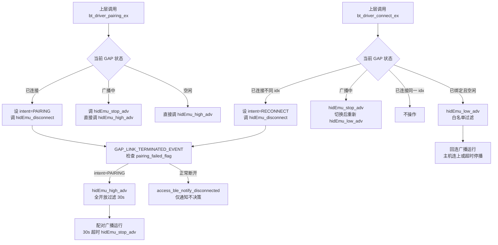

# BLE 首次点击连接失败修复设计

日期: 2026-03-24

## 1. 问题现象

设备上电后自动广播，在 iPad 首次点击连接时失败；再次点击后连接成功。

本轮调试日志显示：

- 首次失败路径:
  - 启动后进入 `bt_driver_pairing_ex()`
  - `pairing_state=1`
  - 本地仍判断当前槽位 `bonded=1`
  - 连接建立后立即断开，`terminate reason=0x3E`
  - 在断开前没有进入 `PAIR STARTED/COMPLETE`
- 第二次成功路径:
  - 进入 `bt_driver_connect_ex()`
  - `pairing_state=0`
  - 同样是 `bonded=1`
  - 连接后完整跑通 `PAIR STARTED -> COMPLETE -> BOND_SAVED`

## 2. 根因结论

根因不是 BLE 栈初始化失败，也不是 iPad 完全不能与当前安全参数配对。

根因是:

1. 当前工程在 BLE 初始化完成后，错误地把“默认启动流程”带入了配对路径，而不是回连路径。
2. 配对路径会改变广播身份地址选择逻辑，导致首次广播使用的地址与已绑定回连场景不一致。
3. iPad 首次点击连接时连接到了“配对身份”广播，链路很快被放弃；第二次点击时走普通回连路径，地址恢复正常，因此连接成功。

## 3. 证据链

### 3.1 启动后被强制带入 pairing

当前启动链路:

- `WL_INIT_EVT` 到达后调用 `system_select_default_transport()`
- `set_transport(TRANSPORT_BLUETOOTH)`
- `bt_transport_enable(true)` 中无条件执行:
  - `wireless_disconnect()`
  - `wireless_pairing_ex(0, NULL)`

关键代码:

- `middleware/communication/transport.c:46`
- `middleware/communication/transport.c:51`
- `middleware/communication/transport.c:58`

这意味着系统一上电默认就是“进入配对广播”。

### 3.2 pairing 路径会切到另一套地址

`bt_driver_pairing_ex()` 会直接设置:

- `access_state.ble_idx = host_idx`
- `access_state.pairing_state = TRUE`

关键代码:

- `drivers/communication/bluetooth/ch584/_bt_driver.c:146`
- `drivers/communication/bluetooth/ch584/_bt_driver.c:159`
- `drivers/communication/bluetooth/ch584/_bt_driver.c:160`

而 `hidEmu_adv_enable()` 中的广播地址选择，明确依赖 `pairing_state` 和 `ble_mac_flag`:

- `ownAddr[4] += access_state.ble_idx`
- `pairing_state==TRUE` 时，可能再改一次 `ownAddr[3]`
- `pairing_state==FALSE` 时，走另一套判断

关键代码:

- `drivers/communication/bluetooth/ch584/hidkbd.c:1006`
- `drivers/communication/bluetooth/ch584/hidkbd.c:1012`
- `drivers/communication/bluetooth/ch584/hidkbd.c:1020`
- `drivers/communication/bluetooth/ch584/hidkbd.c:1024`

本次实测日志里，两次广播地址确实不同:

- 首次失败前: `e4 67 e6 47 9c fe`
- 第二次成功前: `e4 67 e5 47 9c fe`

这说明第一次和第二次并不是同一个广播身份。

### 3.3 已绑定槽位不该走 pairing

首次失败时日志已经显示:

- `bond_flag=1`
- `result=1`
- `pairing=1`

也就是“本地认为这个槽位已经绑定”，却仍然进入了 pairing 广播。

关键代码:

- `drivers/communication/bluetooth/ch584/hidkbd.c:1045`

这与 demo 工程的行为不一致。demo 的默认流程是:

- 已绑定: 普通回连广播
- 未绑定: 等待显式配对命令
- 只有用户主动触发 pairing 时才设置 `pairing_state=TRUE`

参考:

- `docs/code_demo/KB04122-13A-WCH_code.xml` 中 `access_switch_ble_mode`
- `docs/code_demo/KB04122-13A-WCH_code.xml` 中 `access_pairing_mode`

### 3.4 0x3E 只是结果，不是主因

首次失败的 `terminate reason=0x3E` 发生在:

- `link established` 之后
- `PAIR STARTED` 之前

因此它更像是“首条链路很快被控制器/对端放弃”的结果。

结合第二次普通回连可以成功完成 SMP，可以判断:

- 安全参数不是这次回归的主因
- 主因仍然是首次广播身份与启动状态机错误

## 4. 修复方案

### 4.1 启动默认路径按绑定状态分流

修改目标:

- 上电进入 BLE 后，不再无条件进入 `pairing`
- 已绑定槽位默认走 `wireless_connect_ex(...)`
- 未绑定槽位默认走 `wireless_pairing_ex(...)`，进入可发现广播
- 不再在 `bt_transport_enable(true)` 里无条件调用 `wireless_pairing_ex(0, NULL)`

建议改法:

1. 保留显式配对入口:
   - `WL_DISCOVERABLE_EVT`
   - `wireless_pairing_ex(...)`
   - `bt_driver_pairing_ex(...)`
2. 修改默认启动入口:
   - 若存在有效 BLE 槽位且本地已绑定，则调用 `wireless_connect_ex(host_idx, 0)`
   - 若存在有效 BLE 槽位但本地未绑定，则调用 `wireless_pairing_ex(host_idx, NULL)`
   - 若 host 传 0，则由驱动层回退到已保存槽位

### 4.2 启动时不要无条件 disconnect

当前 `bt_transport_enable(true)` 一进入就 `wireless_disconnect()`，这不符合 demo 的启动思路，也会把启动链路拉得更混乱。

建议:

- 启动启用 BT 传输时，不主动断链
- 只有在真正切换主机、切换通道、或显式配对时，才断开当前连接/广播

### 4.3 `WL_PAIR_EVT / WL_DISCOVERABLE_EVT` 语义与触发源收敛

当前问题:

- `WL_PAIR_EVT` 的真实来源是上层“配对请求”
- `WL_DISCOVERABLE_EVT` 的真实含义应是“底层已经进入可发现/配对广播”
- 现状里 `WL_DISCOVERABLE_EVT` 没有真实触发源，`access_ble_notify_advertising()` 直接修改无线状态，导致命名和实际链路不一致

修复要求:

1. `WL_PAIR_EVT` 保留为“配对请求事件”
   - 来源: 上层按键/组合键/业务请求
   - 行为: 触发 `wireless_pairing_ex(...)`
2. `WL_DISCOVERABLE_EVT` 改为“已经进入可发现广播事件”
   - 来源: `access_ble_notify_advertising(pairing_state=1, host_idx)`
   - 行为: 更新无线状态并驱动上层指示
3. `WL_RECONNECTING_EVT` 改为“已经进入回连广播事件”
   - 来源: `access_ble_notify_advertising(pairing_state=0, host_idx)`
   - 行为: 更新无线状态并驱动上层指示

### 4.4 pairing 地址切换逻辑保留给“显式配对”

当前 `pairing_state` 对地址选择是有设计意图的，不建议直接删掉。

建议:

- 保留该逻辑，用于用户明确进入配对模式时
- 禁止默认启动流程误触发该逻辑

## 5. 预期结果

修复后预期日志应变为:

- 上电后:
  - 默认走 `connect_ex`
  - `pairing=0`
  - 已绑定时走普通回连广播
- iPad 首次点击连接:
  - 直接完成连接与后续安全流程
  - 不再出现“第一次失败、第二次成功”

## 6. 修改范围

预计只改以下启动路径代码:

- `middleware/communication/transport.c`

必要时补少量保护逻辑:

- `application/service/communication_service.c`

当前阶段不计划修改:

- `drivers/communication/bluetooth/ch584/hidkbd.c` 的配对地址切换算法
- `project/ch584m/Profile/hiddev.c` 的 BondMgr 安全参数

## 7. 回归验证

修复后重点验证:

1. 已绑定首连
   - 上电进入 BT 后第一次点击 iPad 即可成功连接
2. 重启回连
   - 设备重启后仍走回连路径，不再先走 pairing 路径
3. 清除绑定后新配对
   - 无绑定槽位默认进入可发现广播，能够完成新配对
4. 三模切换
   - USB -> BT
   - 2.4G -> BT
   - BT -> USB / 2.4G
   - 不引入额外断链或错误状态

本轮本地仅能完成代码路径与构建层面的回归检查，真机蓝牙验证仍需依赖烧录后实测。

