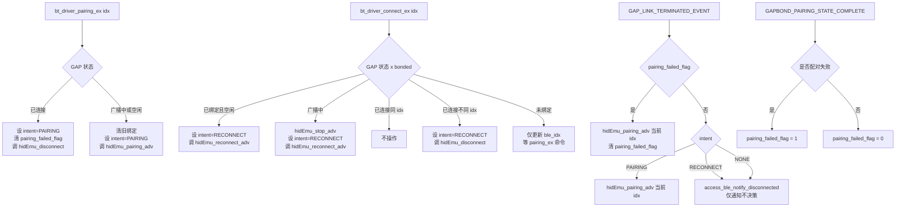

# BLE 蓝牙稳定性修复设计文档

**日期：** 2026-03-24
**状态：** 设计完成，待实施
**需求文档：** `DOCS/plans/2026-03-24-ble-stability-fix-requirements.md`

---

## 1. 方案概述

**方案名称：** BLE 广播分级重构（对齐 Demo 工程 pcl004-ch59x）

**修复目标：**
1. 配对模式经常连不上（首次配对 / 重新配对）
2. 连接成功后重新开关机无回连

**修复范围：**
- `drivers/communication/bluetooth/ch584/hidkbd.c`（主要）
- `drivers/communication/bluetooth/ch584/_bt_driver.c`
- `middleware/communication/wireless_callbacks.c`（约 10-20 行）

**改动规模：** 约 150-200 行

---

## 2. 根因回顾

| 编号 | 根因 | 位置 |
|------|------|------|
| A | 地址漂移：`ownAddr` 从运行时读取并叠加偏移，非幂等 | `hidkbd.c:1027-1051` |
| B | `pairing_state` 四职一身：广播过滤、地址偏移、睡眠豁免、回调路由 | `hidkbd.c`、`_bt_driver.c` |
| C | `pairing_ex` 依赖 disconnect→回调 间接链路启动广播，WAITING 状态下链路不触发 | `_bt_driver.c:185-191` |
| D | `access_ble_notify_disconnected` 在驱动回调内预判下一步，配对失败后路由依赖时序 | `wireless_callbacks.c:182-193` |

---

## 3. 核心流程



---

## 4. 接口设计

### 4.1 新增广播接口（hidkbd.c / hidkbd.h）

```c
// 配对广播：全开放过滤（GAP_FILTER_POLICY_ALL），30s 限时
// 使用 Static Random Address（不设 IRK），base_mac[3] + idx
void hidEmu_pairing_adv(access_ble_idx_t idx);

// 回连广播：白名单过滤（GAP_FILTER_POLICY_WHITE），低频长时
// 使用 Static Random Address，base_mac[3] + idx
void hidEmu_reconnect_adv(access_ble_idx_t idx);

// 停止广播，不自动重启
void hidEmu_stop_adv(void);

// 清零配对失败标志（供 _bt_driver.c 在 pairing_ex/connect_ex 入口调用）
void hidEmu_clear_pairing_failed_flag(void);
```

### 4.2 地址管理（hidkbd.c 内部）

```c
// 出厂 MAC 缓存（hidEmu_init 中读取一次）
static uint8_t base_mac[B_ADDR_LEN];

// hidEmu_init() 中：
GAPRole_GetParameter(GAPROLE_BD_ADDR, base_mac);
// 此时 BLE 栈已初始化，GAPROLE_BD_ADDR 读到的是芯片出厂 OTP 地址

// 广播启动前（hidEmu_pairing_adv / hidEmu_reconnect_adv）：
uint8_t target_mac[B_ADDR_LEN];
memcpy(target_mac, base_mac, B_ADDR_LEN);
target_mac[3] += (uint8_t)idx;   // 幂等计算，不叠加
// 不设置 IRK（移除旧代码中 GAPRole_SetParameter(GAPROLE_IRK, ...) 调用）
GAP_ConfigDeviceAddr(ADDRTYPE_STATIC, target_mac);
```

### 4.3 状态字段重构（_bt_driver.c / hidkbd.h）

```c
// 新增枚举（替代 pairing_state 的广播意图职责）
typedef enum {
    BLE_INTENT_NONE     = 0,
    BLE_INTENT_PAIRING  = 1,
    BLE_INTENT_RECONNECT = 2,
} ble_intent_t;

// access_state_t 修改：
typedef struct {
    // pairing_state 字段改为 intent：
    ble_intent_t intent;          // 替代原 pairing_state（uint8_t）
    uint8_t Fn_state;
    volatile uint8_t sleep_en;
    uint8_t deep_sleep_flag;
    uint8_t idel_sleep_flag;
    access_ble_idx_t ble_idx;
} access_state_t;

// hidkbd.c 内部新增（静态变量）：
static uint8_t pairing_failed_flag = 0;   // 配对失败标志
```

**注意：** `intent` 语义是"已请求的操作意图"，不代表"当前 GAP 状态"。
`intent` 与 GAP 状态之间存在时间差（disconnect 异步完成），`GAP_LINK_TERMINATED_EVENT` 读取 `intent` 时已是可靠的稳定值。

**与需求中 `adv_filter_open + mac_need_change` 方案的关系：**

需求文档（§4 根因 B）建议将 `pairing_state` 拆分为 `adv_filter_open`（广播过滤）和 `mac_need_change`（MAC 切换）两个字段。本设计采用 `ble_intent_t intent` 枚举方案，两者等价：

| intent 值 | 等价于 | 说明 |
|-----------|--------|------|
| `BLE_INTENT_PAIRING` | `adv_filter_open=TRUE, mac_need_change=TRUE` | 配对场景：全开广播 + 新地址 |
| `BLE_INTENT_RECONNECT` | `adv_filter_open=FALSE, mac_need_change=FALSE` | 回连场景：白名单过滤 + 固定地址 |
| `BLE_INTENT_NONE` | `adv_filter_open=FALSE, mac_need_change=FALSE` | 空闲/断开：不广播 |

`intent` 枚举方案的优势：语义更完整（包含"空闲"状态），减少字段数量，避免两个字段的无效组合（如 `adv_filter_open=TRUE, mac_need_change=FALSE` 这种不应出现的状态）。

### 4.4 睡眠豁免处理

旧 `pairing_state` 控制睡眠豁免（`!pairing_state` 才允许深睡眠），修改为：

```c
// hidEmu_adv_enable 中替换 pairing_state 判断：
if (access_state.intent == BLE_INTENT_PAIRING) {
    // 配对期间豁免深睡眠
} else {
    // 回连/空闲期间正常调度睡眠定时器
}
```

---

## 5. 各模块修改说明

### 5.1 hidkbd.c

**新增：**
- `static uint8_t base_mac[B_ADDR_LEN]` 静态变量
- `static uint8_t pairing_failed_flag` 静态变量
- `hidEmu_pairing_adv(idx)` 函数（内部调用 `hidEmu_adv_enable` 或直接设参数）
- `hidEmu_reconnect_adv(idx)` 函数
- `hidEmu_stop_adv()` 函数

**修改：**
- `hidEmuTaskInit()` / `HidEmu_Init()`：添加 `GAPRole_GetParameter(GAPROLE_BD_ADDR, base_mac)`
- `hidEmu_adv_enable()`：
  - 移除 `GAPRole_GetParameter(GAPROLE_BD_ADDR, ownAddr)` + 叠加偏移
  - 改为从 `base_mac` 幂等计算目标地址
  - 移除 `GAPRole_SetParameter(GAPROLE_IRK, ...)` 调用
  - `pairing_state` 判断改为 `intent` 判断（6 处）
- `hidEmuStateCB` `GAP_LINK_TERMINATED_EVENT`：
  - 新增 `pairing_failed_flag` 检查分路
  - `intent == PAIRING` 时重新调用 `hidEmu_pairing_adv`
  - 其他情况调用 `access_ble_notify_disconnected`（简化为仅通知）
- `hidEmuStateCB` `GAPROLE_WAITING`：
  - 移除基于 `pairing_state` 的自动续接广播逻辑
  - 不在此处自动续接，等上层命令
- `hidEmuStateCB` `GAPBOND_PAIRING_STATE_COMPLETE` / `HID_BOND_STATE_CB_EVT`：
  - 配对失败（`SMP_PAIRING_FAILED_*`）时：`pairing_failed_flag = 1`
  - 配对成功时：`pairing_failed_flag = 0`
- 广播超时（`GAP_ADV_TIMEOUT_EVT` 或 `HID_ADV_TIMER_EVT`）：
  - 调用 `hidEmu_stop_adv()`
  - 通知上层 `access_ble_notify_adv_timeout(access_state.ble_idx)`

### 5.2 _bt_driver.c

**修改 `bt_driver_pairing_ex`：**
```c
void bt_driver_pairing_ex(uint8_t host_idx, void *param)
{
    // 1. 入口清零配对失败标志（防止残留）
    // pairing_failed_flag 是 hidkbd.c 的 static 变量，通过以下接口跨文件清零：
    hidEmu_clear_pairing_failed_flag();  // hidkbd.h 中声明的清零接口

    // 2. 清除旧绑定（立即，不等配对完成）
    if (bt_driver_is_host_bonded(host_idx)) {
        hidEmu_clear_bonding(host_idx);  // 清除对应 idx 的绑定记录
    }

    // 3. 设置 intent 和 ble_idx
    access_state.intent = BLE_INTENT_PAIRING;
    access_state.ble_idx = host_idx;

    // 4. 根据当前 GAP 状态直接启动
    if (ble_state == GAPROLE_CONNECTED) {
        hidEmu_disconnect();  // 断开后由 GAP_LINK_TERMINATED_EVENT → intent=PAIRING 续接
    } else {
        if (ble_state == GAPROLE_ADVERTISING) {
            hidEmu_stop_adv();
        }
        hidEmu_pairing_adv(host_idx);  // 直接启动，不等异步回调
    }
}
```

**修改 `bt_driver_connect_ex`：**
```c
void bt_driver_connect_ex(uint8_t host_idx, uint16_t timeout)
{
    // 1. 入口清零配对失败标志
    // （通过访问接口清零）

    // 2. 验证/修正 host_idx
    access_ble_idx_t target_idx = /* 验证逻辑不变 */;

    // 3. 设置 ble_idx，intent 初始为 RECONNECT
    access_state.ble_idx = target_idx;
    access_state.intent = BLE_INTENT_RECONNECT;

    if (ble_state == GAPROLE_CONNECTED) {
        if (con_work_mode == target_idx) {
            return;  // 已连接同一主机，不操作
        }
        hidEmu_disconnect();  // 断开后由 TERMINATED → intent=RECONNECT 续接
    } else if (ble_state == GAPROLE_ADVERTISING) {
        hidEmu_stop_adv();
        if (hidEmu_is_ble_bonded(target_idx)) {
            hidEmu_reconnect_adv(target_idx);
        }
    } else {
        if (hidEmu_is_ble_bonded(target_idx)) {
            hidEmu_reconnect_adv(target_idx);
        } else {
            // 未绑定：仅更新 ble_idx，等 pairing_ex 命令
            access_state.intent = BLE_INTENT_NONE;
        }
    }
}
```

**修改 `access_state_t`：** `pairing_state` → `intent`（类型改为 `ble_intent_t`）

**修改 `bt_driver_dump_state()`：** 更新日志字段名

### 5.3 wireless_callbacks.c

**修改 `access_ble_notify_disconnected`：**
```c
// 修改前：在回调里预判下一步
// 修改后：仅传递断开事件，不决策后续
void access_ble_notify_disconnected(access_ble_idx_t idx, uint8_t reason)
{
    wl_event_t event = {
        .ble_idx = idx,
        .reason = reason,
        // 不再设置 evt_type 为 DISCOVERABLE/RECONNECTING
    };
    // WL_DISCONNECTED_EVT handler 根据上层状态机决定后续
    OSAL_SetEvent(commu_taskID, WL_DISCONNECTED_EVT);
}
```

`WL_DISCONNECTED_EVT` 的 handler 根据 `wireless_state`（非 `intent`）决定是否需要发起 `WL_RECONNECT_EVT`，`intent` 已在驱动层使用，中间件层不应重复读取。

---

## 6. 验证场景与预期结果

| 场景 | 操作 | 预期结果 |
|------|------|---------|
| A | 首次开机无绑定，`pairing_ex(INDEX_1)` | `hidEmu_pairing_adv` 启动，30s 内可被任意主机发现 |
| B | 已绑定主机1，切换主机2配对 | 清除 INDEX_2 旧绑定，新地址 `base[3]+2`，全开广播 |
| C | 已绑定，关机重启，`connect_ex(INDEX_1)` | 地址幂等 `base[3]+1`，白名单过滤，主机回连成功 |
| D | 连接中主机关蓝牙断开 | `pairing_failed_flag=0`，`intent=NONE`，`notify_disconnected` 通知上层，设备停播 |
| D1 | 场景 D 后立即按键 | 设备无广播（`wireless_send_keyboard` 可能调 `wireless_connect`，需确认不发起广播，这是已知限制，见 §7） |
| E | 配对广播 30s 超时 | `hidEmu_stop_adv()`，`notify_adv_timeout(idx)` 通知上层 |
| F | 配对广播中调 `pairing_ex(INDEX_2)` | stop→换 idx→`hidEmu_pairing_adv(INDEX_2)` |
| G | 对已绑定主机重新配对 | 立即清除旧绑定，`hidEmu_pairing_adv` 新地址，旧主机无法抢连 |
| H | `connect_ex` 调用时正在广播 | stop→`hidEmu_reconnect_adv` |
| I | 3 个 idx 循环切换 | 各 idx 地址 `base[3]+1/2/3` 独立，SNV 无冲突 |

---

## 7. 已知风险与限制

| 风险 | 级别 | 说明 | 处理方式 |
|------|------|------|---------|
| SNV 分区大小 | 高 | 3 个 idx 各占 `0x100`，共 `0x300`，CH584 SNV 可能只有 `0x200`，idx_3 越界 | 实施前验证 `project/ch584m/platforms_HAL/include/CONFIG.h` 中 SNV 分区配置 |
| wireless_send_keyboard 竞争 | 中 | `WT_RECONNECTING` 状态下按键调 `wireless_connect()` 硬编码 `BLE_INDEX_1`，可能覆盖 pairing_ex 操作 | 本期标注为已知限制，后续单独修复 wireless.c 中的硬编码 |
| `reconnect_adv_fallback_stage` | 低 | 切换 idx 时 fallback_stage 未复位，可能污染新 idx 广播策略 | 在 `pairing_ex` / `connect_ex` 中调用 `hidEmu_prepare_reconnect_adv()` 复位 |
| `hidEmu_adv_enable` 遗漏读取点 | 低 | `pairing_state` 共有 6 处功能性读取点（`hidEmu_adv_enable` 5处 + `GAPROLE_WAITING` 1处），需全部修改 | 实施时逐一确认，不遗漏 |

---

## 8. 实施计划

### 步骤 1：地址管理重构（hidkbd.c）
**目标文件：** `drivers/communication/bluetooth/ch584/hidkbd.c`
**具体修改：**
1. 在文件顶部添加 `static uint8_t base_mac[B_ADDR_LEN] = {0}`
2. 在 `HidEmu_Init()` 中添加 `GAPRole_GetParameter(GAPROLE_BD_ADDR, base_mac)`
3. 在 `hidEmu_adv_enable()` 中：
   - 删除 `GAPRole_GetParameter(GAPROLE_BD_ADDR, ownAddr)` 及叠加偏移代码（L1027-L1051）
   - 改为 `memcpy(target_mac, base_mac, ...); target_mac[3] += idx`
   - 删除 `GAPRole_SetParameter(GAPROLE_IRK, ...)` 调用
**验证命令：** 编译通过 + 连续调用 `hidEmu_adv_enable` 10 次，日志确认地址不变

### 步骤 2：广播接口分级（hidkbd.c / hidkbd.h）
**目标文件：** `hidkbd.c`、`hidkbd.h`
**具体修改：**
1. 新增 `void hidEmu_pairing_adv(access_ble_idx_t idx)` 实现
2. 新增 `void hidEmu_reconnect_adv(access_ble_idx_t idx)` 实现
3. 新增 `void hidEmu_stop_adv(void)` 实现
4. 在 `hidkbd.h` 中导出三个函数声明
**验证：** 编译通过，函数可被 `_bt_driver.c` 调用

### 步骤 3：状态字段重构（_bt_driver.c / hidkbd.h）
**目标文件：** `_bt_driver.c`、`hidkbd.h`（或 `bt_driver.h`）
**具体修改：**
1. 新增 `ble_intent_t` 枚举定义
2. `access_state_t.pairing_state` 改为 `ble_intent_t intent`
3. 更新所有 `pairing_state` 写入点（6 处）
4. 更新 `bt_driver_dump_state()` 日志
**验证：** 编译通过，所有读写点无遗漏

### 步骤 4：重写 bt_driver_pairing_ex 和 bt_driver_connect_ex（_bt_driver.c）
**具体修改：** 按 §5.2 的伪代码重写两个函数
**验证：** 代码审查确认覆盖 9 个场景

### 步骤 5：配对失败分路处理（hidkbd.c）
**具体修改：**
1. 添加 `static uint8_t pairing_failed_flag = 0`
2. 在 `HID_BOND_STATE_CB_EVT` 中按结果置位/清零
3. 在 `GAP_LINK_TERMINATED_EVENT` 中添加 `pairing_failed_flag` 检查
4. 移除 `GAPROLE_WAITING` 中基于 `pairing_state` 的自动续接逻辑
5. 添加广播超时事件处理（`hidEmu_stop_adv` + `notify_adv_timeout`）
**验证：** 模拟配对失败场景（手动触发 SMP 错误），确认重新发起配对广播

### 步骤 6：简化 wireless_callbacks.c（wireless_callbacks.c）
**具体修改：** 按 §5.3 简化 `access_ble_notify_disconnected`
**验证：** 断开事件后中间件层状态机正常转换

### 步骤 7：SNV 分区验证
**操作：** 读取 `project/ch584m/platforms_HAL/include/CONFIG.h` 确认 SNV 分区大小
**验证：** 3 个 idx 共 `0x300` 字节在分区内，否则调整步长

### 步骤 8：端到端测试
按场景 A-I 逐一验证，使用 nRF Sniffer 抓包确认地址固定性。

---

## 9. 测试桩说明

**PC 桩测试（`drivers/communication/bluetooth/test/_bt_driver.c`）：**
- mock `hidEmu_pairing_adv`、`hidEmu_reconnect_adv`、`hidEmu_stop_adv`，记录调用参数
- 验证：`bt_driver_connect_ex` 各分支 `intent` 设置正确
- 验证：`bt_driver_pairing_ex` 各状态下的函数调用序列
- 验证：`base_mac` 幂等性（多次计算地址不变）

**硬件专用场景（必须上设备）：**
- `GAP_LINK_TERMINATED_EVENT` 触发路径（依赖真实断开事件）
- `pairing_failed_flag` 在 TERMINATED 事件中的实际置位（依赖栈回调顺序）
- 空中包地址验证（nRF Sniffer）
- 多设备 SNV slot 切换后的地址可见性
