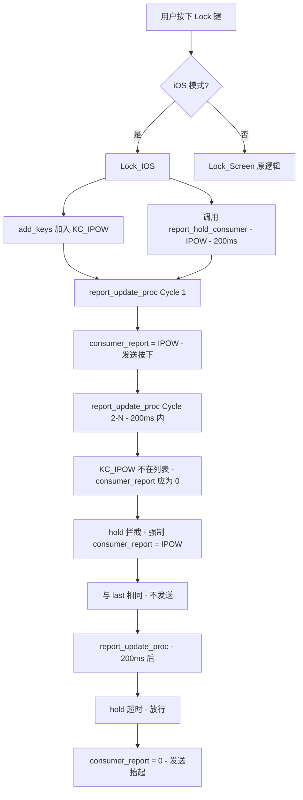

# iOS Lock Screen 设计文档

## 需求摘要

在 kb_fn_action.c 新增 Lock_IOS 方法：发送 KC_IPOW 按下后保持 200ms 再自动抬起。仅 iOS 设备使用，与现有 Lock_Screen 共存，通过 host_system_type 标志位切换。开机默认 iOS 模式。

## 现状分析

- FN action 机制为同步一次性调用（添加键码、立即返回），缺乏异步保持能力
- Consumer report 通过差分检测发送，设置 consumer_report = 0 即释放
- report_update_proc 内部管理 consumer_report，外部无法直接操控
- combo 引擎已有 timer_elapsed32 定时器模式可复用

## 方案设计

### 核心思路

在 report.c 新增 `report_hold_consumer(keycode, duration_ms)` 接口和 consumer_hold 状态机。在 report_update_proc 的 consumer 差分检测前插入拦截逻辑：hold 激活且未超时时强制 consumer_report 保持 hold 键码值；超时后放行，consumer_report 自然归零触发抬起。

### 核心流程



### 时序图

```
t=0ms    : Lock_IOS 触发 → add KC_IPOW → report_hold_consumer(IPOW, 200)
t=0ms    : report_update_proc → consumer=IPOW → hold强制IPOW → 发送按下
t=1~5ms  : report_update_proc → consumer=0 → hold强制为IPOW → 与last相同 → 不发送
...
t=200ms  : report_update_proc → hold超时 → consumer=0 → 与last不同 → 发送抬起
```

### 改动清单

#### 1. report.h — 新增接口

```c
// 保持 consumer 键按下指定时长（超时后自动释放）
// 参数为已转换的 consumer usage 值（通过 KEYCODE2CONSUMER 转换）
void report_hold_consumer(uint16_t consumer_usage, uint32_t duration_ms);
```

#### 2. report.c — hold 状态机

```c
#include "timer.h"

static struct {
    bool active;
    uint16_t keycode;       // 已转换的 consumer usage 值
    uint32_t start_time;
    uint32_t duration;
} consumer_hold = {false, 0, 0, 0};

void report_hold_consumer(uint16_t consumer_usage, uint32_t duration_ms) {
    consumer_hold.active = true;
    consumer_hold.keycode = consumer_usage;
    consumer_hold.start_time = timer_read32();
    consumer_hold.duration = duration_ms;
}
```

#### 3. report.c — report_update_proc 拦截逻辑

在 consumer 差分检测之前（构建完成后、发送前）插入：

```c
// hold 拦截：检测新 consumer 键冲突
if (consumer_hold.active) {
    if (timer_elapsed32(consumer_hold.start_time) >= consumer_hold.duration) {
        // 超时，放行自然释放
        consumer_hold.active = false;
    } else if (consumer_report != 0 && consumer_report != consumer_hold.keycode) {
        // 新 consumer 键出现，终止 hold（防吞键）
        consumer_hold.active = false;
    } else {
        // 未超时且无冲突，强制保持按下
        consumer_report = consumer_hold.keycode;
    }
}
```

#### 4. kb_fn_action.c — Lock_IOS 函数

```c
// iOS 锁屏：发送 KC_IPOW，保持 200ms 后自动抬起
uint8_t Lock_IOS(uint16_t* add_keys) {
    add_keys[0] = KC_IPOW;
    report_hold_consumer(KEYCODE2CONSUMER(KC_IPOW), 200);
    return 1;
}
```

#### 5. kb_combo_engine.c — iOS 标志位切换（combo 注册处）

```c
// 根据 host_system_type 选择 Lock 函数
if (host_system_type == IOS) {
    FN_ADD_ACTION(fn_lock_screen, Lock_IOS);
} else {
    FN_ADD_ACTION(fn_lock_screen, Lock_Screen);
}
```

### 防重入机制

- `consumer_hold.active` 即防重入标志：hold 激活期间再次调用 `report_hold_consumer` 会覆盖，重新计时
- hold 期间新 consumer 键出现时终止 hold，避免吞键

### 异常处理

| 场景 | 处理方式 |
|------|---------|
| 200ms 内重复触发 | report_hold_consumer 覆盖，重新计时 |
| BLE 断连 | hold 200ms 后 active 清除，send_consumer 失败但不泄漏状态 |
| hold 期间新 consumer 键 | 终止 hold，新键正常发送 |
| iOS 标志位运行时切换 | 切换后下次触发走对应函数，不影响当前 hold |
| timer 溢出 | TIMER_DIFF_32 无符号减法天然处理 uint32 环绕 |

## 评审结论

- 功能完整性：通过
- 技术可行性：通过（timer 精度 1-5ms 可接受）
- 可维护性：通过（改动局部化，接口通用可复用）
- 可测试性：中等（建议仿真层提供时间注入）
- 风险：2 个高风险已通过设计缓解（新 consumer 键冲突 + 拦截点时序）

## 实施计划

### SMART 分步计划

| 步骤 | 内容 | 文件 | 完成标准 | 依赖 |
|------|------|------|---------|------|
| 1 | 新增 `report_hold_consumer` 接口声明 | `report.h` | 编译通过 | 无 |
| 2 | 新增 `consumer_hold` 状态机 + 实现 | `report.c` | 编译通过 | 步骤 1 |
| 3 | 在 `report_update_proc` 插入 hold 拦截逻辑 | `report.c` | 编译通过 | 步骤 2 |
| 4 | 新增 `Lock_IOS` 函数 + 头文件声明 | `kb_fn_action.c` + `.h` | 编译通过 | 步骤 1 |
| 5 | FN 注册处添加 iOS 标志位切换 | `kb_combo_engine.c` | 编译通过 | 步骤 4 |
| 6 | 编译验证 | 全项目 | `cmake --build` 无错误 | 步骤 1-5 |
| 7 | 硬件实测 | CH584M + iOS 设备 | iOS 锁屏成功 + 非 iOS 不受影响 | 步骤 6 |

**并行分组：** 步骤 1-3（report 模块）和步骤 4-5（fn_action 模块）相互独立，可并行实施。
