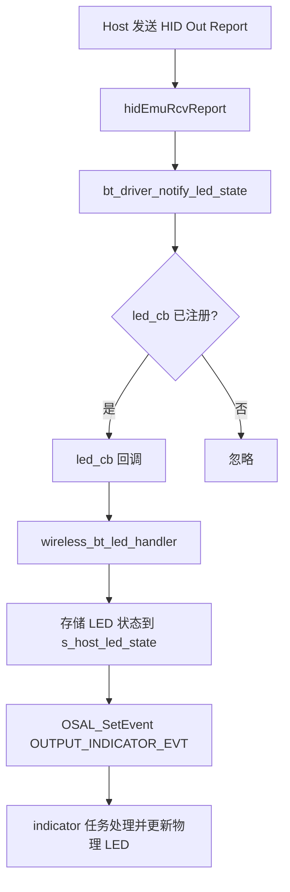

# 设计文档：统一三模 HID LED 回调架构

> 日期：2026-03-29
> 状态：已确认

## 1. 需求摘要

为蓝牙驱动 bt_driver 注册大小写灯回调，调用点在 hidEmuRcvReport，统一三模 LED 回调架构。BLE 先实现完整链路，2.4G/USB 预留接口不实现。

**功能范围**：所有 HID LED 状态（Caps Lock / Num Lock / Scroll Lock）

## 2. 现状分析

| 模块 | 文件 | 现状 | 差距 |
|------|------|------|------|
| BLE HID | `drivers/communication/bluetooth/ch584/hidkbd.c` | hidEmuRcvReport 收到 LED 报告，仅打印日志 | 缺少回调通知上层 |
| BT Driver | `drivers/communication/bluetooth/ch584/_bt_driver.c/h` | 无 LED 相关接口 | 需添加 LED 回调注册/通知接口 |
| Wireless | `middleware/communication/wireless.c/h` | 驱动函数表中无 LED 回调字段 | 需添加 LED 回调注册 |
| Indicator | `drivers/output/indicators/indicator.c` | LED 控制接口完善 | 通过 OSAL 事件更新，无需修改 |

## 3. 方案设计

### 3.1 核心流程



### 3.2 架构设计

**层级约束**：
- Profile → Driver：hidkbd.c 只调用 bt_driver 接口，不直接调用 wireless
- Driver → Middleware：通过回调函数指针向上通知，不直接依赖
- Middleware → Driver：wireless.c 通过 OSAL 事件通知 indicator

| 层级 | 文件 | 修改内容 |
|------|------|---------|
| Profile | `hidkbd.c` | hidEmuRcvReport 中调用 `bt_driver_notify_led_state(led_state)` |
| Driver | `_bt_driver.h` | 新增类型定义和两个函数声明 |
| Driver | `_bt_driver.c` | 实现 static 函数指针 + register/notify |
| Middleware | `wireless.h` | 新增 LED 回调注册声明 |
| Middleware | `wireless.c` | 实现 LED 回调处理，存储状态 + 抛 OSAL 事件 |

### 3.3 接口设计

**bt_driver 新增接口：**
```c
// _bt_driver.h
typedef void (*bt_led_cb_t)(uint8_t led_state);
void bt_driver_register_led_cb(bt_led_cb_t cb);
void bt_driver_notify_led_state(uint8_t led_state);
```

**bt_driver 实现：**
```c
// _bt_driver.c
static bt_led_cb_t s_led_cb = NULL;

void bt_driver_register_led_cb(bt_led_cb_t cb) {
    s_led_cb = cb;
}

void bt_driver_notify_led_state(uint8_t led_state) {
    if (s_led_cb) s_led_cb(led_state);
}
```

**wireless.c 注册：**
```c
// wireless.c
static uint8_t s_host_led_state = 0;

// indicator 任务通过此接口读取 LED 状态
uint8_t wireless_get_host_led_state(void) {
    return s_host_led_state;
}

static void wireless_bt_led_handler(uint8_t led_state) {
    s_host_led_state = led_state;
    OSAL_SetEvent(task_id, OUTPUT_INDICATOR_EVT);
}

// BT _init 阶段注册（主机协议初始化后）
bt_driver_register_led_cb(wireless_bt_led_handler);
```

**BLE 断开时清理：**
```c
// wireless.c 断开处理中
bt_driver_register_led_cb(NULL);  // 注销回调
s_host_led_state = 0;             // 清除 LED 状态
```

**hidkbd.c 调用：**
```c
// hidEmuRcvReport 中，解析 LED 状态后调用
bt_driver_notify_led_state(led_state);
```

### 3.4 数据流

```
hidEmuRcvReport(led_state)
  → bt_driver_notify_led_state(led_state)
    → s_led_cb(led_state)  // wireless_bt_led_handler
      → s_host_led_state = led_state
      → OSAL_SetEvent(OUTPUT_INDICATOR_EVT)
        → indicator 任务读取 s_host_led_state → 更新物理 LED
```

### 3.5 错误处理

- 回调未注册（`s_led_cb == NULL`）：notify 内 null check，静默忽略
- LED 状态位图直接传递 uint8_t，由 indicator 层解析
- 回调内仅做原子写 + SetEvent，保持极轻量（协议栈上下文安全）

### 3.6 风险与缓解

| 风险 | 级别 | 缓解措施 |
|------|------|---------|
| 协议栈上下文栈溢出 | 高 | 回调内仅赋值 + SetEvent，无阻塞操作 |
| 模式切换状态残留 | 中 | BLE 断开时注销回调或清除 LED 状态 |
| OSAL 事件不携带数据 | 已处理 | 通过 static 变量 s_host_led_state 中转 |
| 多次 notify 状态覆盖 | 低 | LED 状态是最新值语义，覆盖正确 |

## 4. 实施计划

| 步骤 | 修改文件 | 具体内容 | 完成标准 | 依赖 |
|------|---------|---------|---------|------|
| 1 | `_bt_driver.h` | 添加 `bt_led_cb_t` 类型定义、`register_led_cb` 和 `notify_led_state` 声明 | 编译通过 | 无 |
| 2 | `_bt_driver.c` | 实现 static 函数指针 + register/notify 两个函数 | 编译通过 | 步骤 1 |
| 3 | `wireless.c/h` | 添加 `s_host_led_state` 变量、`wireless_bt_led_handler` 回调函数、注册调用 | 编译通过 | 步骤 2 |
| 4 | `hidkbd.c` | hidEmuRcvReport 中调用 `bt_driver_notify_led_state(led_state)` | 编译通过 | 步骤 2 |
| 5 | 全部 | 编译验证 + 实机烧录测试 | BLE 连接后 Caps Lock 灯同步 | 步骤 1-4 |

## 5. 测试策略

| 测试类型 | 方式 | 验证点 |
|---------|------|--------|
| 编译验证 | WCH RISC-V 工具链 | 无编译错误/警告 |
| 实机验证 | CH584M 烧录 | BLE 连接后按 Caps Lock，指示灯同步 |
| 边界验证 | 实机 | 连接/断连/重连后 LED 状态正确性 |

**验收标准**：BLE 连接状态下，主机按 Caps Lock/Num Lock/Scroll Lock，键盘指示灯同步更新。

## 6. 扩展预留

2.4G/USB 模式可复用相同架构：
- 2.4G 驱动新增 `wireless_driver_register_led_cb`
- USB 驱动新增 `usb_driver_register_led_cb`
- wireless.c 根据当前模式注册对应驱动的回调
