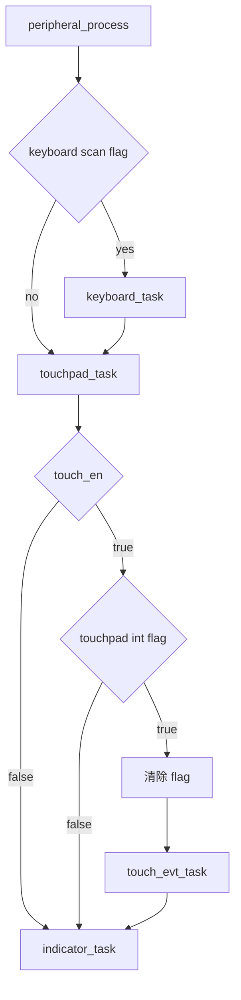

# 设计文档：Touchpad 轮询模式改造

## 1. 需求摘要

将 touchpad 模块的 DATA 处理路径从 OSAL 事件调度改为在主 while 循环（peripheral_process）中直接轮询处理，减少触控延迟。

**需求决定**：
- 保留 GPIO 中断设置标志位，主循环中检查标志位并处理
- 每次 peripheral_process 循环都调用，与 keyboard_task 同频
- touchpad_setup 和 touchpad_set_kb_break 保持不变
- 完全移除 touchpad DATA 路径的 OSAL 事件调度

## 2. 现状分析

### 当前数据流
```
GPIO中断 → g_touchpad_int_flag(未实际使用) → touchpad_setup注册OSAL →
OSAL_SetEvent(INIT) → touchpad_process_event 分支处理4种事件
```

### 关键发现
- `touchpad_notify_int()` 当前已被注释掉，不发送 TOUCHPAD_DATA_EVT
- `g_touchpad_int_flag` 在 input_service.c 中定义为 static volatile bool，但未实际使用
- `touchpad_process_event` 处理 4 种事件：INIT、DATA、REG_INIT、KB_BREAK
- keyboard_task 已在 peripheral_process 中使用轮询模式

## 3. 方案设计

### 核心流程



### 方案要点

1. **新增 touchpad_task()**：每次 peripheral_process 循环调用，检查 touch_en 和 g_touchpad_int_flag
2. **暴露 flag**：通过 getter/setter 函数暴露 g_touchpad_int_flag，保持封装性
3. **安全控制**：touch_en 为 false 时直接返回，不访问 I2C
4. **OSAL 保留**：touchpad_setup、kb_break 定时事件、reg_init 重试保持 OSAL 模式不变

### 涉及文件

| 文件 | 修改类型 | 内容 |
|------|---------|------|
| `middleware/touchpad/touchpad.c` | 新增 | touchpad_task() 函数实现 |
| `middleware/touchpad/touchpad.h` | 新增 | touchpad_task() 函数声明 |
| `application/service/input_service.c` | 新增 | input_get_touchpad_int_flag() / input_clear_touchpad_int_flag() |
| `application/service/input_service.h` | 新增 | 上述 getter/setter 声明 |
| `application/system/system_init.c` | 添加 | peripheral_process 中添加 touchpad_task() 调用 |

### 接口设计

```c
// touchpad.h — 新增声明
void touchpad_task(void);

// touchpad.c — 新增实现
void touchpad_task(void)
{
    if (!touch_en) return;
    if (input_get_touchpad_int_flag()) {
        input_clear_touchpad_int_flag();
        touch_evt_task();
    }
}

// input_service.c — 新增 getter/setter
bool input_get_touchpad_int_flag(void)
{
    return g_touchpad_int_flag;
}

void input_clear_touchpad_int_flag(void)
{
    g_touchpad_int_flag = false;
}

// system_init.c — peripheral_process 修改
__HIGH_CODE
void peripheral_process()
{
    if (input_get_matrix_scan_flag()) {
        keyboard_task();
        input_clear_matrix_scan_flag();
    }

    touchpad_task();  // 新增

    indicator_task();
}
```

### 评审记录

| 维度 | 结论 | 关键意见 | 回应 |
|------|------|---------|------|
| 功能完整性 | 通过 | 需确保 touch_en=0 快速返回 | 已在设计中实现 |
| 技术可行性 | 通过 | volatile bool 安全，位置合理 | — |
| 可维护性 | 有问题 | 混合模式增加理解负担 | 用户选择，后续统一 |
| 可测试性 | 有问题 | 建议调试日志 | 保持最小改动，不加日志 |
| 风险识别 | 有问题 | flag 可见性、中断丢失 | getter/setter 解决；volatile bool 原子安全 |

## 4. 实施计划

| 步骤 | 具体操作 | 文件 | 验证标准 |
|------|---------|------|---------|
| 1 | 暴露 g_touchpad_int_flag：添加 getter/setter 函数和声明 | input_service.c, input_service.h | 编译通过 |
| 2 | 新增 touchpad_task() 实现和声明 | touchpad.c, touchpad.h | 编译通过 |
| 3 | 在 peripheral_process 中添加 touchpad_task() 调用 | system_init.c | 编译通过 |
| 4 | 使用 /wch-riscv-build 编译 CH584M 固件 | — | 零错误零警告 |
| 5 | 烧录验证触控板功能 | — | 触控响应主观无延迟 |
