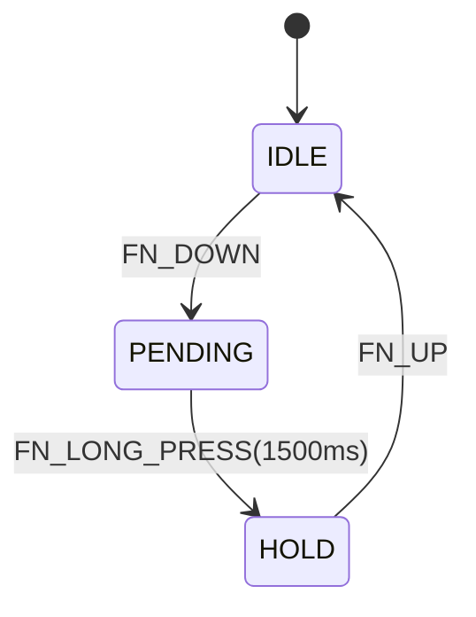
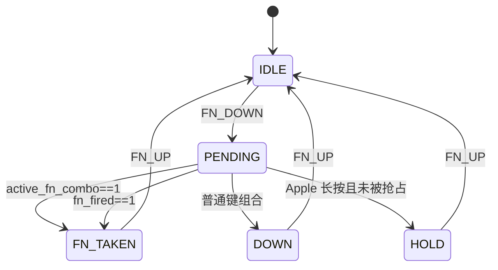

# Shared Fn/Earth 系统组合键抑制误发设计

## 1. 背景

现有共享 `S_FN_KEY` / Earth 键实现已经覆盖：

- 单按发送 Earth
- `Fn` 功能组合键不发送 Earth
- 普通键组合时补发 Earth
- Apple 平台长按进入 Earth 保持

但在重新配对场景中，`BLE_PARING_combo = { S_FN_KEY, KC_DELETE }` 仍会误发一次 Earth。

### 1.1 现场日志

本次问题日志的关键时间线如下：

- `16:29:53.443`：两次 `Key pressed`
- `16:29:54.952`：`Report: Consumer report changed, sending update:029D`
- `16:29:56.482`：`Pair_button triggered`

其中 `0x029D` 是 `KC_KEYBOARD_LAYOUT` 对应的 consumer usage，即 Earth 键。

从时间差看，Earth 误发发生在组合键按下约 1.5 秒后，而 `Pair_button` 在约 3 秒后才触发，和当前配置完全一致：

- `FN_LONG_PRESS_ID` 长按阈值：`1500ms`
- `BLE_PARING_ID` 长按阈值：`3000ms`

这说明误发不是由蓝牙断连或配对回调直接触发，而是共享 Fn 的 Earth 长按路径先一步生效。

## 2. 问题定义

### 2.1 需求要求

根据 `docs/plans/2026-03-17-shared-fn-earth-key-requirements.md`：

- 进入 `FnComboActive` 后，`active_fn_combo = 1`
- `combinations_flag = 0`
- 禁止再发送 Earth

也就是说，只要已经命中系统组合键或 `Fn` 组合键的判定路径，就不应再触发共享 Earth 行为，不应等待业务回调真正执行后再抑制。

### 2.2 当前实际行为

当前实现中：

1. `BLE_PARING_combo` 在 `S_FN_KEY + KC_DELETE` 同时按下后就已经进入 `active_status = 1`
2. 但由于它是 `LONG_PRESS_START` 组合，`fn_function_fired` 要到 `3000ms` 回调执行时才会置位
3. `earth_post_loop_decision()` 仅检查 `fn_fired`
4. 因此在 `0 ~ 3000ms` 窗口内，`earth_state` 会一直保持 `EARTH_PENDING`
5. 当 `FN_LONG_PRESS_ID` 在 `1500ms` 触发时，`FN_LONG_PRESS_KEY()` 会把状态切到 `EARTH_HOLD`
6. 同一帧末尾 Earth 被注入扩展上报列表，主机端收到 `0x029D`

结论：**根因是 Earth 状态机没有把“系统组合键已处于 active”视为抢占条件，只把“业务回调已触发”视为抢占条件。**

## 3. 现状代码分析

### 3.1 相关文件

| 文件 | 作用 |
|------|------|
| `middleware/keyboard/combo/kb_combo_map.c` | 注册 `FN_LONG_PRESS_ID` 和 `BLE_PARING_ID` |
| `middleware/keyboard/combo/kb_combo_engine.c` | 每帧计算 `active_fn_combo`、`fn_function_fired`，并调用 `earth_post_loop_decision()` |
| `middleware/keyboard/combo/kb_fn_action.c` | Earth 状态机与 `FN_DOWN/FN_LONG_PRESS/FN_UP` 行为 |
| `utils/linkedlist.c` | `deactivate()` 仅关闭上报，不影响组合键继续匹配 |

### 3.2 关键实现事实

#### 事实 1：`BLE_PARING_combo` 很早就已经是 active

`combo_task()` 中即使组合键回调还未触发，只要 `combo->active_status == 1 && combo->fn_combo == 1`，就会把 `active_fn_combo` 置 1。

因此，配对组合从两个键同时按下开始，语义上就已经进入“系统组合键占用共享 Fn”的状态。

#### 事实 2：`fn_function_fired` 只代表“回调已执行”

当前 `fn_function_fired` 只在：

- 本帧有回调事件
- 且该组合是 `fn_combo`

时才会置 1。

对于 `BLE_PARING_combo` 这种 `LONG_PRESS_START = 3000ms` 的组合，`fn_function_fired` 在前 3 秒内始终为 0。

#### 事实 3：`deactivate()` 不会阻止组合继续存在

`deactivate()` 只会把按键节点的 `is_report` 置 0，用来阻止成员键直通上报，不会从 `_key_code_list` 删除节点，也不会阻止 `apply_combo()` 持续检测该组合。

因此，`BLE_PARING_combo` 在长按等待阶段是真正处于 active 状态，而不是“尚未成立”。

## 4. 设计目标

### 4.1 必须达成

- 任意 `Fn` 系统组合键一旦进入 active 状态，就必须立即抢占共享 Earth
- `BLE_PARING_combo` 在 `3000ms` 回调之前，不能再出现 Earth 上报
- 现有单按 Earth、普通键组合 Earth、Apple 长按 Earth 行为保持不变
- 现有配对长按时间、蓝牙断连流程、业务回调接口保持不变

### 4.2 明确不做

- 不修改蓝牙配对逻辑
- 不修改 report 层 consumer 映射
- 不重构 combo 框架或调整长按状态机
- 不新增日志专用字段、接口参数或运行时状态透传

## 5. 方案比较

### 方案 A：调整组合键遍历顺序

做法：

- 把 `BLE_PARING_ID` 放到 `FN_LONG_PRESS_ID` 之前，让配对组合先参与处理

优点：

- 改动看似很小

缺点：

- 依赖数组顺序，语义脆弱
- 只能覆盖当前已知组合，后续新增系统组合键仍可能复发
- 无法体现“系统组合键 active 即抢占 Earth”的真实业务规则

结论：**不推荐**

### 方案 B：在 Earth 状态机中把 `active_fn_combo` 作为抢占条件

做法：

- 在 `earth_post_loop_decision()` 中，`EARTH_PENDING` 状态下如果检测到 `active_fn_combo == 1`，立即切到 `EARTH_FN_TAKEN`
- 保留现有 `fn_fired` 判断，兼容已在本帧执行回调的 `Fn` 组合键

优点：

- 直接对应需求语义
- 不依赖组合键数组顺序
- 能同时覆盖背光、电量、配对等所有 `fn_combo`
- 改动范围小，集中在 Earth 状态机

缺点：

- 依赖 `active_fn_combo` 语义保持稳定

结论：**推荐**

### 方案 C：新增专用“Earth 抢占标志”

做法：

- 在 combo 引擎中新增单独的 `earth_suppressed_by_combo` 标志，由所有系统组合键维护

优点：

- 语义最清晰

缺点：

- 改动面更大
- 与现有 `active_fn_combo` 职责重叠
- 对当前问题属于过度设计

结论：**本轮不采用**

## 6. 推荐设计

### 6.1 总体思路

保持现有 combo 引擎和报告层结构不变，只修正 Earth 状态机的抢占判定：

- 之前：只有 `fn_function_fired == 1` 才认为 Earth 被占用
- 之后：`fn_function_fired == 1` 或 `active_fn_combo == 1` 任一成立，都认为 Earth 被占用

这样，长按型系统组合键在等待业务回调的窗口内，也能提前阻止 Earth 进入 `EARTH_HOLD`。

### 6.2 状态机修订

原始关键路径：



修订后关键路径：



### 6.3 具体改动点

#### 改动点 1：`kb_fn_action.c` 的抢占条件前移

位置：`earth_post_loop_decision()`

当前逻辑：

```c
if (earth_state == EARTH_PENDING) {
    if (fn_fired) {
        earth_state = EARTH_FN_TAKEN;
        return;
    }
    ...
}
```

修订逻辑：

```c
if (earth_state == EARTH_PENDING) {
    if (fn_fired || active_fn_combo == 1) {
        earth_state = EARTH_FN_TAKEN;
        return;
    }
    ...
}
```

语义说明：

- `fn_fired`：本帧已有 `Fn` 组合业务回调执行
- `active_fn_combo`：本帧已存在处于 active 的 `Fn` / 系统组合键

只要两者任一成立，说明共享 `S_FN_KEY` 已经被系统组合语义占用，不允许再走 Earth 分支。

#### 改动点 2：保持 `FN_LONG_PRESS_KEY()` 现有状态守卫语义

位置：`FN_LONG_PRESS_KEY()`

本轮不改变其核心行为，只依赖已有条件：

```c
if (is_apple_platform() && earth_state == EARTH_PENDING) {
    ...
}
```

因为修复后，系统组合键会在 1500ms 之前把 `earth_state` 提前切到 `EARTH_FN_TAKEN`，因此这里不会再误入 `EARTH_HOLD`。

如后续评审认为可读性不足，可仅补注释说明“该函数只处理未被系统组合键抢占的共享 Earth 长按路径”，不新增额外状态和接口。

### 6.4 为什么不使用 `combinations_flag`

`combinations_flag` 不能作为本问题的唯一判定依据，原因如下：

- 场景 C（普通键组合）也会把它清 0
- Apple Earth 长按进入 `EARTH_HOLD` 时也会清 0
- 它表达的是“是否仍允许 Earth 语义延迟决策”，不是“当前一定存在系统组合键 active”

如果直接以 `combinations_flag == 0` 代替系统组合键占用判定，会误伤普通键组合和长按场景。

因此，本轮使用语义更准确的 `active_fn_combo`。

## 7. 影响范围

### 7.1 代码改动范围

最小实现只需修改 1 个文件：

| 文件 | 改动 |
|------|------|
| `middleware/keyboard/combo/kb_fn_action.c` | 在 `earth_post_loop_decision()` 中追加 `active_fn_combo` 抢占判断 |

可选的说明性改动：

| 文件 | 改动 |
|------|------|
| `middleware/keyboard/combo/kb_fn_action.c` | 为 `FN_LONG_PRESS_KEY()` 增加注释，说明它只处理未被系统组合键占用的 Earth 长按 |

本轮不需要修改：

- `kb_combo_engine.c`
- `kb_combo_map.c`
- `kb_fn_action.h`
- `wireless.c`
- `report.c`

## 8. 验证方案

### 8.1 编译验证

按仓库要求执行：

```bash
/wch-riscv-build
```

### 8.2 手动验证矩阵

| ID | 场景 | 操作 | 预期 |
|----|------|------|------|
| V1 | 单按 Earth | 单按 `S_FN_KEY` | 仍发送平台对应 Earth |
| V2 | 普通键组合 | `S_FN_KEY + 普通键` | 仍进入 `EARTH_DOWN`，Earth 与普通键并行 |
| V3 | 短按系统组合 | `S_FN_KEY + KC_DELETE`，不足 1500ms 松开 | 不发送 Earth，不触发配对 |
| V4 | 中间窗口 | `S_FN_KEY + KC_DELETE`，按住 1500ms~2999ms | 不发送 `0x029D` |
| V5 | 正常配对 | `S_FN_KEY + KC_DELETE`，按住超过 3000ms | 触发 `Pair_button`，且在此之前没有 Earth |
| V6 | 其它 Fn 系统组合 | `S_FN_KEY + KC_RSFT/ENTER/RCMD` | 正常执行系统功能，不发送 Earth |
| V7 | Apple 长按 | 单独按住 `S_FN_KEY` 超过 1500ms | 仍进入 Earth 长按保持 |

### 8.3 日志关注点

修复后，配对复现场景的期望日志顺序应为：

- 出现 `Key pressed`
- 不应出现 `Report: Consumer report changed, sending update:029D`
- 到 `3000ms` 后才出现 `Pair_button triggered`
- 松开按键后不应出现多余 Earth 补发

## 9. 风险与回归点

### 9.1 风险

- 如果后续新增某个共享 `Fn` 系统组合，但未被正确标记为 `fn_combo`，则仍不会触发该抑制逻辑
- 本方案依赖 `active_fn_combo` 的当前定义，即“任意带 `S_FN_KEY` 且 `key_count > 1` 的 active 组合”

### 9.2 回归重点

- 单按 Earth 不可丢失
- 普通键组合时 Earth 不可被错误抑制
- Apple 长按 Earth 不可被错误抑制
- 长按型系统组合在回调前后都不可误发 Earth

## 10. 结论

本问题的根因不是蓝牙配对流程，而是共享 Earth 状态机的抑制条件过晚。

最小且正确的修复方式是：

- 在 `earth_post_loop_decision()` 中，把 `active_fn_combo` 视为和 `fn_fired` 同级的抢占条件

该方案：

- 符合既有需求文档对 `FnComboActive` 的定义
- 不依赖组合键数组顺序
- 不修改配对业务逻辑
- 改动小、回归面清晰，适合作为本轮修复方案
