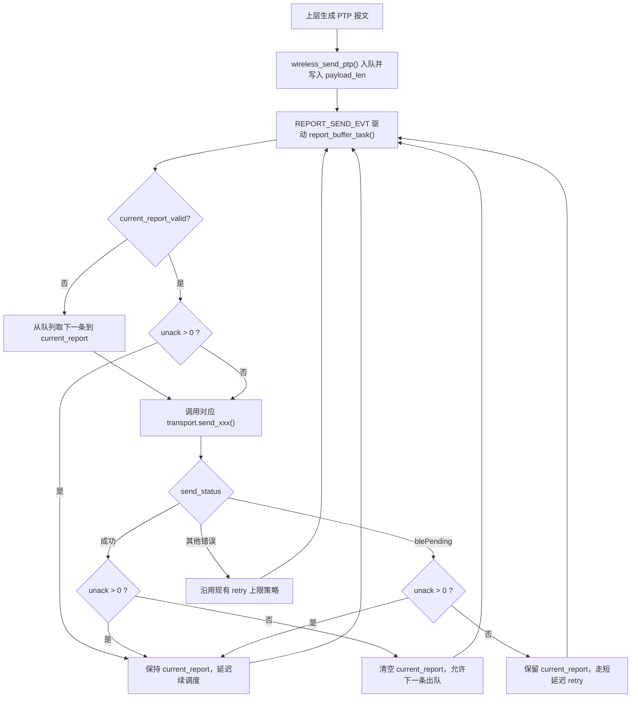

# 设计文档：触控板 PTP BLE 流控补齐

**日期：** 2026-04-02  
**状态：** 待实施  
**对应需求：** [2026-04-02-touchpad-ptp-flow-control-requirements.md](./2026-04-02-touchpad-ptp-flow-control-requirements.md)

## 1. 设计摘要

本次设计在公共无线发送链路中引入“队列 + 单个在途报文槽”的窗口等待机制，继续保留：

```text
touchpad_service -> wireless_send_ptp() -> report_buffer -> REPORT_SEND_EVT -> bt_driver
```

不变更触控板业务层逻辑，不新增独立 PTP 通道，不修改 HID 描述符。

核心改动如下：

- `wireless_send_ptp()` 入队时保存真实 `payload_len`
- `report_buffer_task()` 不再把“调用发送接口成功”视为报文生命周期结束
- 当前报文发送成功后，只有在 `LL_GetNumberOfUnAckPacket()` 归零时才允许发送下一条
- `ret=22`（`blePending`）视为忙态流控信号，不再按普通错误处理
- `REPORT_SEND_EVT` 续调度条件补齐到“队列 / 重试 / 在途等待”三类状态

## 2. 核心流程



## 3. 架构设计

### 3.1 分层边界

- `component/touch_component/touchpad_service.c`
  - 保持现状，只负责生成 PTP 报文并调用 `wireless_send_ptp(report, len)`
  - 不感知 `blePending`、未确认包数量、窗口释放条件

- `middleware/communication/wireless.c`
  - 继续负责构造 `report_buffer_t`
  - 补齐 `payload_len` 写入
  - 不承载状态机逻辑

- `middleware/communication/report_buffer.c`
  - 承载本次新增的发送窗口状态机
  - 统一管理“当前报文是否有效”“当前报文是否等待未确认包清空”“是否还需要续调度”

- `application/service/communication_service.c`
  - 继续负责 `REPORT_SEND_EVT` 分发
  - 使用新的“是否仍有待完成发送工作”判断接口来决定是否续调度

- `drivers/communication/bluetooth/ch584/_bt_driver.c`
  - 新增未确认包数查询封装
  - 调整忙态日志语义

### 3.2 设计原则

- BLE 细节只停留在驱动层和 transport 抽象层
- 公共发送层只依赖 `wireless_transport`，不直接读取 BLE Profile 全局变量
- 不通过修改业务层接口签名来换取日志或调试便利

## 4. 组件与接口设计

### 4.1 `wt_func_t` 扩展

在 [wireless.h](/D:/Code/VScode/keyboard-framework/middleware/communication/wireless.h) 的 `wt_func_t` 中新增：

```c
uint32_t (*get_unack_packets)(void);
```

约定如下：

- BLE 驱动返回当前连接的未确认包数
- 非 BLE 通道或未连接状态返回 `0`
- 上层无需知道底层使用的是 `LL_GetNumberOfUnAckPacket()`

### 4.2 `report_buffer` 状态增强

在 [report_buffer.c](/D:/Code/VScode/keyboard-framework/middleware/communication/report_buffer.c) 中新增以下内部状态：

- `current_report`
  - 当前已出队但生命周期未结束的报文
- `current_report_valid`
  - 当前报文槽是否有效
- `current_report_wait_unack`
  - 当前是否正在等待未确认包清空

保留现有：

- `retry`
- `retry_time_buffer`
- `report_buffer_queue`

### 4.3 发送长度透传

继续使用 [report_buffer.h](/D:/Code/VScode/keyboard-framework/middleware/communication/report_buffer.h) 中已有的 `payload_len` 字段。

要求：

- `wireless_send_ptp()` 写入调用方传入的 `len`
- `wireless_send_keyboard()`、`wireless_send_mouse()`、`wireless_send_consumer()` 写入各自固定长度
- `report_buffer_task()` 按 `payload_len` 发送，不再写死 PTP 长度

### 4.4 待完成发送工作判断

建议新增对外辅助接口：

```c
bool report_buffer_has_pending_work(void);
```

返回条件为以下任一成立：

- 队列非空
- `retry > 0`
- `current_report_valid == true`

供 [communication_service.c](/D:/Code/VScode/keyboard-framework/application/service/communication_service.c) 判断 `REPORT_SEND_EVT` 是否需要继续调度。

## 5. 数据流与错误处理

### 5.1 正常发送路径

1. 上层调用 `wireless_send_ptp(report, len)`
2. `wireless.c` 组装 `report_buffer_t`
   - `type = REPORT_TYPE_PTP`
   - `payload_len = len`
3. 报文入队并触发 `REPORT_SEND_EVT`
4. `report_buffer_task()` 若没有当前报文，则先出队到 `current_report`
5. 若 `current_report_wait_unack == true` 且 `get_unack_packets() > 0`，则本轮仅等待，不发下一条
6. 若允许发送，则调用 `wireless_transport.send_ptp(..., current_report.payload_len)`
7. 发送成功后再次读取未确认包数
   - 大于 0：保留 `current_report`，进入等待窗口释放状态
   - 等于 0：清空 `current_report`，允许发送下一条

### 5.2 `blePending` 处理

当发送返回 `blePending` 时：

- 不清空 `current_report`
- 先读取未确认包数
- 若未确认包数大于 0，则进入等待窗口释放状态
- 若未确认包数等于 0，则按现有短延迟 retry 机制继续尝试

这样可把 `ret=22` 从“错误”降级为“流控信号”。

### 5.3 其他错误处理

对于非忙态错误：

- 保持当前 `retry` 上限逻辑
- 超过重试上限后清空 `current_report`
- 保留错误日志，避免真正异常被静默吞掉

### 5.4 忙态日志策略

在 [\_bt_driver.c](/D:/Code/VScode/keyboard-framework/drivers/communication/bluetooth/ch584/_bt_driver.c) 中：

- `blePending` 不再每次 `LOG_E`
- 可降为低频信息日志，或由上层状态机统一吞掉
- 其他错误码继续保留错误日志

## 6. 续调度策略

当前 [communication_service.c](/D:/Code/VScode/keyboard-framework/application/service/communication_service.c) 中 `REPORT_SEND_EVT` 只在队列非空时重投事件，无法覆盖“当前报文仍在等待未确认包清空”的情况。

建议调整为：

```c
if (report_buffer_has_pending_work()) {
    OSAL_ClearEvent(commu_taskID, REPORT_SEND_EVT);
    OSAL_SetDelayedEvent(commu_taskID, REPORT_SEND_EVT, 16 * 15);
}
```

这样以下状态都能继续推进：

- 队列仍有新报文
- 当前报文处于 retry
- 当前报文已发出但仍在等待窗口释放

## 7. 测试策略

### 7.1 单元测试

在现有 `test/report_buffer_retry_test.c` 基础上补齐并锁定以下行为：

1. `payload_len` 透传
   - PTP 入队长度与实际发送长度一致

2. 窗口未释放前禁止发送下一帧
   - `get_unack_packets()` 返回大于 0 时，第二条报文不得被发送

3. `blePending` 后保留当前报文
   - 忙态后不丢当前报文
   - 窗口释放后可以继续推进

4. 续调度条件覆盖在途报文
   - 当前报文有效但队列为空时，仍应继续调度

### 7.2 编译验证

统一使用仓库要求的：

```bash
/wch-riscv-build
```

### 7.3 实机验证

- BLE 连接后单指连续滑动 30 秒
- 两指滑动 / 滚动
- 滑动同时穿插键盘输入
- 观察日志中是否仍持续出现 `[BT] send_ptp fail, ret=22,len:19`

## 8. 风险与缓解

### 风险 1：高频输入下队列仍可能增长

这是当前阶段接受的取舍，因为本次不改成 latest-only。

缓解：

- 保持语义不变，先验证窗口等待是否已足够解决主问题
- 后续若仍堆积，再评估是否只对 PTP 引入覆盖式发送

### 风险 2：公共发送层改动可能影响键盘路径

缓解：

- 逻辑仍通过 `wireless_transport` 统一发送
- 键盘路径纳入单元测试和实机交叉验证

### 风险 3：非 BLE 通道无未确认包概念

缓解：

- `get_unack_packets` 缺省返回 `0`
- 非 BLE 路径保持兼容，不额外阻塞发送

## 9. 多角度评审结论

### 功能完整性

- 通过
- 已覆盖长度透传、窗口等待、忙态处理、续调度闭环

### 技术可行性

- 通过
- `LL_GetNumberOfUnAckPacket()` 与 `hidEmuConnHandle` 已具备接入条件
- 通过 transport 抽象可避免把 BLE 细节扩散到 middleware 其他模块

### 可维护性

- 通过
- 状态机集中在 `report_buffer.c`，没有把流控逻辑散落到业务层

### 可测试性

- 通过
- 现有测试文件已具备扩展基础，关键行为可以通过 stub `get_unack_packets()` 锁定

### 风险识别

- 通过，有残余风险
- 主要残余风险为高频输入下的队列增长与公共链路对键盘路径的影响
- 当前通过“不改语义、先补窗口控制”的方式控制变更面

## 10. 结论

推荐实施方案为：

**在公共 `report_buffer` 链路中补齐 `payload_len` 透传、当前报文在途状态、`LL_GetNumberOfUnAckPacket()` 窗口等待和 `REPORT_SEND_EVT` 续调度闭环；上层触控板逻辑保持不变。**

这是当前满足需求、改动面最小、且符合现有分层边界的方案。

## 11. 实施计划

### 任务 1：补齐 transport 未确认包查询接口

**涉及文件：**

- 修改 `middleware/communication/wireless.h`
- 修改 `middleware/communication/wireless.c`
- 修改 `drivers/communication/bluetooth/bt_driver.h`
- 修改 `drivers/communication/bluetooth/ch584/_bt_driver.c`

**目标：**

- 在 `wt_func_t` 中新增 `get_unack_packets`
- BLE 驱动封装 `LL_GetNumberOfUnAckPacket()`
- 非 BLE 路径返回 `0`

**完成标准：**

- 所有 transport 函数表初始化完整
- `report_buffer` 可通过统一接口读取未确认包数

### 任务 2：补齐报文长度语义

**涉及文件：**

- 修改 `middleware/communication/wireless.c`
- 修改 `middleware/communication/report_buffer.h`

**目标：**

- `wireless_send_ptp()` 保存调用方传入的 `len`
- 键盘、鼠标、消费者键也写入各自 `payload_len`
- `payload_len` 成为发送层唯一长度来源

**完成标准：**

- PTP 发送长度不再写死
- 所有入队报文长度来源统一明确

### 任务 3：实现 report_buffer 在途状态机

**涉及文件：**

- 修改 `middleware/communication/report_buffer.c`
- 修改 `middleware/communication/report_buffer.h`

**目标：**

- 新增 `current_report`
- 新增 `current_report_valid`
- 新增 `current_report_wait_unack`
- 成功发送后根据未确认包数决定是清空当前报文，还是等待窗口释放
- `blePending` 时保留当前报文，不发送下一条

**完成标准：**

- 任意时刻最多只有一条报文占用链路窗口
- 未确认包未清空前，不会发送下一条队列报文

### 任务 4：补齐 REPORT_SEND_EVT 续调度闭环

**涉及文件：**

- 修改 `application/service/communication_service.c`
- 修改 `middleware/communication/report_buffer.h`
- 修改 `middleware/communication/report_buffer.c`

**目标：**

- 新增 `report_buffer_has_pending_work()`
- 让 `REPORT_SEND_EVT` 续调度同时覆盖：
  - 队列非空
  - retry 中
  - 当前报文仍在等待未确认包清空

**完成标准：**

- 队列为空但当前报文尚未结束生命周期时，状态机仍能继续推进
- 不会出现“窗口已释放但无人继续驱动发送”的停滞情况

### 任务 5：补齐测试与日志语义

**涉及文件：**

- 修改 `test/report_buffer_retry_test.c`
- 修改 `drivers/communication/bluetooth/ch584/_bt_driver.c`

**目标：**

- 锁定 `payload_len` 透传行为
- 锁定“窗口未释放前不得发送下一帧”
- 锁定“`blePending` 后保留当前报文，窗口释放后再继续”
- 对 `ret=22` 忙态日志降噪，保留真正异常日志

**完成标准：**

- 单测覆盖关键状态机行为
- 连续滑动时不再持续刷 `[BT] send_ptp fail, ret=22,len:19`

### 验证顺序

1. 先运行 `test/report_buffer_retry_test.c` 对应单测或编译验证
2. 再执行仓库统一编译命令：

```bash
/wch-riscv-build
```

3. 最后执行实机验证：
   - BLE 连接后单指连续滑动 30 秒
   - 两指滑动 / 滚动
   - 滑动同时穿插键盘输入
   - 观察是否仍持续出现 `[BT] send_ptp fail, ret=22,len:19`
