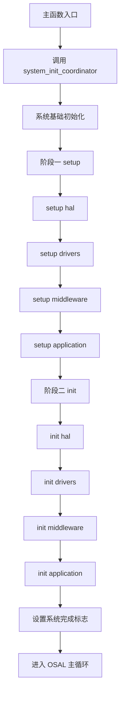
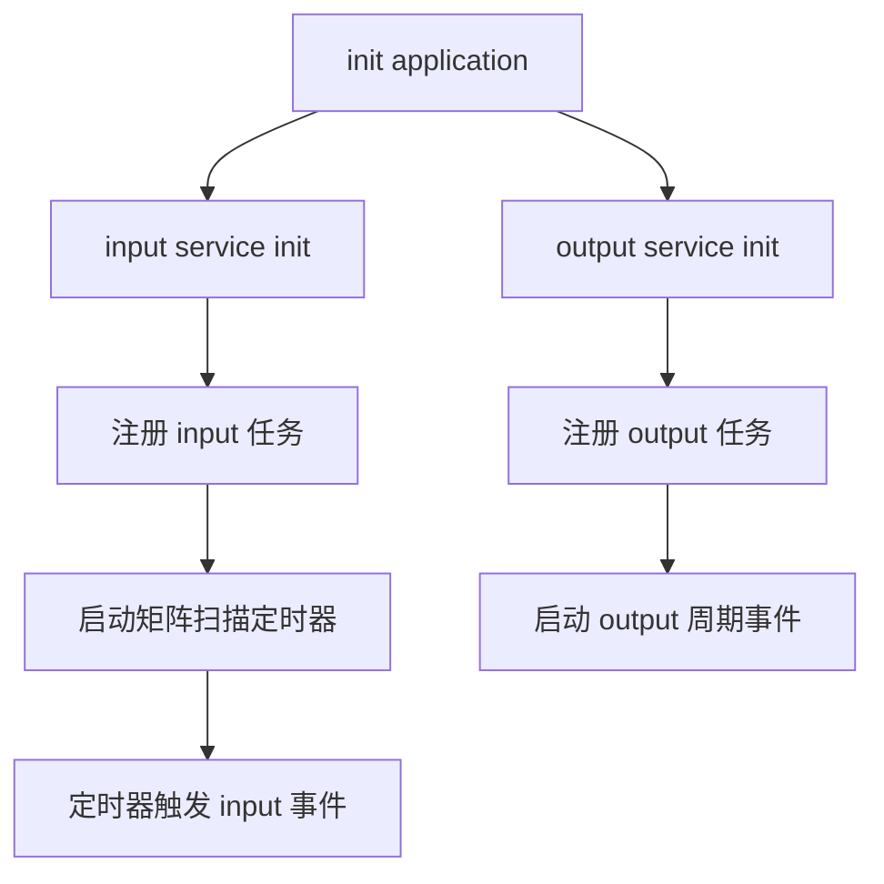

# system_init_coordinator 启动流程目录

## 文档目的

- 梳理程序启动阶段中 `system_init_coordinator` 的完整执行路径
- 区分 当前已执行步骤 与 代码中预留步骤
- 便于联调与问题定位

## 启动主流程图

## 启动阶段目录

### 0 主入口

1. `main` 或 `test_main` 进入程序
2. 调用 `system_init_coordinator`
3. 返回值非零则直接退出
4. 返回值为零则进入 `OSAL_SystemProcess`

对应文件

- `application/main.c`
- `test_main.c`

### 1 系统基础初始化

执行 `system_hal_init`

关键动作

- 配置电源与系统时钟
- 配置基础 GPIO 默认状态
- 初始化 BLE 相关基础模块
- 标记平台系统初始化完成

对应文件

- `application/system/system_init.c`
- `hal/platforms/ch584/_system_hal.c`

### 2 阶段一 setup

执行顺序

1. `system_setup_hal`
2. `system_setup_drivers`
3. `system_setup_middleware`
4. `system_setup_application`

当前作用

- 以层级顺序推进状态机
- 标记 setup 进度
- 多数具体硬件动作仍为预留位

对应文件

- `application/system/system_init.c`

### 3 阶段二 init

执行顺序

1. `system_init_hal`
2. `system_init_drivers`
3. `system_init_middleware`
4. `system_init_application`

#### 3.1 init hal 当前实际动作

- 绑定并初始化调试串口
- 设置调试输出引脚
- 调用 `hw_timer_init`
- 更新初始化状态为 hal init

#### 3.2 init drivers 当前状态

- 流程已保留
- 存储 电池 指示灯初始化调用位已预留

#### 3.3 init middleware 当前状态

- 流程已保留
- 报告缓冲 低功耗 无线 键盘初始化调用位已预留

#### 3.4 init application 当前实际动作

- 调用 `input_service_init`
- 调用 `output_service_init`
- 设置初始化状态为 completed
- 设置系统初始化完成标志

对应文件

- `application/system/system_init.c`

## 应用初始化后的任务注册流程图

## 应用初始化后的任务事件目录

### 输入服务

- 注册任务处理函数 `input_process_event`
- 启动矩阵扫描硬件定时器
- 定时器回调触发 `INPUT_MATRIX_SCAN_EVT`

对应文件

- `application/service/input_service.c`
- `application/service/input_service.h`

### 输出服务

- 注册任务处理函数 `output_process_event`
- 启动周期事件 `OUTPUT_BACKLIGHT_BRIGHTNESS_EVT`

对应文件

- `application/service/output_service.c`
- `application/service/output_service.h`

## 启动中已预留但未接入 coordinator 的模块

- `system_service_init` 当前未在 coordinator 中启用
- `commu_service_init` 当前未在 coordinator 中启用

补充说明

- 这两个服务已有独立任务和事件设计
- 若后续接入 coordinator 启动阶段 建议放在 `system_init_application`

对应文件

- `application/service/system_service.c`
- `application/service/communication_service.c`
- `application/system/system_init.c`

## 启动状态机目录

状态按顺序推进

1. not started
2. hal setup
3. driver setup
4. middleware setup
5. application setup
6. hal init
7. driver init
8. middleware init
9. application init
10. completed

状态查询接口

- `system_is_initialized`
- `system_get_init_status`

对应文件

- `application/system/system_init.h`
- `application/system/system_init.c`
